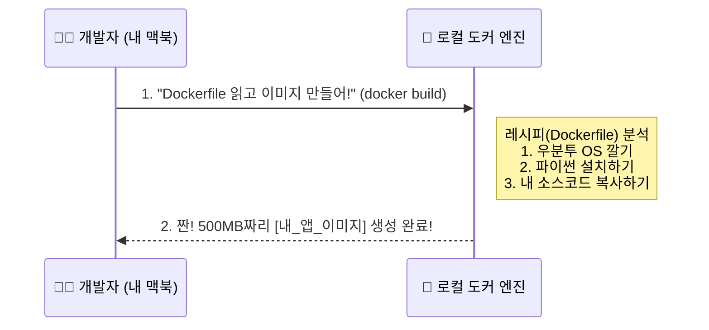
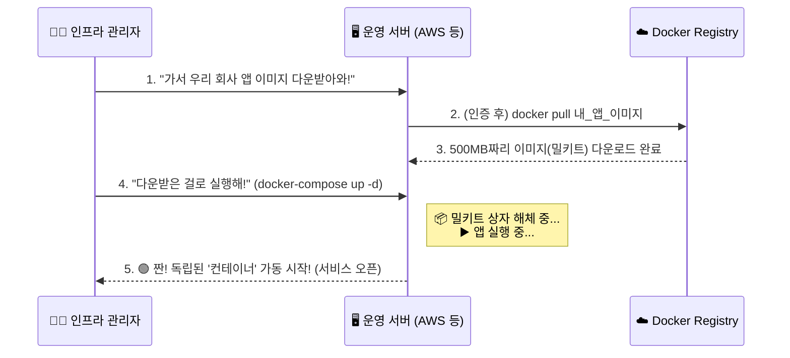

# 🚀 [Summary] 실무 도커 워크플로우 대통합 (Code to Container)

지금까지 배운 깃허브(GitHub), 도커 허브/레지스트리(Docker Hub/Registry), 도커 이미지(Image), 그리고 컨테이너(Container)가 **실제 실무(IT 기업) 환경에서 어떻게 연결되고 흘러가는지** 단계별로 완벽하게 묶어서 정리해 드립니다.

---

## 🗺️ 전체 조감도 (The Big Picture)

개발자의 노트북에서 시작된 단 한 줄의 코드가, 어떻게 전 세계 사용자가 접속하는 라이브 서버의 컨테이너로 변신하는지 전체 흐름을 먼저 살펴보겠습니다.

이제 각 단계가 어떻게 이루어지는지 하나씩 뜯어보겠습니다.

---

## 🛠️ Step 1. 개발 및 소스 코드 저장 (GitHub)

개발자는 자신의 노트북에서 열심히 코딩을 합니다. 이때 만들어지는 것은 순수한 **"텍스트(글자)"**입니다.

1. **파이썬/노드 코드 작성:** 실제 비즈니스 로직 (`app.py`, `server.js`)
2. **요리 레시피 작성:** 이 코드를 나중에 어떻게 포장할지 적어둔 설명서 (`Dockerfile`, `docker-compose.yml`)
3. **GitHub에 업로드 (Git Push):** 혹시 노트북이 고장 날까 봐, 혹은 팀원들과 코드를 공유하기 위해 이 **텍스트 파일들**을 GitHub에 올립니다.

> 💡 **핵심:** 아직 이 단계에서는 "실행 가능한 프로그램"이 없습니다. 오직 설계도(글자)만 존재합니다.

---

## 📦 Step 2. 도커 이미지 굽기 (Docker Build)

설계도가 완성되었으니, 이제 도커 엔진(요리사)을 시켜서 설계도대로 **밀키트(완성품)**를 만들 차례입니다.

> 💡 **핵심:** 글자(텍스트)였던 코드가, 우분투 OS와 파이썬 실행기까지 통째로 압축된 거대한 **'실행 가능한 덩어리(Docker Image)'**로 변신했습니다.

---

## ☁️ Step 3. 클라우드 창고에 보관하기 (Docker Push)

내 노트북에서 구워낸 이 멋진 이미지를, 나중에 실제 라이브 서버(예: 아마존 AWS 서버)에서 가져다 쓰게 하려면 어딘가 인터넷 상의 거대한 창고에 올려두어야 합니다.

* 내가 방금 구운 무거운 이미지 덩어리를 **레지스트리(Registry)**로 쏘아 올립니다(`docker push`). 
* 앞서 배운 도커 허브(Docker Hub)나 깃허브 GHCR이 바로 이 창고 역할을 해줍니다.

---

## 🚀 Step 4. 운영 서버에 배포 및 실행 (Docker Pull & Run/Compose)

이제 실제 서비스를 제공할 아마존 AWS 서버(운영 환경)로 접속합니다. 이 서버에는 아직 소스 코드도 없고, 아무것도 없습니다. 오직 도커 엔진 하나만 깔려 있습니다.

1. **`docker pull`:** 클라우드 창고(Registry)에서 무거운 이미지 덩어리를 서버로 다운받습니다.
2. **`docker-compose up` (또는 `docker run`):** 다운받은 이미지(밀키트)의 포장을 뜯어서, 메모리에 올리고 실제로 실행시킵니다. 이 **"실행되어 살아 숨 쉬는 상태"**가 바로 **컨테이너(Container)**입니다.

---

## 🔥 (보너스) 실무의 완성: CI/CD 자동화 파이프라인

지금까지 설명한 과정(Step 1 ~ 4)을 개발자가 매번 손으로 직접 치려면 귀찮고 실수하기도 쉽습니다. 
그래서 넷플릭스, 토스, 카카오 같은 현대적인 IT 기업들은 이 과정을 **로봇(GitHub Actions, Jenkins 등)**에게 맡겨버립니다. 이를 **CI/CD 파이프라인 자동화**라고 부릅니다.

**[🤖 실무 CI/CD 파이프라인 궁극의 흐름]**

즉, 실무 개발자는 노트북에서 코드를 짜고 **`git push`** 한 번만 누르면, 뒤에서 수많은 로봇들이 알아서 **이미지를 굽고 ➡️ 레지스트리에 올리고 ➡️ 서버에서 다운받아 ➡️ 컨테이너로 교체 가동**시켜 주는 마법 같은 시스템이 완성되는 것입니다! 

이것이 도커 생태계를 이루는 핵심 워크플로우의 모든 것입니다. 🎉
