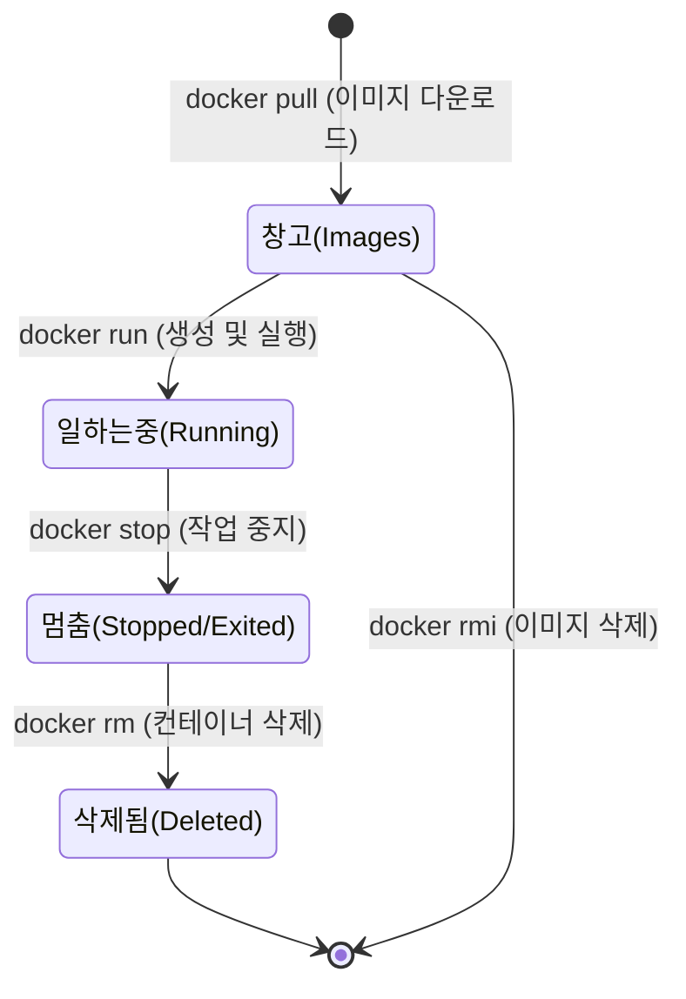

# Docker 완전 정복: 2강. Docker 기본 명령어 마스터하기 🛠️

지난 1강에서는 **"Docker는 항구의 표준화된 철제 컨테이너 박스다!"**라는 비유를 통해 Docker가 왜 필요한지, 그리고 **이미지(빵틀/설계도)**와 **컨테이너(구워진 빵/실제 박스)**의 차이에 대해 알아보았습니다.

이번 2강에서는 지난 시간에 배웠던 그 '컨테이너'들을 실제로 우리 항구(내 컴퓨터)로 불러오고, 일하게 만들고, 멈추게 하고, 폐기하는 **'기본 명령어(Commands)'**들을 아주 쉽고 자세하게 배워보겠습니다.

---

## 1. 항구 비유로 이해하는 Docker 명령어 흐름

명령어를 무작정 외우기보다는, 항구의 관리자가 되었다고 상상하고 명령어의 흐름을 이해해 봅시다.

- 📦 **`docker pull`**: 공장(Docker Hub)에 전화해서 **컨테이너 설계도(이미지)를 주문**해서 항구 창고에 가져다 놓습니다.
- 🏗️ **`docker run`**: 가져온 설계도(이미지)를 바탕으로 **실제 컨테이너를 조립해서 일을 시작**시킵니다.
- 📋 **`docker ps`**: 현재 우리 항구에서 **열심히 일하고 있는 컨테이너들의 현황판**을 봅니다.
- 🛑 **`docker stop`**: 일하고 있는 컨테이너에게 **"잠시 멈춰!"**라고 지시합니다. (컨테이너는 항구에 그대로 남아있습니다.)
- 🗑️ **`docker rm`**: 멈춰있는 컨테이너를 아예 **고철로 분해해서 항구에서 치워버립니다.** (완전 삭제)
- 🖼️ **`docker images`**: 우리 항구 창고에 어떤 **설계도(이미지)들이 보관되어 있는지 목록**을 봅니다.
- 🔥 **`docker rmi`**: 창고에 있는 **설계도(이미지) 자체를 불태워버립니다.** (이미지 삭제)

---

## 2. 시각적으로 보는 컨테이너의 일생 (Lifecycle)

컨테이너가 어떻게 생성되고 사라지는지 한눈에 살펴보겠습니다.



> **💡 핵심 포인트:** 컨테이너(실제 박스)를 먼저 지워야(`rm`), 그 바탕이 된 이미지(설계도)를 지울 수 있습니다(`rmi`). 컨테이너가 떡하니 있는데 설계도를 먼저 찢어버릴 수는 없겠죠!

---

## 3. 왜 Ubuntu 컨테이너는 실행하자마자 꺼질까?

강의에서 아주 중요한 개념이 하나 나왔습니다. 
**"컨테이너는 운영체제(Windows 같은 것)를 켜두기 위한 것이 아니라, '특정 작업'을 하기 위한 것이다!"**

웹 서버(`nginx`)처럼 계속해서 손님(웹 요청)을 기다려야 하는 프로그램은 켜두면 계속 살아있습니다. 
하지만 `ubuntu` 이미지처럼 안에 특별히 실행할 프로그램이 없는 빈 껍데기 운영체제는, 켜지자마자 **"어? 내가 할 일이 없네? 그럼 퇴근!"** 하고 바로 꺼져버립니다(Exited 상태).

이런 컨테이너에게 일을 시키려면 명확한 명령을 줘야 합니다.
- 예: `docker run ubuntu sleep 5` (우분투야, 켜져서 5초 동안 잠자고 있어!) -> 5초 뒤에 스스로 꺼집니다.

## 4. 포어그라운드(Foreground) vs 백그라운드(Background) 실행

강의에서 아주 중요한 옵션인 `-d` (Detached mode)가 언급되었습니다.

- **포어그라운드 (Attached 모드):** `docker run nginx`처럼 실행하면 터미널이 컨테이너 화면에 딱 달라붙게 됩니다. 실행 중인 로그를 계속 볼 수 있지만, 터미널 창을 다른 명령어를 치는 데 사용할 수 없습니다. `Ctrl + C`를 누르면 컨테이너도 같이 종료됩니다.
- **백그라운드 (Detached 모드):** `docker run -d nginx`처럼 `-d` 옵션을 주면 컨테이너가 뒤에서 조용히 일하게 됩니다. 우리는 즉시 터미널 프롬프트를 돌려받아 다른 명령어를 자유롭게 쓸 수 있습니다.
- **다시 연결하기 (`docker attach`):** 백그라운드에서 뒤로 숨겨둔 컨테이너의 화면을 다시 앞(터미널)으로 꺼내서 보고 싶다면 `docker attach 컨테이너ID`를 입력하시면 됩니다.

---

## 5. 실습 환경 세팅 및 단계별 실습 가이드

지난 시간에 Docker Desktop을 설치하고 `docker --version`으로 고래가 잘 살아있는지 확인하셨죠?
이제 Mac의 **터미널(Terminal)**을 열고 아래 명령어를 순서대로 똑같이 타이핑해 보세요!

### 💻 실습 1: 이미지 다운받고 실행해 보기
```bash
# 1. Nginx(웹 서버) 이미지를 사용해 컨테이너를 실행합니다.
# 내 컴퓨터에 설계도(이미지)가 없으면 알아서 인터넷에서 다운로드(pull)한 뒤 실행합니다.
docker run nginx
```
*(실행하면 터미널에 로그들이 주르륵 뜨면서 멈춰있는 것처럼 보입니다. 웹 서버가 손님을 기다리는 중입니다! 빠져나오려면 `Ctrl + C`를 누르세요.)*

### 💻 실습 2: 컨테이너 목록 확인하기
```bash
# 2. 현재 내 항구에 어떤 설계도(이미지)들이 있는지 확인합니다.
docker images

# 3. 현재 살아서 일하고 있는(Running) 컨테이너 목록을 봅니다.
docker ps

# 4. 과거에 일하다가 멈춘(Exited) 컨테이너까지 싹 다 포함해서 봅니다.
docker ps -a
```
*(`docker ps -a`를 치면 아까 Ctrl+C로 멈춘 nginx 컨테이너가 Exited 상태로 남아있는 것을 볼 수 있습니다.)*

### 💻 실습 3: 백그라운드에서 실행하고 관리하기 (명령어 응용)
```bash
# 5. -d 옵션(Detached mode)을 주면, 컨테이너가 '백그라운드'에서 조용히 일하게 됩니다.
# 터미널 창을 계속 쓸 수 있어서 아주 유용합니다!
docker run -d nginx

# 6. 백그라운드에서 잘 일하고 있는지 확인해 봅시다. (컨테이너 ID를 확인해 두세요!)
docker ps

# 7. 이제 이 컨테이너를 멈춰보겠습니다.
# 아래 '컨테이너ID' 부분에 위에서 확인한 ID의 앞 3~4자리만 적어주셔도 됩니다. (예: docker stop a1b)
docker stop 컨테이너ID

# 8. 멈춘 컨테이너를 내 컴퓨터에서 완전히 삭제합니다.
docker rm 컨테이너ID
```

### 💻 실습 4: 실행 중인 컨테이너 안에 쳐들어가기! (`exec`)
```bash
# 9. 다시 한 번 nginx를 백그라운드에서 실행시킵니다.
docker run -d nginx

# 10. `docker ps`로 방금 띄운 컨테이너의 ID를 확인합니다.
docker ps

# 11. 살아서 돌아가고 있는 컨테이너 안에서 명령어를 실행해 봅니다!
# nginx 컨테이너 안에 있는 /etc/hosts 파일의 내용을 화면에 출력(cat)하라는 의미입니다.
docker exec 컨테이너ID cat /etc/hosts
```

---

## 6. 터미널 출력 결과 완벽 해독하기 (보충 설명)

터미널에 수많은 영어 글자들이 뜬다고 당황하지 마세요. 방금 실습하신 결과를 바탕으로 화면에 뜨는 내용들을 하나씩 해석해 드리겠습니다.

### 💡 `docker run nginx` 실행 시 일어나는 일
1. **`Unable to find image 'nginx:latest' locally`**
   - 내 컴퓨터(로컬) 창고에 `nginx` 설계도(이미지)가 없는지 확인합니다.
2. **`Pulling from library/nginx ... Pull complete`**
   - 인터넷(Docker Hub)에서 설계도를 여러 부품으로 나눠서 다운로드합니다.
3. **`/docker-entrypoint.sh: Configuration complete; ready for start up`**
   - 다운로드가 끝나고, 컨테이너를 조립한 뒤 `nginx`라는 웹 서버를 실행시켰습니다. (이제 손님을 맞이할 준비가 다 됐다는 뜻입니다!)
4. **`^C signal 2 (SIGINT) received, exiting`**
   - 사용자가 `Ctrl + C`를 눌러서 멈춤 신호를 주면, 웹 서버가 "퇴근할게!" 하고 정상적으로 종료됩니다.

### 💡 `docker images` 실행 결과
- **REPOSITORY / TAG / IMAGE ID / CREATED / SIZE** 열이 나옵니다.
- 방금 받은 `nginx` 외에도 창고에 있는 이미지들의 크기(SIZE)와 버전(TAG)을 한눈에 확인할 수 있습니다.

### 💡 `docker ps` 와 `docker ps -a` 실행 결과
- **CONTAINER ID:** 컨테이너의 고유 신분증 번호입니다. (명령어를 칠 때 앞 3~4자리만 써도 됩니다.)
- **IMAGE:** 어떤 설계도로 만든 박스인지 알려줍니다.
- **STATUS:** `Up X minutes` (지금 일하는 중) 또는 `Exited (0) X seconds ago` (정상적으로 종료됨) 상태를 보여줍니다.
- **NAMES:** 우리가 따로 이름을 안 지어주면 Docker가 무작위로 재미있는 이름(예: `serene_swartz`)을 자동으로 붙여줍니다.

---

## 🎯 학습 점검 및 마무리

명령어들이 눈에 좀 들어오시나요? 오늘 꼭 기억하셔야 할 것은 다음과 같습니다.
1. `run` (실행), `ps` (목록 확인), `stop` (정지), `rm` (삭제) 의 흐름
2. 이미지를 보는 `images` 와 이미지를 삭제하는 `rmi`
3. 컨테이너는 할 일이 없으면 바로 꺼진다는 사실!

위 내용을 바탕으로 실습을 진행해 보시고 다음 사항을 점검해 주세요.

* **점검 1:** 터미널에서 `docker run -d nginx` 를 치고 `docker ps` 를 쳤을 때, 컨테이너가 잘 돌아가고 있는 것을 확인하셨나요?
* **점검 2:** `docker run ubuntu` 를 했을 때 컨테이너가 왜 곧바로 멈춰버리는지(Exited 상태가 되는지) 이해가 되셨나요?

**💡 보충 의견:**
앞으로 `포트(Port) 연결`이나 `이름 지정(--name)`과 같은 더 많은 옵션이 등장할 텐데, 혹시 오늘 배운 기본 명령어 중에 터미널에서 잘 안되거나 에러가 나는 부분이 있다면 꼭 복사해서 알려주세요! 원인을 친절하게 분석해 드리겠습니다.

실습까지 무사히 마치셨다면, 다음 스크립트를 제공해 주시면 바로 이어서 진행하겠습니다!
