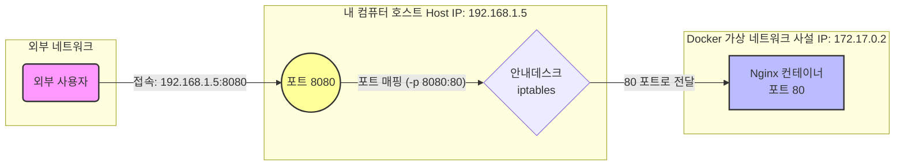
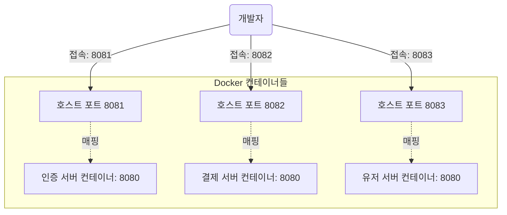
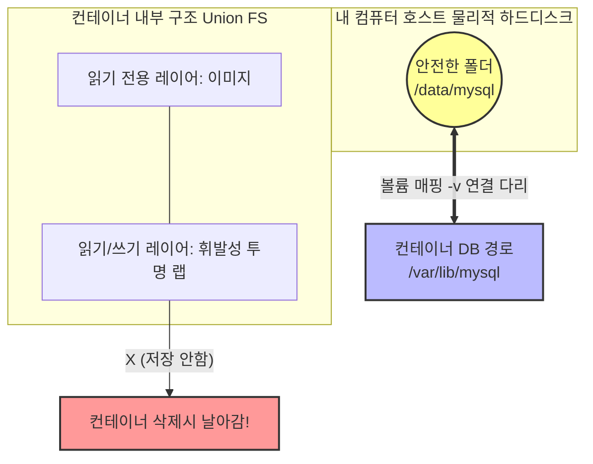

# Docker 완전 정복: 5-1강. 포트(Port)와 볼륨(Volume) 심층 탐구 및 실무 적용례 🔬

이전 시간에 비유를 통해 알아보았던 포트 매핑과 볼륨 매핑을, 이번에는 비유를 벗어나 **실제 IT 인프라와 네트워크 관점**에서 조금 더 기술적이고 깊이 있게 파헤쳐 보겠습니다. 또한 실무 현장에서는 이 기능들이 정확히 어떤 문제를 해결하기 위해 쓰이는지 구체적인 예시와 함께 알아봅시다.

---

## 1. 포트 매핑 심층 분석 (Port Mapping, `-p`)

### 🧠 시각적 원리 이해: "왜 굳이 포트를 연결해야 하나요?"

Docker를 실행하면 내 컴퓨터(Host) 내부에 진짜 컴퓨터와는 다른 **가상의 네트워크망(사설 IP, 예: 172.17.0.x)**이 생깁니다.
문제는 외부 인터넷에서는 이 가상의 네트워크망을 절대 볼 수 없다는 점입니다! 외부 사람은 오직 내 컴퓨터의 진짜 IP 주소만 알고 있습니다.

따라서 밖에서 들어온 트래픽을 컨테이너 내부로 배달해주는 '안내데스크(NAT)' 역할이 필요한데, 이것이 바로 **포트 매핑(`-p`)**입니다.

* `docker run -p 8080:80 nginx`의 진짜 의미:
  > **"내 컴퓨터의 8080번 문으로 들어오면, 172.17.0.2라는 가상 주소에 있는 컨테이너의 80번 문으로 보내줘!"**

### 🏢 실무 활용 예시: 마이크로서비스 충돌 방지
보통 여러 개의 서버(인증, 결제, 유저)를 띄우면 모두 기본 포트인 **8080**을 사용하려고 해서 충돌(에러)이 납니다. 하지만 Docker를 쓰면 컨테이너끼리 서로 방이 나뉘어 있어서 8080을 각각 써도 문제가 없습니다!

이처럼 외부 포트만 8081, 8082, 8083으로 나눠주면 **포트 충돌을 완벽하게 예방**할 수 있습니다.

---

## 2. 볼륨 매핑 심층 분석 (Volume Mapping, `-v`)

### 🧠 시각적 원리 이해: "데이터가 날아가는 것을 막아라!"

Docker 컨테이너는 양파처럼 겹겹이 쌓인 **레이어(Layer)** 구조로 되어 있습니다. 컨테이너가 켜지면 가장 맨 위에 얇은 **'읽기/쓰기 투명 랩(Layer)'**이 씌워지고, 파일 저장은 모두 이 투명 랩 위에 기록됩니다.
하지만 컨테이너를 삭제하면(`docker rm`), 이 투명 랩도 같이 버려집니다. 즉, 데이터가 통째로 날아갑니다!

이를 막기 위해 **컨테이너의 저장 공간에 내 컴퓨터의 튼튼한 하드디스크 폴더를 다이렉트로 연결(우회)**하는 것이 바로 볼륨 매핑입니다.

* `-v /data/mysql:/var/lib/mysql`의 진짜 의미:
  > **"컨테이너가 데이터를 저장하려고 할 때, 휘발성 랩에 쓰지 말고 내 진짜 컴퓨터의 `/data/mysql` 폴더에 몰래 저장해!"**

### 🏢 실무 활용 예시 1: 데이터베이스(DB) 무중단 버전 업데이트
MySQL 버전을 5.7에서 8.0으로 올려야 할 때, 일반 서버라면 밤을 새워야 합니다. 하지만 Docker 볼륨을 쓰면 1분 만에 끝납니다.

1. **기존 DB 운영:** `docker run -v /my_data:/var/lib/mysql mysql:5.7` (고객 데이터가 내 컴퓨터 `/my_data`에 차곡차곡 쌓임)
2. **컨테이너 과감히 삭제:** 5.7 컨테이너를 부숴도, 내 컴퓨터에 쌓인 데이터는 무사함!
3. **새 버전 DB 켜기:** `docker run -v /my_data:/var/lib/mysql mysql:8.0` (새 버전 엔진이 기존 데이터를 그대로 물고 켜짐!)

### 🏢 실무 활용 예시 2: 개발 코드 실시간 동기화 (Hot Reload)
개발할 때마다 코드를 고치고 컨테이너를 재시작한다면 너무 힘들겠죠?
`-v /내_컴퓨터_소스폴더:/app` 형태로 연결해 두면, 내 컴퓨터에서 VSCode로 코드를 저장하는 순간 **컨테이너 안의 파일도 0.1초 만에 같이 바뀝니다.** 컨테이너 안에서 서버가 변경을 감지하고 자동으로 새로고침 되므로, 개발 생산성이 압도적으로 높아집니다!
