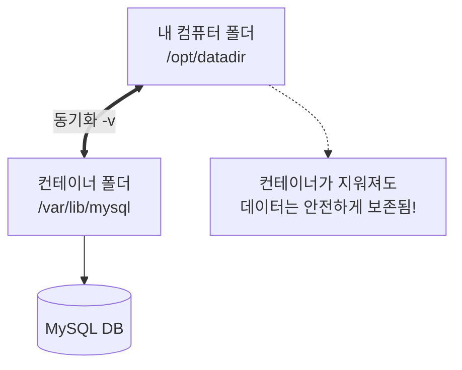

# Docker 완전 정복: 5강. Docker Run 심화 (태그, 포트, 볼륨, 로그) 🚀

지난 3강에서 우리는 `docker run -it`를 통해 컨테이너 내부로 직접 들어가 보았고, 4강에서는 `run -d`를 통해 백그라운드에서 컨테이너를 실행하는 실무 예시를 살펴보았습니다. 

이번 5강(강의의 3.1 파트)에서는 **`docker run` 명령어의 진정한 힘**을 깨우는 핵심 옵션들을 배웁니다. 특정 버전을 지정하는 방법부터, 외부에서 접속하기 위한 **포트 매핑**, 데이터를 안전하게 보관하는 **볼륨 매핑**까지, 실무에서 절대 빠질 수 없는 내용들을 알아봅시다!

---

## 1. 이미지 버전 고르기: 태그 (Tags) 🏷️

지금까지 우리는 `docker run redis` 처럼 이름만 적어서 실행했습니다. 이렇게 하면 Docker는 자동으로 가장 최신 버전인 **`latest`** 태그를 찾아 다운로드합니다. 
마치 서점에서 "해리포터 주세요" 하면 가장 최근에 나온 개정판을 주는 것과 같습니다.

하지만 실무에서는 "이전 버전(예: 4.0)에 맞춰서 개발해야 해!" 라는 상황이 자주 생깁니다. 이때 사용하는 것이 **콜론(`:`) 기호**입니다.

```bash
# Redis 4.0 버전을 콕 집어서 실행하고 싶을 때
docker run redis:4.0
```
> **꿀팁:** 어떤 버전들이 있는지 궁금하다면 [Docker Hub](https://hub.docker.com/) 홈페이지에 접속해서 소프트웨어 이름을 검색한 뒤, `Tags` 탭을 눌러보세요!

---

## 2. `-it` 옵션의 숨겨진 비밀 (입력과 프롬프트) ⌨️

우리는 이미 `-it` 옵션을 '컨테이너 내부로 들어가는 마법의 명령어'로 외웠습니다. 강사님은 이 두 알파벳이 각각 어떤 역할을 하는지 정확히 짚어줍니다.

* **`-i` (Interactive):** 호스트(내 컴퓨터)의 키보드 입력을 컨테이너의 표준 입력(Standard Input)으로 연결해 줍니다. 즉, **"내가 치는 글자를 컨테이너가 알아듣게 해줘!"** 입니다.
* **`-t` (TTY):** 가상 터미널(Pseudo Terminal)을 만들어 줍니다. 즉, **"터미널 화면(프롬프트)을 예쁘게 띄워줘!"** 입니다.

따라서 입력을 주고받으며 화면까지 제대로 보려면 이 둘을 합친 **`-it`** 가 반드시 필요합니다.

---

## 3. 포트 매핑 (Port Mapping, `-p`): 외부와 통신하기 🌐

컨테이너 안에서 멋진 웹사이트(포트 5000번)를 만들어서 띄웠다고 상상해 봅시다. 하지만 밖에서는 이 웹사이트에 접속할 수 없습니다. 컨테이너는 철저하게 격리된 '방'이기 때문입니다.

이를 해결하기 위해 **내 컴퓨터(호스트)의 특정 포트(문)로 들어오는 사람을 컨테이너의 특정 포트(문)로 안내(매핑)해 주는 작업**이 필요합니다.

### 🏨 포트 매핑 비유: 호텔 프론트 데스크
* **내 컴퓨터 (Docker 호스트):** 호텔 건물 전체 (IP: `192.168.1.5`)
* **내 컴퓨터의 80번 포트:** 호텔 1층 정문
* **컨테이너의 5000번 포트:** 5000호 객실 (웹 애플리케이션이 일하고 있는 곳)

손님(사용자)이 `192.168.1.5:80` (호텔 정문)으로 찾아오면, 프론트 데스크가 **"아, 80번 문으로 오셨군요? 5000호 객실로 안내해 드리겠습니다!"** 하고 연결해 주는 것이 바로 포트 매핑입니다.


```bash
# 내 컴퓨터의 80번 포트로 들어오면, 컨테이너의 5000번 포트로 연결해 줘!
docker run -p 80:5000 웹애플리케이션_이미지
```

---

## 4. 볼륨 매핑 (Volume Mapping, `-v`): 데이터 영구 저장 💾

컨테이너의 가장 큰 특징 중 하나는 **"삭제되면 안에 있던 모든 데이터도 함께 날아간다"**는 것입니다.
만약 MySQL 데이터베이스 컨테이너에 10년 치 회원 정보를 모아뒀는데, 누군가 `docker rm`으로 컨테이너를 지운다면? 생각만 해도 끔찍합니다.

그래서 컨테이너 내부의 데이터를 **내 컴퓨터(호스트)의 안전한 폴더에 실시간으로 복사(연결)**해두는 것이 **볼륨 매핑**입니다.

### 🔌 볼륨 매핑 비유: 외장 하드디스크 연결하기
컨테이너라는 컴퓨터를 쓰면서, 내 실제 컴퓨터의 폴더를 '외장 하드'처럼 꽂아두는 것과 같습니다. 컨테이너가 박살 나도 외장 하드는 내 컴퓨터에 안전하게 남아있습니다.



```bash
# 내 컴퓨터의 /opt/datadir 폴더를 컨테이너의 /var/lib/mysql 폴더와 연결해 줘!
docker run -v /opt/datadir:/var/lib/mysql mysql
```

---

## 5. 컨테이너 돋보기 & CCTV (`inspect` & `logs`) 🔍

마지막으로, 실행 중인 컨테이너의 상태를 점검할 때 사용하는 두 가지 필수 명령어입니다.

### 1) `docker inspect` (컨테이너 종합 건강 검진)
컨테이너의 이름, IP 주소, 마운트(볼륨) 상태, 네트워크 설정 등 **컨테이너의 모든 세부 정보**를 JSON(데이터 형식) 형태로 자세히 보고 싶을 때 사용합니다.
```bash
docker inspect 컨테이너이름_또는_ID
```

### 2) `docker logs` (컨테이너 CCTV)
`-d` 옵션을 주어 백그라운드에서 실행시킨 컨테이너는 화면에 아무것도 출력하지 않습니다. 컨테이너 안에서 무슨 일이 벌어지고 있는지(에러가 났는지, 접속자가 있는지) **기록(로그)**을 보고 싶을 때 사용합니다.
```bash
docker logs 컨테이너이름_또는_ID
```

---

## 🎯 학습 점검 및 마무리

오늘은 실무에서 절대 모르면 안 되는 가장 중요한 두 가지, **포트(네트워크)**와 **볼륨(데이터 저장)**의 개념을 다루었습니다.

* **점검 1:** `docker run -p 80:5000` 명령어에서 **앞의 80번**이 내 컴퓨터의 포트이고, **뒤의 5000번**이 컨테이너 내부의 포트라는 것이 호텔 비유를 통해 이해되셨나요?
* **점검 2:** 왜 데이터베이스 같은 컨테이너를 띄울 때는 반드시 `-v` 옵션(볼륨 매핑)을 써야 하는지(데이터 증발 방지) 와닿으시나요?

내용이 잘 이해되셨다면, 다음 단계로 가기 위한 완벽한 준비가 되신 겁니다!
정리가 되시면 **다음 데모 파트(3.2 Demo - Advanced Docker Run Features)** 스크립트를 남겨주세요. 직접 명령어를 쳐보며 배운 내용을 손에 익혀보겠습니다! 🚀
