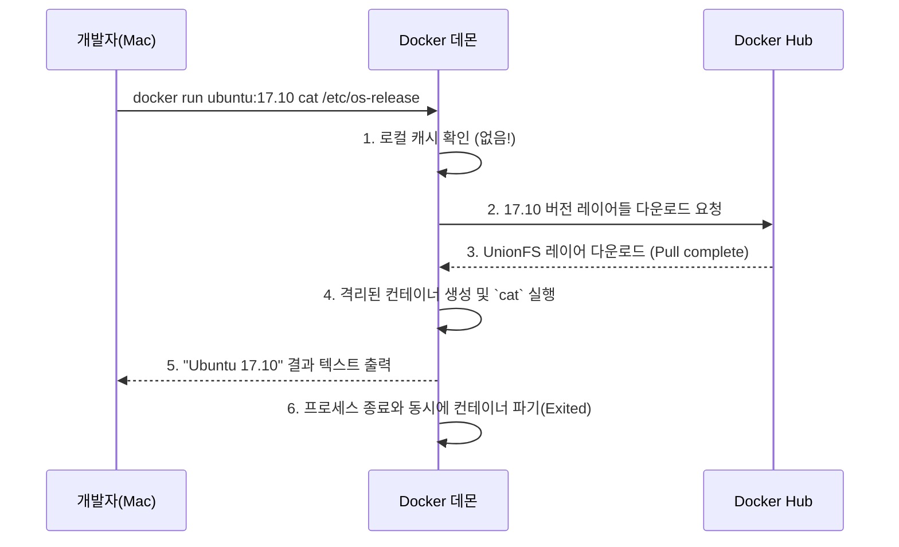
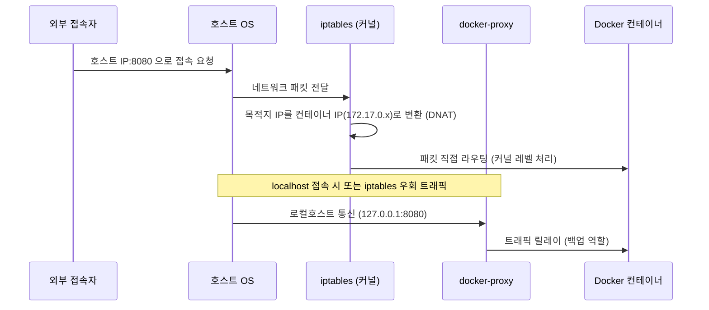
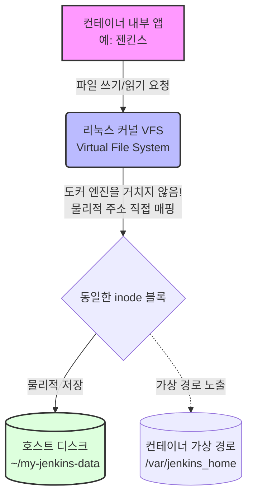
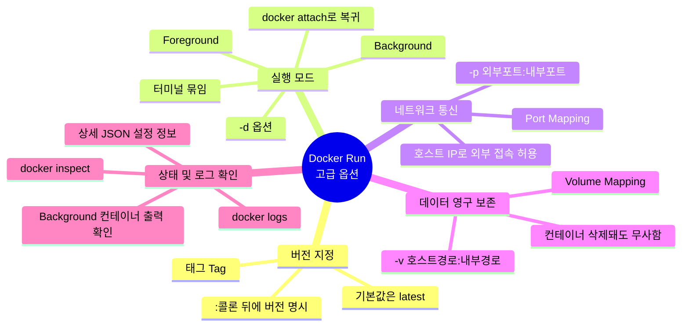

# Docker 완전 정복: 6강. 실전! 고급 Docker Run 기능 다루기 (Demo - Advanced Docker Run Features) 🚀

안녕하세요! 이전 파일에서 혼선이 있었던 점 사과드립니다. 새롭게 제공해주신 **[3.2 Demo - Advanced Docker Run Features]** 스크립트를 바탕으로 완벽하게 분석하고, 이해하기 쉽게 풀어드리겠습니다.

---

## 🔗 1. 지난 시간과의 연결고리 및 공통 비유 (큰 그림 그리기)

### 지난 시간에 배운 내용은?
우리는 지난 시간(5강 및 5-1강)에 **태그(Tag)**로 버전을 지정하는 법, **포트 매핑(`-p`)**으로 외부와 통신하는 법, **볼륨 매핑(`-v`)**으로 데이터를 영구 저장하는 법의 **"이론과 시각적 원리"**를 딥 다이브했습니다.

### 오늘 배울 내용은?
이번 6강은 바로 그 이론을 터미널에서 **100% 실전으로 증명하는 시간**입니다. 이론으로 배운 명령어들이 실제 화면에서 어떻게 작동하고 어떤 결과를 내뱉는지, **Jenkins(젠킨스)**라는 실제 서버 구축을 통해 뼈저리게 체험하게 됩니다.

### 🏢 하나의 공통 비유: "Docker 호스트 = 커다란 오피스 빌딩"
오늘의 모든 실습은 이 비유 하나로 관통됩니다.
* **Docker 호스트(내 컴퓨터):** 거대한 오피스 빌딩 🏢
* **Ubuntu, Jenkins 이미지:** 빌딩에 입주하려는 다양한 "회사들" 💼
* **`docker run` 명령어:** "이 회사, 우리 빌딩에 입주시켜!" 라는 서류 결재 📝
* **포트 매핑(`-p`):** 외부 손님이 1층 로비(호스트 8080포트)로 전화를 걸면, 해당 회사 사무실(컨테이너 8080포트)로 "내선 연결"을 해주는 작업 ☎️
* **볼륨 매핑(`-v`):** 회사가 망해서 방을 빼더라도(컨테이너 삭제), 중요한 서류는 "빌딩 외부 공용 창고"에 보관하도록 연결해두는 작업 🗄️

자, 이제 이 빌딩을 직접 관리하는 건물주가 되어 실습을 시작하겠습니다!

---

## 💻 2. 실습 1: 태그(Tag) 활용 및 일회성 명령어 실행

가장 먼저, 단순히 빈 Ubuntu 컨테이너를 띄우는 것을 넘어, 컨테이너를 띄움과 동시에 특정한 일을 시키고 바로 빠져나오는 방법을 알아봅니다.

### 📝 실습 목표: Ubuntu 17.10 버전을 띄우고, OS 버전만 확인한 뒤 바로 종료하기

```bash
# 맥(Mac) 환경에서는 '*' 해석 문제로 정확한 파일명인 os-release를 사용합니다.
docker run ubuntu:17.10 cat /etc/os-release
```

**✅ 실제 터미널 출력 결과 분석 (Deep Dive)**

명령어를 실행하면 터미널에 아래와 같은 과정이 촤르륵 출력됩니다. 이 출력 로그를 **전공자 수준의 실무적 관점**에서 한 줄 한 줄 뜯어보겠습니다.

```text
Unable to find image 'ubuntu:17.10' locally
17.10: Pulling from library/ubuntu
092cea5a3bf3: Pull complete 
... (중략) ...
Digest: sha256:3b811ac794645dfaa47408f4333ac6e433858ff16908965c68f63d5d315acf94
Status: Downloaded newer image for ubuntu:17.10
NAME="Ubuntu"
VERSION="17.10 (Artful Aardvark)"
... (중략) ...
```

**💡 출력 로그 상세 해설 및 아키텍처 이해:**

1. **`Unable to find image 'ubuntu:17.10' locally` (로컬 캐시 확인)**
   * **설명:** 도커 데몬이 가장 먼저 내 컴퓨터(맥북)의 하드디스크에 해당 버전의 이미지가 있는지 뒤져봅니다. 없으니까 밖으로 가지러 가겠다는 선언입니다. 실무에서 빠른 배포를 위해 도커가 **로컬 캐시를 최우선으로 활용**한다는 증거입니다.
2. **`Pulling from library/ubuntu` & `Pull complete` (레이어 다운로드와 UnionFS)**
   * **설명:** 단순히 통짜 파일 1개를 다운받는 게 아니라, 5~6개의 해시값(예: `092cea...`)을 가진 줄이 내려옵니다. 도커는 이미지를 통째로 만들지 않고 양파 껍질처럼 겹겹이 쌓인 **레이어(Layer) 구조**로 만듭니다. 이를 리눅스의 **Union File System (UnionFS)** 기술이라고 합니다. 겹치는 레이어는 재사용하고 필요한 껍질만 다운받아 용량과 시간을 획기적으로 줄이는 도커의 핵심 기술입니다.
3. **`NAME="Ubuntu"` ... `VERSION="17.10"` (명령어 실행 및 격리 증명)**
   * **설명:** 다운로드가 끝나자마자 도커는 17.10 컨테이너를 띄우고 그 안에서 `cat /etc/os-release` 명령을 실행합니다. 이 출력 결과는 **내 맥북의 OS 정보가 아니라, 완벽히 격리된(Isolated) 우분투 17.10 환경 안에서 실행된 결과**입니다. 이것이 바로 도커가 가상머신(VM)처럼 동작하면서도 훨씬 가볍게 격리 공간을 만들어낸다는 명백한 증거입니다.
4. **명령어 종료 직후 다시 `~ %` 프롬프트로 복귀 (일회성 컨테이너의 라이프사이클)**
   * **설명:** 우분투 OS를 켰는데 로그인 화면도 없이 버전만 찍고 바로 터미널 제어권이 나에게 돌아왔습니다. 컨테이너는 운영체제가 아니라 **"주어진 프로세스(여기선 `cat`)가 끝나면 스스로 숨을 거두는 일회용 캡슐"**입니다. 할 일이 끝나면 미련 없이 메모리에서 사라집니다.

**결과 흐름도:**

이처럼 단순한 명령어 한 줄과 몇 줄의 로그 안에는 도커의 3대 핵심 아키텍처인 **캐싱, 레이어(UnionFS), 프로세스 격리**가 모두 녹아 있습니다.

---

## 💻 3. 실습 2: 포어그라운드(Attach) vs 백그라운드(Detach) 모드

프로그램을 실행할 때 내 터미널(화면)을 그 프로그램에게 완전히 뺏기느냐, 아니면 뒤에서 조용히 일하게 두느냐의 차이입니다.

### 📝 실습 2-1: 터미널 뺏기기 (Foreground)
```bash
docker run ubuntu sleep 15
```
**✅ 실제 터미널 출력 결과 분석**
```text
^C^C^C
got 3 SIGTERM/SIGINTs, forcefully exiting
```
* **의미:** `sleep 15` (15초 대기) 명령을 내립니다. 옵션 없이 실행했기 때문에 **포어그라운드(Foreground)**로 실행됩니다.
* **현상 및 딥 다이브:** 터미널에 아무것도 칠 수 없게 커서가 멈춥니다(묶임). 이때 참지 못하고 강제 종료 단축키인 `Ctrl + C`(`^C`)를 3번 연타했더니, 도커가 이를 감지하고 프로세스에 종료 시그널(SIGINT)을 보내어 강제 종료하며 빠져나왔습니다. 만약 실무에서 웹 서버를 이렇게 띄웠다면 끄기 전까지 터미널 창 하나를 아예 버려야 합니다.

### 📝 실습 2-2: 뒤에서 일하게 만들기 (Background / Detached, `-d`)
```bash
docker run -d ubuntu sleep 1500
```
**✅ 실제 터미널 출력 결과 분석**
```text
ed9561dbef6b6b0c85e97188aa134621bb38f64a8c6c15342915623b158dbaad
```
* **의미:** `-d` (Detached) 옵션을 추가하여 "뒤에서 알아서 1500초 동안 돌고 있어라"고 명령했습니다.
* **현상 및 딥 다이브:** 실행되자마자 컨테이너가 백그라운드로 넘어가면서 위와 같은 **64자리의 고유 컨테이너 ID 전체(Full ID)**를 뱉어내고 터미널 프롬프트(`~ %`)를 즉시 돌려줍니다. 터미널의 자유를 되찾았습니다!

### 📝 `docker ps` 로 백그라운드 멀티태스킹 확인하기
```bash
docker ps
```
**✅ 실제 터미널 출력 결과 분석**
```text
CONTAINER ID   IMAGE                             COMMAND                   ...
ed9561dbef6b   ubuntu                            "sleep 1500"              ...
e1599f10fc82   grafana/tempo:latest              "/tempo -config.file…"   ...
0ee90bf3ee8d   grafana/grafana:11.2.0            "/run.sh"                 ...
... (prometheus, redis, mysql 등) ...
```
* **현상 및 딥 다이브:** 방금 띄운 `ed9561dbef6b`(64자리 ID의 앞 12자리) 컨테이너가 정상적으로 돌고 있습니다. 
더 놀라운 점은 회원님의 로컬 컴퓨터에 이미 **Grafana, Prometheus, Redis, MySQL 등 거대한 아키텍처 서버들이 동시에 백그라운드로 돌아가고 있다는 점**입니다! 
만약 `-d` 옵션 없이 이 서버들을 띄우려 했다면 터미널 창을 6~7개나 열어놓고 방치해야 했을 것입니다. 이처럼 `-d` 옵션은 단 하나의 터미널 창에서 거대한 인프라 전체를 띄우고 지휘(Orchestration)할 수 있게 해주는 실무 필수 옵션입니다.

### 📝 실습 2-3: 다시 컨테이너 화면으로 들어가기 (`attach`)
뒤에서 돌고 있는 녀석의 화면을 다시 내 터미널로 끌고 오고 싶다면 어떻게 할까요?
```bash
# 1. docker ps 로 ID 확인 (예: 3a8)
docker attach 3a8
```
* **의미:** 뒤에서 돌고 있는 `3a8` 컨테이너의 화면(표준 출력/입력)을 현재 터미널에 찰싹(attach) 붙입니다. 다시 터미널이 묶이게 됩니다.

---

## 💻 4. 실습 3: 실전 Jenkins 서버 구축 (포트와 볼륨의 콜라보레이션)

오늘의 하이라이트입니다. 이 과정을 완벽히 이해하면 실무에서 어떤 서버든 띄울 수 있습니다.
Jenkins(젠킨스)는 개발자가 코드를 짜면 자동으로 테스트하고 서버에 배포해 주는 유명한 'CI/CD 자동화 서버'입니다.

### ❌ 1차 시도: 무작정 띄우기
```bash
# 과거(영상)의 명령어: docker run -d jenkins
# 현재 올바른 명령어:
docker run -d jenkins/jenkins:lts
```
**✅ 터미널 에러 분석 (Image Not Found의 비밀)**
```text
docker: Error response from daemon: failed to resolve reference "docker.io/library/jenkins:latest": docker.io/library/jenkins:latest: not found
```
* **현상 및 딥 다이브 (이미지 Deprecated):** 영상에서는 `jenkins` 라고만 쳤지만, 회원님의 컴퓨터에서는 에러가 납니다! 이는 도커 허브 생태계의 변화 때문입니다. 옛날에는 도커 공식 저장소(`library/jenkins`)에서 관리했지만, 현재는 젠킨스 공식 팀이 직접 관리하는 **`jenkins/jenkins`** 저장소로 통째로 이관되었습니다.
* **전공자 실무 팁:** 실무에서는 유지보수가 중단된(Deprecated) 옛날 이름(`jenkins`)을 쓰지 않습니다. 항상 보안 패치가 제공되는 젠킨스 팀 공식 이미지의 안정 버전인 **`jenkins/jenkins:lts` (Long Term Support)**를 사용하는 것이 인프라 안정성의 핵심입니다.

* Jenkins가 뒤에서 켜졌습니다. `docker ps`로 확인해 보니 `f011de23380b`라는 ID로 8080 포트에서 대기 중인 것을 알 수 있습니다.
* **문제:** 웹 브라우저 주소창에 내 컴퓨터 IP인 `http://192.168.1.14:8080`을 치고 들어가려 하지만 **접속이 안 됩니다!** (내선 전화 연결인 포트 매핑을 안 해줬기 때문입니다.)

**✅ 실제 터미널 출력 결과 분석 (`docker stop` 오류와 `docker inspect`)**
```text
shinwookkang@... ~ % docker stop
docker: 'docker stop' requires at least 1 argument

shinwookkang@... ~ % docker inspect f011de23380b
[
    {
        "Id": "f011de23380be4...",
... (중략) ...
        "NetworkSettings": {
            "Networks": {
                "bridge": {
                    "IPAddress": "172.17.0.3",
... (중략) ...
]
```
* **현상 및 딥 다이브 (`docker stop` 에러):** 컨테이너를 끄기 위해 무작정 `docker stop`을 쳤더니 "최소 1개의 아규먼트(Argument)가 필요하다"고 에러를 뱉습니다. 회원님의 컴퓨터에는 지금 젠킨스, 그라파나, 레디스 등 수많은 컨테이너가 돌고 있기 때문에, 도커 데몬 입장에서는 "도대체 누구를 꺼야 하는지 ID나 이름을 명확히 명시해 달라!"는 뜻입니다. 올바른 명령어는 `docker stop f011de23380b` 가 되어야 합니다.
* **현상 및 딥 다이브 (`docker inspect` 와 컨테이너 IP):** 도커 데몬에게 특정 컨테이너(`f011de...`)의 영혼(메타데이터)까지 전부 털어서 JSON 형태로 보여달라고 하는 명령어가 `docker inspect` 입니다. 
출력된 거대한 JSON 덩어리의 맨 아랫부분 `NetworkSettings` -> `IPAddress` 항목을 보면 **`"172.17.0.3"`** 이라는 값이 찍혀 있습니다. 
이는 도커 엔진이 젠킨스에게 몰래 부여해 준 도커 내부 사설 IP입니다. 내 컴퓨터 웹 브라우저에서 이 사설 IP(`172.17.0.3:8080`)를 치고 들어가면 젠킨스가 뜨긴 뜹니다. 하지만 이는 내 컴퓨터 안에서만 통하는 '꼼수 접속'이므로, 실무에서 외부 손님들이 들어오게 하려면 반드시 다음 시도처럼 **포트 매핑(`-p`)**을 적용해야 합니다.

### ❌ 2차 시도: 포트 매핑(`-p`) 적용하기와 충돌 에러 (Port Already in Use)
기존 젠킨스를 `docker stop`으로 끄고, 당당하게 포트 매핑 명령어를 쳤습니다.
```bash
docker run -d -p 8080:8080 jenkins/jenkins:lts
```
**✅ 실제 터미널 출력 결과 분석 (포트 충돌 에러)**
```text
docker: Error response from daemon: ports are not available: exposing port TCP 0.0.0.0:8080 -> 127.0.0.1:0: listen tcp 0.0.0.0:8080: bind: address already in use
```
* **현상 및 딥 다이브 (포트 충돌):** 와우! 문서 맨 아래에 있는 '점검 문제 2'의 상황을 실전에서 정확히 마주하셨습니다. 도커가 "너의 맥북(호스트) 8080 포트는 이미 누군가가 쓰고 있어서 내가 차지할 수 없다(`bind: address already in use`)"며 에러를 뱉어냈습니다. 
* **해결책:** 회원님의 맥북에 이미 8080 포트를 쓰는 다른 프로그램이나 서비스가 켜져 있는 상태입니다. 젠킨스 컨테이너 내부의 고정 포트(오른쪽 `8080`)는 바꿀 필요가 없지만, 맥북의 대문(왼쪽 `8080`)은 비어있는 다른 포트(예: `8088` 또는 `8888`)로 바꿔주어야 합니다.

### ✅ 3차 시도: 포트 매핑 충돌 해결하여 띄우기
포트를 `8088:8080`으로 바꿔서 다시 실행합니다.
```bash
docker run -d -p 8088:8080 jenkins/jenkins:lts
```
* **의미:** 외부에서 내 컴퓨터의 `8088`번 문으로 들어오면, 컨테이너 내부의 `8080`(젠킨스)으로 내선 연결을 해라!
* **결과:** 정상적으로 긴 ID가 출력되며 젠킨스가 실행됩니다. 이제 브라우저에서 `http://localhost:8088` 로 접속하면 드디어 젠킨스의 환영 화면이 나타납니다!

### 🔐 3-1: 젠킨스 첫 접속 및 비밀번호 잠금 해제 (Unlock Jenkins)
브라우저에 접속하면 아래와 같은 젠킨스 잠금 해제 화면(Unlock Jenkins)이 뜹니다.


화면을 보면 **"Administrator password"**를 입력하라고 나오며, 비밀번호가 컨테이너 내부의 `/var/jenkins_home/secrets/initialAdminPassword` 경로에 있다고 친절하게 알려줍니다. 우리는 도커를 다루고 있으므로 이 파일의 내용을 확인하는 **두 가지 전문적인 방법**이 있습니다.

**방법 1: 컨테이너 로그 뒤져보기 (`docker logs`)**
젠킨스는 처음 켜질 때 이 비밀번호를 로그로 친절하게 뱉어냅니다. 터미널에 아래와 같이 쳐보세요.
```bash
# 앞서 얻은 컨테이너 ID 앞부분을 사용합니다.
docker logs 71108ee
```
* **현상:** 주르륵 올라가는 로그 중간에 `****************` 별표 모양 사이로 길고 복잡한 영문+숫자 비밀번호가 출력되어 있습니다. 이를 복사해서 브라우저에 붙여넣으세요.

**방법 2: 컨테이너 내부로 침투해서 파일 읽어오기 (`docker exec`)**
로그가 너무 길어서 찾기 귀찮다면, 컨테이너 안으로 명령을 밀어넣어서 직접 저 파일만 읽어올 수 있습니다.
```bash
docker exec 71108ee cat /var/jenkins_home/secrets/initialAdminPassword
```
* **현상:** 비밀번호 문자열 딱 하나만 터미널에 깔끔하게 출력됩니다. 이 방법이 실무에서 훨씬 더 빠르고 정확합니다! (복사 후 브라우저에 붙여넣기 ➡️ Continue 클릭 ➡️ Install suggested plugins 클릭)

### 🚨 4차 시도: 데이터 날아감(휘발성)의 공포 경험하기
신나게 젠킨스 화면에 접속해서 "TestJob"이라는 작업을 만들고 비밀번호도 설정했습니다.
그리고 터미널로 돌아가 컨테이너를 끄고(`docker stop`) 지운 뒤 다시 똑같은 명령어로 켭니다.
* **결과:** 브라우저를 새로고침하면? **모든 설정과 "TestJob"이 다 날아가고 처음의 초기화 화면이 다시 나옵니다.** (컨테이너가 지워지면서 데이터 레이어가 같이 폭파되었기 때문입니다.)

### 🚀 5차 시도: 볼륨 매핑(`-v`)으로 영원불멸의 데이터 만들기
이 무서운 데이터 증발 사태를 막기 위해 내 컴퓨터 물리 하드디스크의 특정 폴더를 젠킨스에게 물려줍니다.
*(참고: 젠킨스는 내부적으로 `/var/jenkins_home` 이라는 곳에 모든 데이터를 저장합니다.)*

#### ❌ 5-1: 맥(Mac) 환경에서의 볼륨 마운트 권한 에러 (Mounts Denied)
영상처럼 아무 생각 없이 `/root/my-jenkins-data` 경로를 사용해서 실행해 봅니다.
```bash
docker run -d -p 8088:8080 -v /root/my-jenkins-data:/var/jenkins_home -u root jenkins/jenkins:lts
```
**✅ 터미널 에러 분석**
```text
docker: Error response from daemon: mounts denied: 
The path /root/my-jenkins-data is not shared from the host and is not known to Docker.
```
* **현상 및 딥 다이브 (Mac OS 파일 공유 제한):** 도커 데몬이 마운트(연결)를 거부(denied)했습니다. Mac 환경의 Docker Desktop은 보안상의 이유로 `/Users`, `/tmp` 등 특정 폴더만 컨테이너와 공유하도록 허락하고 있습니다. `/root` 폴더는 Mac 시스템의 최상위 보안 영역이므로 도커가 접근할 수 없습니다.

#### ✅ 5-2: 올바른 경로(`~`)로 볼륨 매핑 다시 시도하기
`/root` 대신 내 사용자 홈 디렉토리(`~` = `/Users/shinwookkang`) 아래에 폴더를 만들도록 명령어를 수정합니다.
```bash
docker run -d -p 8088:8080 -v ~/my-jenkins-data:/var/jenkins_home -u root jenkins/jenkins:lts
```
* **의미:** 내 컴퓨터의 바탕화면 상위 폴더인 내 홈 디렉토리 밑에 `my-jenkins-data` 폴더(`~/my-jenkins-data`)를 만들고, 거기를 컨테이너의 `/var/jenkins_home` 자리에 그대로 덮어씌워라! (권한 문제 방지를 위해 `-u root` 옵션 추가)

#### 🧪 5-3: 볼륨 매핑의 기적 증명하기 (컨테이너 파괴 및 복구 테스트)
위 명령어로 젠킨스를 띄운 뒤 브라우저에서 설정을 마치고 "TestJob"이라는 작업을 하나 만듭니다. 그 다음, 터미널에서 아래 명령어를 차례대로 입력하여 **컨테이너를 가차 없이 파괴하고 다시 부활**시켜 봅니다.

```bash
# 1. 돌아가고 있는 젠킨스 컨테이너 ID 확인
docker ps

# 2. 컨테이너를 정지(stop)할 새도 없이 곧바로 강제 파괴 (Force Remove)
docker rm -f [방금 확인한 젠킨스 컨테이너 ID]

# 3. 컨테이너가 완전히 삭제되었는지 확인 (목록에 없어야 정상)
docker ps

# 4. 아까와 100% 동일한 볼륨 매핑 명령어로 새 젠킨스 컨테이너 띄우기 (부활)
docker run -d -p 8088:8080 -v ~/my-jenkins-data:/var/jenkins_home -u root jenkins/jenkins:lts
```

* **결과:** 기존 컨테이너를 흔적도 없이 날려버렸음에도 불구하고, 다시 브라우저(`http://localhost:8088`)에 접속해보면 **초기화 화면이 뜨지 않고 이전에 만들었던 "TestJob"이 완벽하게 보존되어 있습니다!** 
* **딥 다이브:** 컨테이너(건물 안 사무실)는 폭파되었지만, 젠킨스의 모든 핵심 데이터는 내 맥북의 `~/my-jenkins-data` 폴더(안전한 외부 공용 창고)에 실시간으로 기록되고 있었기 때문입니다. 새로운 컨테이너가 뜰 때 이 창고를 다시 연결해주기만 하면 완벽하게 데이터가 복구되는 것이 **볼륨 매핑(`-v`)의 가장 중요한 존재 이유**입니다.

---

## 🔬 5. 전공자 / 전문가 수준의 딥 다이브 (Deep Dive)

자, 이제 면접이나 실무 인프라 설계에서 "아, 이 사람 도커 진짜 깊이 아네?" 라는 소리를 들을 수 있도록 내부 아키텍처를 파헤쳐 보겠습니다.

### 💡 5.1 포트 매핑(`-p`)의 실제 동작 원리 (iptables 와 docker-proxy)
`-p 8080:8080` 옵션을 사용했을 때, 도커는 단순히 포트를 열어주는 것이 아니라 리눅스 운영체제의 네트워크 제어 기능을 활용하여 트래픽 방향을 전환합니다. 여기에는 두 가지 기술이 사용됩니다.

1. **iptables의 DNAT (Destination NAT)**
   * 도커는 호스트(내 컴퓨터) 리눅스의 커널 방화벽인 `iptables`에 새로운 라우팅 규칙을 자동으로 추가합니다.
   * 외부 네트워크에서 호스트의 `8080` 포트로 트래픽이 들어오면, 커널이 이 패킷의 목적지 주소를 컨테이너가 가진 내부 사설 IP(예: `172.17.0.x:8080`)로 강제로 변환(DNAT)하여 전달합니다. 
   * 이 과정은 운영체제의 커널 레벨에서 처리되므로 네트워크 속도 저하가 거의 없습니다.

2. **docker-proxy 프로세스**
   * `iptables` 규칙 외에도, 도커는 호스트 운영체제에 `docker-proxy`라는 실제 백그라운드 프로세스를 띄워 `8080` 포트를 대기 상태(Listen)로 점유합니다.
   * 이는 외부망이 아닌 호스트 내부망(localhost)에서 접근할 때 `iptables`를 거치지 않는 트래픽을 처리하거나, 커널 라우팅이 실패할 경우를 대비한 2차 백업 라우터 역할을 합니다.



### 💡 5.2 볼륨 매핑(Bind Mount)의 스토리지 아키텍처 (VFS와 inode 우회)
`-v ~/data:/var/jenkins_home` 옵션을 사용하면 데이터가 영구 보존되는 것을 넘어, **성능 저하가 전혀 발생하지 않는다**는 것이 핵심 기술입니다. 이를 리눅스에서는 **Bind Mount**라고 부릅니다.

1. **도커 데몬을 거치지 않는 직접 쓰기**
   * 볼륨 매핑은 도커 프로세스가 중간에서 파일을 일일이 복사하거나 옮겨주는 동기화 방식이 아닙니다.
   * 컨테이너 내부의 애플리케이션(예: Jenkins)이 파일을 저장(`write()`)하려고 하면, 리눅스 커널의 VFS(Virtual File System) 계층이 이를 즉시 가로챕니다.

2. **inode 공유로 인한 I/O 오버헤드 Zero**
   * VFS는 컨테이너 내부의 `/var/jenkins_home` 가상 경로가 호스트의 `~/data` 경로와 완벽하게 동일한 디스크 물리적 주소(`inode`)를 가리키도록 연결해 둡니다.
   * 결과적으로 컨테이너 안에서 파일을 쓰면, 도커를 거치는 연산(오버헤드) 없이 호스트의 물리 디스크에 다이렉트로 데이터가 기록됩니다. 따라서 데이터베이스(MySQL, Redis 등)를 컨테이너 안에서 실행해도 디스크 읽기/쓰기 속도가 전혀 느려지지 않습니다.



---

## 🏢 6. 실무 환경에서의 활용 및 추후 학습 연결

### 1) 이 기술들이 실무에서 어떻게 쓰이는가?
* 실무에서는 서버가 한 대가 아닙니다. DB 서버, 캐시 서버, API 서버 등 수십 개를 띄웁니다.
* 개발자들은 더 이상 `sudo apt-get install java`를 하지 않습니다. 오직 `docker run` 하나로 개발 환경을 통일시킵니다. "내 컴퓨터에선 되는데 네 컴퓨터에선 왜 안돼?" 라는 고질적인 문제가 사라집니다.

```mermaid
graph TD
    subgraph 과거의 고통 (Before Docker)
        devA((개발자 A<br/>Mac)) -->|Java 8 설치<br/>설정 다름| error1[개발자 A 컴에선 됨]
        devB((개발자 B<br/>Windows)) -->|Java 11 설치<br/>환경변수 꼬임| error2[실행 에러!]
        Server((운영 서버<br/>Linux)) -->|의존성 부족| error3[배포 실패!]
        error1 -.->|"내 자리에선 되는데?"| error2
    end

    subgraph 도커 도입 후 (After Docker)
        devC((개발자 C<br/>Mac)) -->|docker run| Container[동일한 Docker Image<br/>OS, 의존성, 환경 완벽 일치]
        devD((개발자 D<br/>Windows)) -->|docker run| Container
        Server2((운영 서버<br/>Linux)) -->|docker run| Container
        Container --> Success{어디서든 100%<br/>동일하게 동작!}
    end
    
    style error1 fill:#ffcccc,stroke:#ff0000
    style error2 fill:#ffcccc,stroke:#ff0000
    style error3 fill:#ffcccc,stroke:#ff0000
    style Success fill:#ccffcc,stroke:#00aa00,stroke-width:2px
```

### 2) 현재 방식의 한계와 미래 (Docker Compose의 등장 예고)
* 명령어 한 줄이 너무 깁니다. `docker run -d -p 8080:8080 -v ... -e MYSQL_ROOT_PASSWORD=... mysql:8.0` 등 옵션이 수십 개가 붙습니다.
* 이걸 사람이 매번 치는 것은 오타의 위험이 큽니다.
* **추후 학습 연결:** 그래서 이 길고 복잡한 명령어들을 하나의 텍스트 문서(`YAML` 파일)에 예쁘게 적어두고 명령어 한방(`docker-compose up`)에 수십 개의 컨테이너를 한꺼번에 띄우는 **Docker Compose (도커 컴포즈)** 기술을 나중에 배우게 될 것입니다. 오늘 배운 `-p`와 `-v`는 컴포즈 파일에서 `ports:`, `volumes:` 라는 키워드로 100% 동일하게 재사용됩니다.

---

## ✅ 7. 실용적인 이해도 점검 및 모범 답안

암기식 문제 대신, 실제 실무에서 겪을 법한 시나리오로 점검해 보겠습니다. 스스로 답변을 생각해보신 후 모범 답안을 확인해 보세요.

**❓ 점검 문제 1:**
신입 개발자가 웹 서버를 띄우겠다며 터미널에 `docker run ubuntu:20.04 sleep 1000`을 입력하고 엔터를 쳤습니다. 그러더니 "선배님! 터미널이 먹통이 돼서 다른 명령어를 칠 수가 없습니다!" 라며 당황해합니다. 선배로서 이 신입에게 **어떤 옵션**을 빼먹었는지, 그리고 **지금 당장 해결할 방법 두 가지**를 어떻게 조언해 주시겠습니까?

<details>
<summary>💡 모범 답안 및 보충 설명 (클릭해서 확인)</summary>

**모범 답안:**
1. "너 뒤에서 조용히 실행하게 하는 백그라운드 옵션인 **`-d` (Detached)** 를 빼먹었구나."
2. "해결 방법은 두 가지야. 
   첫 번째, 지금 그 터미널은 포기하고 **새로운 터미널 창을 열어서** `docker ps`로 ID를 찾은 다음 `docker stop [ID]` 로 끄면 풀려.
   두 번째, 그냥 터미널에서 **Ctrl + C** 를 눌러서 프로세스를 강제 종료(Kill)하고 빠져나오렴."

**보충 설명:** `-d` 옵션을 주지 않으면 포어그라운드(Foreground)로 묶입니다. 실무에서 데몬(서버) 역할을 하는 컨테이너를 띄울 때는 무조건 `-d`를 습관화해야 합니다.
</details>

<br>

**❓ 점검 문제 2:**
로컬 개발 환경에서 프로젝트 A를 위한 젠킨스를 `docker run -d -p 8080:8080 jenkins/jenkins:lts` 로 잘 쓰고 있었습니다. 그런데 오늘 프로젝트 B를 위한 별도의 젠킨스 컨테이너를 하나 더 띄워야 합니다. 터미널에 똑같이 `docker run -d -p 8080:8080 jenkins/jenkins:lts` 를 쳤더니 "포트 충돌(Port already allocated)" 에러가 났습니다. 기존 프로젝트 A 젠킨스도 끄면 안 되는 상황에서, **프로젝트 B 젠킨스를 어떻게 띄워야 외부에서 접속할 수 있을까요?**

<details>
<summary>💡 모범 답안 및 보충 설명 (클릭해서 확인)</summary>

**모범 답안:**
"명령어의 포트 매핑 부분을 `-p 8081:8080` (또는 9000 등 비어있는 포트) 으로 수정해서 실행하면 됩니다."

**보충 설명:** 컨테이너 내부의 8080 포트는 격리된 공간이므로 상관없지만, 내 컴퓨터(호스트)의 8080번 문은 이미 프로젝트 A가 차지하고 있습니다. 따라서 내 컴퓨터의 8081번 문을 프로젝트 B 컨테이너의 8080으로 연결해주면 두 개의 젠킨스를 동시에 완벽하게 돌릴 수 있습니다.
</details>

---

## 🌟 8. 최종 요약 및 마인드맵 정리

오늘 다룬 고급 Docker Run 옵션들의 핵심 요약입니다.



오늘의 실습을 통해 "컨테이너를 내 마음대로 요리조리 다루는 법"을 마스터하셨습니다.
점검 문제까지 모두 이해하셨다면 피드백을 남겨주시거나, 이와 관련하여 더 깊이 알고 싶은 부분(예: "리눅스 VFS 원리가 더 궁금해요!")이 있다면 편하게 질문해 주세요. 

준비되셨다면 다음 단계 스크립트로 넘어가 보겠습니다! 🚀
