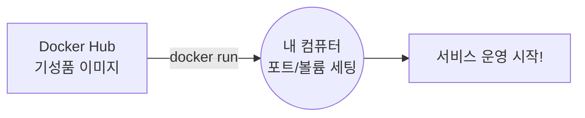

# Docker 완전 정복: Chapter 4. Docker Images (4-1. Docker Images) 🚀

안녕하세요! 드디어 도커의 진정한 꽃이라고 할 수 있는 **"나만의 도커 이미지 만들기(Dockerfile)"** 챕터에 진입하셨습니다. 이번 시간에는 왜 우리가 이미지를 직접 만들어야 하는지, 그리고 그 내부는 어떤 혁신적인 구조로 이루어져 있는지 낱낱이 파헤쳐 보겠습니다.

---

## 1. 지난 시간과의 연결고리 및 큰 그림 그리기

### 🏭 실무적 관점: 기성품 운영에서 "자체 서비스 컨테이너화"로의 확장
이전 챕터(Chapter 3)에서는 Docker Hub에 퍼블릭하게 공개되어 있는 '기성품 이미지(Ubuntu, Jenkins 등)'를 가져와서 내 컴퓨터에 띄우는 **"인프라 운영"** 관점을 배웠습니다.
* **[요약 복습]** `docker run -d -p 8088:8080 -v ~/data:/var/jenkins_home jenkins/jenkins:lts`



하지만 실무 환경에서는 남이 만든 서비스만 돌리지 않습니다. 우리 회사의 개발자들이 직접 짠 애플리케이션 코드(예: Python 웹 서버, Spring Boot API 서버 등)를 서버에 배포해야 합니다. 
단순히 소스코드를 압축해서 서버에 올리는 방식은 환경 불일치(버전 충돌, OS 차이) 문제를 낳습니다. 따라서 우리 회사의 애플리케이션 자체가 하나의 독립적인 도커 이미지로 동작할 수 있도록 **"자체 서비스를 컨테이너화(Containerization)"** 해야 합니다. 
이때 전체 과정을 **"붕어빵 만들기"**에 비유하면 아주 쉽습니다.
1. **`Dockerfile` (설계도):** 우리 앱이 돌아가기 위한 OS, 라이브러리, 소스코드 세팅 방식을 코드로 명확하게 적어둔 "도면"입니다.
2. **`docker build` (무쇠 틀 제작):** 이 설계도(Dockerfile)를 도커 엔진에게 주면, 도커가 도면을 읽고 쾅쾅 망치질을 해서 영원히 변하지 않는 "단단한 무쇠 붕어빵 틀(Docker Image)"을 만들어냅니다. (이 틀은 일단 내 컴퓨터 하드디스크에 저장됩니다.)
3. **`docker run` (붕어빵 굽기):** 만들어진 무쇠 틀(Image)에 밀가루를 붓고 구워내어, 실제로 숨쉬고 동작하는 붕어빵(Container)을 만들어냅니다.

---

## 2. 수동 설치의 고통과 Dockerfile의 탄생

만약 내가 만든 Python Flask 웹앱을 리눅스 서버에 배포한다고 상상해 봅시다.
수동으로 한다면 터미널에 접속해서 다음 5단계를 거쳐야 합니다.
1. **`apt-get update`**: 리눅스 패키지 매니저의 최신 목록을 가져옵니다. (안전하고 최신 버전의 패키지를 다운받기 위한 필수 준비 작업)
2. **`apt-get install python-dependencies`**: 파이썬이 실행되기 위해 OS(리눅스) 레벨에서 필요한 C 라이브러리나 시스템 의존성 패키지들을 설치합니다.
3. **`pip install flask`**: 파이썬 전용 패키지 매니저(pip)를 이용해, 우리 웹앱을 구동하는 핵심 프레임워크인 'Flask'를 설치합니다. (애플리케이션 레벨 의존성 설치)
4. **`cp -r . /opt/`**: 내 노트북에서 개발이 완료된 실제 소스코드 파일(`.py` 등)들을, **배포될 목적지(예: AWS 클라우드 서버 혹은 도커 컨테이너 내부의 리눅스 공간)**의 특정 디렉토리(`/opt/`)로 복사하여 옮겨 심습니다.
5. **`flask run`**: 소스코드가 있는 폴더에서 웹 서버 구동 명령어를 실행합니다. 여기서 **'외부에서 접속할 수 있도록 백그라운드 프로세스를 띄운다'**는 말은, 우리가 만든 프로그램이 터미널 창을 끄더라도 죽지 않고 뒤에서 24시간 내내 계속 돌아가면서 인터넷(외부)을 통해 들어오는 손님들의 접속 요청(HTTP Request)을 기다리는 상태(Listen 대기 상태)로 만든다는 뜻입니다.

서버가 1대라면 사람이 직접 타이핑해도 괜찮지만, 실무처럼 서버가 100대라면 어떨까요? 중간에 오타를 내거나, A 서버에는 1.0 버전을 깔고 B 서버에는 2.0 버전을 까는 휴먼 에러가 발생할 수 있습니다. 

**[수동 배포 vs Dockerfile 자동화 시각화]**
```mermaid
graph TD
    subgraph 과거의 수동 배포 (휴먼 에러의 늪)
        Dev((개발자)) -->|SSH 접속 후<br/>5단계 명령어 타이핑| S1[서버 1]
        Dev -.->|오타 발생!| S2[서버 2: 설치 실패]
        Dev -->|명령어 순서 헷갈림| S3[서버 3: 구동 실패]
    end

    subgraph Dockerfile 기반 배포 (완벽한 자동화)
        DF[Dockerfile 작성<br/>5단계 명령어 명세] -->|docker build| IMG((하나의 완벽한<br/>Docker Image))
        IMG -->|docker run| S4[서버 1: 100% 성공]
        IMG -->|docker run| S5[서버 2: 100% 성공]
        IMG -->|docker run| S6[서버 3: 100% 성공]
    end
    
    style S2 fill:#ffcccc,stroke:#ff0000
    style S3 fill:#ffcccc,stroke:#ff0000
    style S4 fill:#ccffcc,stroke:#00aa00
    style S5 fill:#ccffcc,stroke:#00aa00
    style S6 fill:#ccffcc,stroke:#00aa00
```
이러한 수동 명령어의 위험성을 없애고, 설치 과정 전체를 **도커가 자동으로 수행할 수 있는 5줄의 코드**로 바꾼 것이 바로 `Dockerfile`입니다.

```dockerfile
# 1. 빈 방(OS) 준비
FROM ubuntu

# 2~3. 인테리어 및 필수품 설치 (명령어 실행)
RUN apt-get update && apt-get install -y python-dependencies
RUN pip install flask

# 4. 내 컴퓨터의 소스코드를 컨테이너 안으로 복사
COPY . /opt/source-code

# 5. 컨테이너가 켜질 때 최종적으로 실행할 명령어
ENTRYPOINT ["flask", "run"]
```

이 설계도(Dockerfile)를 만들고 `docker build -t my-custom-app .` 명령어를 치면, 도커가 알아서 이 주문을 순서대로 실행하며 나만의 애플리케이션 이미지(무쇠 틀)를 내 컴퓨터 하드디스크에 구워냅니다. 

**💡 주의할 점 (빌드 이후의 흐름):**
`docker build`를 했다고 해서 전 세계 사람들이 바로 내 이미지를 쓸 수 있는 것은 아닙니다! 
빌드된 이미지는 현재 '내 컴퓨터(Local)'에만 존재합니다. 누군가가(혹은 실무 운영 서버가) 이 이미지를 다운받아 `docker run`을 치게 하려면, 내가 만든 이미지를 **Docker Hub(또는 사내 저장소)에 업로드(`docker push`)**하는 과정이 반드시 필요합니다.
* **전체 흐름:** `Dockerfile 작성` ➡️ `docker build (내 컴퓨터에 틀 생성)` ➡️ `docker push (도커 허브에 업로드)` ➡️ `누군가가 docker run (다운받아 실행)`

---

## 🔬 3. 전공자 / 전문가 수준의 딥 다이브 (Deep Dive)

자, 이제 이 단순해 보이는 `Dockerfile`이 실무 환경에서 왜 그토록 위대한지, **컴퓨터 공학 및 인프라 아키텍처 관점**에서 깊게 파고들어 보겠습니다. 이 부분을 완벽히 이해하시면 면접이나 실무 설계에서 엄청난 경쟁력을 갖출 수 있습니다.

### 💡 3.1 레이어드 아키텍처 (Layered Architecture)와 UnionFS
강의에서 언급된 가장 중요한 핵심은 **"도커 이미지는 통째로 된 하나의 거대한 덩어리가 아니라, 여러 겹의 층(Layer)으로 이루어져 있다"**는 사실입니다.

Dockerfile의 명령어 한 줄(`FROM`, `RUN`, `COPY` 등)이 실행될 때마다 도커는 이전 상태에서 **"변경된 부분(Diff)"**만을 새로운 레이어로 쌓아 올립니다.
* **Layer 1 (FROM):** 베이스 Ubuntu OS (약 120MB)
* **Layer 2 (RUN apt):** apt 패키지 설치로 인한 변경분 (약 300MB)
* **Layer 3 (RUN pip):** Python 패키지 설치 변경분
* **Layer 4 (COPY):** 소스코드 복사본
* **Layer 5 (ENTRYPOINT):** 실행 메타데이터

이러한 겹겹이 쌓인 레이어 구조를 리눅스 커널의 **Union File System (UnionFS)** 기술을 통해 마치 하나의 온전한 파일 시스템처럼 합쳐서(Union) 보여주는 것이 도커 이미지의 실체입니다. 터미널에서 `docker history [이미지이름]` 명령어를 치면 이 레이어들이 층층이 쌓인 내역과 용량을 직접 눈으로 확인할 수 있습니다.

### 💡 3.2 이미지 레이어 캐싱 (Image Layer Caching)의 기적
레이어 구조가 실무에서 빛을 발하는 순간은 바로 **"캐싱(Caching)"**입니다.
실무 개발 과정에서는 하루에도 수십 번씩 소스 코드를 수정하고 이미지를 다시 빌드(`docker build`)해야 합니다. 만약 매번 Ubuntu를 다운받고 300MB짜리 패키지를 새로 설치한다면 빌드에만 10분이 넘게 걸릴 것입니다.

하지만 도커는 **"캐시(Cache)"**를 사용합니다.
만약 여러분이 파이썬 소스 코드(`COPY` 명령어 단계)만 수정하고 다시 빌드를 돌린다면?
도커는 "어? `FROM`이랑 `RUN` 명령어는 아까랑 토시 하나 안 틀리고 똑같네?" 라고 판단하고, **Layer 1~3까지는 다시 실행하지 않고 하드디스크에 저장해둔 기존 레이어를 0.1초 만에 그대로 재활용**합니다. 오직 코드가 바뀐 `COPY` 단계(Layer 4)부터만 새로 물리적인 빌드를 진행합니다.
이 엄청난 빌드 속도 덕분에 실시간 CI/CD(지속적 통합/배포) 자동화 파이프라인이 가능해진 것입니다.

### 💡 3.3 Infrastructure as Code (IaC) 와 불변 인프라 (Immutable Infrastructure)
* **IaC (인프라를 코드로 관리):** 과거에는 서버 세팅 방법을 엑셀 문서나 위키에 "1번: 파이썬 설치, 2번: 폴더 복사..."라고 한글로 적어서 넘겼습니다. 이제는 `Dockerfile`이라는 코드로 서버 인프라 전체를 완벽하게 정의합니다. 코드로 관리되므로 Git에 올려 버전 관리를 할 수 있고, 누가 언제 인프라 환경을 바꿨는지(Commit log) 투명하게 추적할 수 있습니다.
* **불변 인프라 (Immutable Infrastructure):** 
  "불변(Immutable)"이란, 한 번 실행된 서버의 상태(설정, 패키지 등)는 절대 변하지 않는다는 원칙입니다.
  과거에는 서버에 버그가 생기면 개발자가 서버에 몰래 원격 접속(SSH)해서 코드를 조금 고치거나 패키지를 업데이트(Mutable 방식)했습니다. 이 방식은 시간이 지날수록 서버마다 환경이 미세하게 달라지는 "설정 드리프트(Configuration Drift)" 현상을 낳습니다.
  하지만 도커를 사용하는 실무 환경에서는 **절대 돌아가고 있는 컨테이너 내부에 접속해서 무언가를 고치지 않습니다.** 
  수정할 내용이 있다면 `Dockerfile` 자체를 고치고 **새로운 버전(V2)의 이미지를 통째로 다시 빌드**합니다. 그리고 기존에 돌고 있던 컨테이너(V1)를 가차 없이 삭제하고, 방금 만든 새 컨테이너(V2)로 완전히 교체해 버립니다.

  **[가변(Mutable) 인프라 vs 불변(Immutable) 인프라 시각화]**
  ```mermaid
  graph TD
      subgraph 가변 인프라 (과거: Mutable)
          A1[운영 서버 V1] -->|개발자 SSH 접속<br/>수동으로 패치 적용| A2[운영 서버 V1.1<br/>상태를 추적하기 힘듦]
          A2 -->|다른 담당자가<br/>또 수동 패치| A3[운영 서버 V1.2<br/>누더기 서버 완성...]
      end

      subgraph 실무 배포: 불변 인프라 (도커: Immutable)
          B1[Dockerfile V1] -->|docker build -t app:v1| C1((이미지 v1)) -->|로드밸런서가 트래픽을 V1으로| D1[운영 컨테이너 V1 실행 중]
          B2[Dockerfile V2 수정] -->|docker build -t app:v2| C2((이미지 v2))
          C2 -->|v2 컨테이너 먼저 띄움| D2[새로운 운영 컨테이너 V2]
          D2 -->|안정성 확인 후<br/>트래픽을 V2로 전환| Switch(트래픽 100% 전환)
          Switch -->|기존 V1은 쿨하게 버림| D1_Kill(V1 컨테이너 삭제 docker rm)
      end
      
      style A3 fill:#ffcccc,stroke:#ff0000
      style D2 fill:#ccffcc,stroke:#00aa00
  ```
  **💡 실무에서는 V1, V2를 어떻게 교체하나요? (블루-그린 무중단 배포)**
  실무에서는 개발자가 코드를 수정할 때마다 태그(Tag)를 다르게 주어 `docker build -t my-app:v2` 처럼 완전히 독립된 별개의 이미지(V2)를 찍어냅니다. 
  운영 서버에서는 고객들이 사이트가 멈췄다고 느끼지 않게 하기 위해, 기존 V1 컨테이너가 쌩쌩하게 돌아가고 있는 상태에서 **V2 컨테이너를 옆에 새로 하나 더 띄웁니다.** 
  V2가 완벽하게 켜진 것이 확인되면, 네트워크 라우터(로드밸런서)가 고객들의 접속 통로를 V1에서 V2로 휙 돌려버립니다. 그리고 고객의 발길이 완전히 끊긴 기존 V1 컨테이너는 미련 없이 삭제(`docker rm`)해 버립니다. 
  이처럼 컨테이너를 **수리해서 쓰는 고장난 자동차**가 아니라, **언제든 버리고 새로 찍어내는 일회용 종이컵**처럼 취급하는 아키텍처 덕분에 서버 수백 대가 100% 동일한 상태를 유지할 수 있습니다.

---

## 🎯 4. 실무 환경에서의 전체 워크플로우 시각화

위에서 설명한 레이어 캐싱과 실무 배포 파이프라인을 Mermaid 다이어그램으로 한눈에 이해하기 쉽게 정리했습니다.

```mermaid
flowchart TD
    subgraph 1. 개발자의 PC (Dockerfile 작성)
        A[Dockerfile 수정<br/>소스코드 업데이트] --> B(docker build)
    end
    
    subgraph 2. Docker 빌드 캐싱 시스템 (초고속 빌드)
        B --> C{이전 레이어와<br/>명령어가 동일한가?}
        C -- YES --> D[기존 캐시된 레이어 재활용<br/>시간 소요: 0초]
        C -- NO --> E[변경된 레이어부터<br/>새로 빌드 시작]
        D --> F(새로운 Docker Image 탄생)
        E --> F
    end

    subgraph 3. 배포 파이프라인 (CI/CD)
        F -->|docker push| G[(Docker Hub / 사내 전용 Registry)]
        G -->|docker pull| H[운영 서버 A]
        G -->|docker pull| I[운영 서버 B]
        H & I --> J{완벽하게 동일한<br/>환경으로 서버 구동!}
    end
    
    style D fill:#ccffcc,stroke:#00aa00
    style E fill:#ffffcc,stroke:#aaaa00
    style J fill:#cceeff,stroke:#0066ff
```

---

## ✅ 마무리 및 다음 단계
이처럼 Dockerfile은 단순한 텍스트 파일이 아니라, **레이어 캐싱**과 **IaC(코드형 인프라)**라는 현대 소프트웨어 공학 인프라의 정수가 담긴 마법의 주문서입니다.

강의 영상 후반부에서 강사님이 "앞으로는 모든 소프트웨어가 도커로 띄워질 것이다"라고 단언한 이유가 바로 이 완벽한 이식성과 효율성 때문입니다. 

이론 파트에 대한 전공자 수준의 딥 다이브 정리가 완료되었습니다. **다음 데모 실습 파트(4-2. Demo - Creating a New Docker Image)** 스크립트나 직접 타이핑하실 터미널 명령어 결과 등을 넘겨주시면, 직접 Dockerfile을 만들고 레이어 캐싱의 기적을 체험해보는 과정을 안내해 드리겠습니다! 🚀
