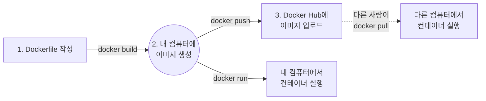
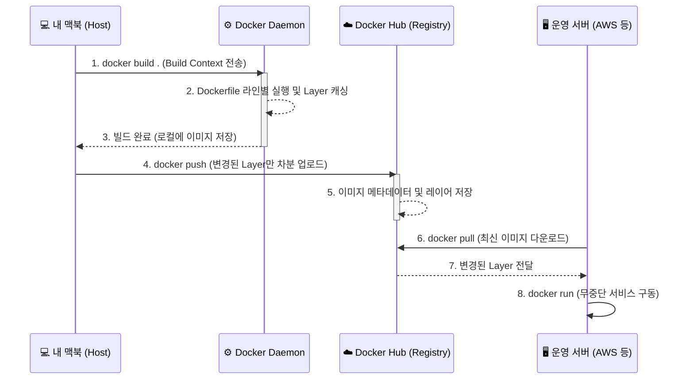
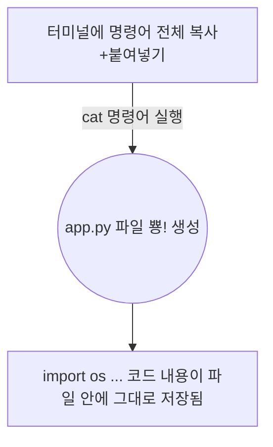
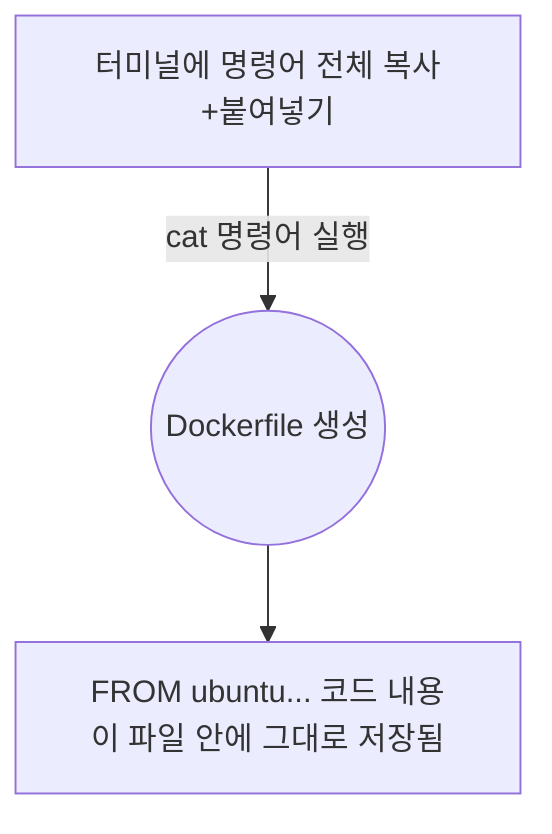

# Docker 완전 정복: Chapter 4-2. Demo - Creating a New Docker Image 💻

이번 챕터에서는 앞서 4-1에서 배운 이론을 바탕으로, **실제 Python Flask 웹 애플리케이션을 도커 이미지로 만들고 도커 허브에 배포(Push)**하는 전 과정을 실습합니다. 

### 💡 [선수 지식 복습] 도커 이미지 워크플로우 3단계
우리가 앞으로 터미널에서 칠 명령어들의 큰 그림은 아래와 같습니다. 


영상에서는 구버전(Python 2.7)을 기준으로 설명하지만, 본 가이드는 **Mac OS 환경 및 최신 버전(Python 3.x)**에 맞추어 실무에서 즉시 사용할 수 있는 완벽한 최신 명령어로 재구성했습니다.

---

## 🔬 1. [전공자 딥 다이브] 실무 환경에서의 도커 이미지 빌드와 레지스트리 아키텍처

우리가 타이핑할 명령어들이 시스템 내부에서 어떤 흐름을 만들어내는지 500자 이상의 깊이 있는 시각으로 먼저 파헤쳐 보겠습니다.

### 💡 1.1 일회성(Ephemeral) 컨테이너와 수동 설치의 한계
영상 초반부 강사는 `docker run -it ubuntu bash`로 우분투 빈 깡통에 접속하여 수동으로 `apt-get`과 `pip`를 치며 환경을 구성합니다. 하지만 이는 **Anti-Pattern(피해야 할 방식)**을 보여주기 위한 빌드업입니다. 
도커 컨테이너는 태생적으로 **일회성(Ephemeral)**을 갖도록 설계되었습니다. 컨테이너가 내려가는 순간, 내부에서 수동으로 설치했던 모든 패키지와 소스코드는 메모리에서 증발하듯 사라집니다. 실무에서는 언제든 컨테이너가 죽고(Kill) 다시 태어날(Restart) 수 있어야 하므로, 컨테이너 내부에 직접 들어가서 세팅을 바꾸는 행위는 인프라의 '멱등성(동일한 결과를 보장하는 성질)'을 심각하게 훼손합니다.

### 💡 1.2 Docker Build Context 와 데몬(Daemon) 아키텍처
`docker build .` 명령어를 칠 때 마지막의 `.` (현재 디렉토리)는 단순히 경로를 의미하는 것이 아닙니다. 이를 컴퓨터 공학에서는 **Build Context(빌드 컨텍스트)**라고 부릅니다.
맥북(호스트)의 터미널에서 이 명령을 치면, 현재 폴더에 있는 모든 파일(`app.py`, `Dockerfile` 등)이 백그라운드에 숨어있는 **도커 데몬(Docker Daemon)** 프로세스로 통째로 묶여 전송됩니다. 도커 데몬은 이 파일들을 가지고 격리된 가상 공간에서 `Dockerfile`의 명령어를 한 줄씩 실행하며 무쇠 붕어빵 틀(Image)을 깎아냅니다. 이때, 각 줄이 실행될 때마다 중간 저장소(Intermediate Layer)에 해시값을 가진 레이어가 저장되며, 이것이 바로 **레이어 캐싱**의 원천이 됩니다.

**[Build Context 전송 시각화]**


### 💡 1.3 Registry (Docker Hub) 분산 저장소 원리
빌드된 이미지는 내 맥북 하드디스크에만 존재합니다. 이 무거운 이미지(수백 MB)를 다른 서버로 배포할 때 파일 채로 USB에 담아 복사하는 것은 불가능합니다.
그래서 우리는 **Docker Registry (도커 허브)**라는 중앙 저장소 아키텍처를 사용합니다. `docker push`를 하면 이미지가 통째로 날아가는 것이 아닙니다! 도커는 로컬의 레이어들의 SHA256 해시값을 도커 허브의 해시값과 비교하여, **도커 허브에 없는 새로운 레이어(예: 새로 작성한 소스코드 레이어)만 차분하게(Delta) 업로드**합니다. 이 엄청난 네트워크 대역폭 절약 기술 덕분에 실무에서 수시로 CI/CD 배포를 하더라도 눈 깜짝할 사이에 배포가 완료되는 것입니다.

**[아키텍처 전체 워크플로우 시각화]**


---

## 🚀 2. Step-by-Step Mac OS 최신 터미널 실습 가이드

자, 이제 맥북의 터미널(Terminal)을 열고 아래 명령어들을 순서대로 복사+붙여넣기 하며 직접 따라 해보세요.

### Step 2.1: 작업 폴더 및 소스코드 생성
먼저 실습을 진행할 빈 폴더를 만들고, 간단한 파이썬 웹 서버 코드를 작성합니다. 터미널에 아래 명령어를 그대로 복사해서 붙여넣기 하세요.

```bash
# 1. 바탕화면의 실습 폴더로 이동하여 웹앱 폴더 생성
cd ~/Desktop/DataEnginnering/Data_Engineering/Docker
mkdir my-simple-webapp
cd my-simple-webapp

# 2. 파이썬 소스코드(app.py) 자동 생성
# 'cat << EOF > 파일명' 명령어는 터미널에 복사+붙여넣기 편하도록, EOF라는 글자가 나올 때까지의 모든 내용을 해당 파일로 만들어주는 리눅스 마법 명령어입니다.



**🐍 app.py 코드 한 줄 분석:**
* `from flask import Flask`: 파이썬 웹 프레임워크인 Flask를 불러옵니다.
* `@app.route("/")`: 사용자가 브라우저에서 메인 주소(`/`)로 접속했을 때 띄워줄 화면을 정의합니다.
* `app.run(host="0.0.0.0", port=5000)`: 내 컴퓨터의 5000번 포트를 열어두고 24시간 손님을 기다리겠다는 뜻입니다. (`0.0.0.0`은 외부의 모든 접속을 허용한다는 의미)

```bash
cat << 'EOF' > app.py
import os
from flask import Flask
app = Flask(__name__)

@app.route("/")
def main():
    return "Welcome! My Custom Docker Image is working!"

@app.route("/how are you")
def hello():
    return "I am good, how about you?"

if __name__ == "__main__":
    app.run(host="0.0.0.0", port=5000)
EOF
```

### Step 2.2: Dockerfile 작성 (최신 Python 3 반영)
동일한 폴더 안에 `Dockerfile`을 생성합니다. 영상의 구버전(Python 2) 대신, 최신 트렌드에 맞춘 `Python 3` 코드로 변경했습니다.

```bash
# 3. Dockerfile 자동 생성 (마찬가지로 터미널에 복붙하면 파일이 뿅! 만들어집니다)



**🐳 Dockerfile 명령어 한 줄 분석:**
* `FROM ubuntu:22.04`: 가장 먼저 빈 방(리눅스 우분투 최신 버전)을 하나 임대합니다. (베이스 이미지)
* `RUN apt-get update && apt-get install -y ...`: 그 빈 방에 파이썬을 설치합니다. `-y`는 "설치할래? (Y/n)" 하고 묻는 창에서 무조건 Y를 누르겠다는 뜻입니다. 안 쓰면 터미널 창에서 입력을 기다리며 빌드가 영원히 멈춥니다!
* `EXPOSE 5000`: (새로 추가됨) "이 컨테이너는 5000번 포트를 사용할 거야!" 라고 도커에게 미리 알려주는 선언입니다. 이 한 줄을 적어두면 나중에 Docker Desktop(UI)에서 포트 설정 칸이 자동으로 예쁘게 생성됩니다!
* `COPY app.py /opt/app.py`: 방금 전 내 맥북에서 만든 파이썬 소스 파일을, 도커 컨테이너 내부(우분투 OS)의 `/opt/` 폴더로 복사해 넣습니다. (`/opt/`는 내 컴퓨터에 있는 폴더가 아니라, `FROM ubuntu`로 생성된 도커 안의 기본 리눅스 시스템 폴더입니다. 도커가 알아서 자동 관리하는 격리된 공간입니다!)
* `ENTRYPOINT ["python3", "/opt/app.py"]`: 컨테이너가 켜지면 무조건 이 파이썬 파일을 실행해서 웹 서버를 구동하라고 명령합니다.

```bash
cat << 'EOF' > Dockerfile
# 1단계: OS 빈 방 준비 (Ubuntu 22.04 LTS 사용)
FROM ubuntu:22.04

# 2단계: 최신 파이썬(python3) 및 pip 설치
RUN apt-get update && apt-get install -y python3 python3-pip

# 3단계: Flask 프레임워크 설치
RUN pip3 install flask

# 4단계: 포트 노출 선언 (도커 데스크탑 UI 등에서 5000번 포트를 쓴다는 것을 알려줌)
EXPOSE 5000

# 5단계: 내 컴퓨터의 app.py를 컨테이너 내부의 /opt/ 폴더로 복사
COPY app.py /opt/app.py

# 6단계: 컨테이너가 켜질 때 실행할 웹 서버 구동 명령어
ENTRYPOINT ["python3", "/opt/app.py"]
EOF
```

### Step 2.3: 도커 이미지 빌드 (docker build)
작성된 설계도를 바탕으로 내 맥북에 이미지를 굽습니다.

```bash
# 4. 이미지 빌드 (마지막의 점(.)을 절대 빼먹지 마세요. 현재 폴더를 의미합니다!)
# -t (Tag) 옵션: 도커 이미지에 사람이 읽기 쉬운 이름표(태그)를 붙입니다. 
# 만약 -t 옵션을 안 쓰면 이미지가 'd3f4a9b...' 같은 무작위 해시 문자로 만들어져서 나중에 찾거나 실행하기가 매우 힘들어집니다!
docker build -t my-simple-webapp .
```
> **👀 관전 포인트:** 명령어 실행 후 터미널 창을 유심히 보세요. `Step 1/5`, `Step 2/5` 하면서 명령어가 한 줄 한 줄 층(Layer)을 쌓으며 다운로드 및 설치되는 과정을 직접 눈으로 확인할 수 있습니다. 설치가 꽤 오래 걸릴 수 있습니다!

### Step 2.4: 만든 이미지로 컨테이너 띄우기 (docker run)
이제 우리가 직접 만든 무쇠 틀(이미지)로 붕어빵(컨테이너)을 구워서 웹 브라우저로 접속해봅시다.

```bash
# 5. 컨테이너 백그라운드(-d)로 실행 및 포트 연결(-p 호스트:컨테이너)
# [Mac OS 에러 주의] 만약 address already in use 에러가 발생하셨나요?!
# 🚨 맥북 최신 OS(Monterey 이상)는 내부적으로 5000번 포트를 'AirPlay 수신 모드'로 혼자 쓰고 있습니다.
# 그래서 도커가 5000번을 쓰려고 하면 Mac OS가 충돌을 뿜어냅니다. 
# 이럴 때는 맥북의 포트를 5001번으로 피해서 연결해주면 깔끔하게 해결됩니다! (5001:5000)
docker run -d -p 5001:5000 --name my-first-app my-simple-webapp

# 6. 컨테이너가 잘 돌고 있는지 상태 확인
docker ps
```
✅ **테스트 방법:** 맥북에서 웹 브라우저(크롬/사파리)를 켜고 주소창에 `http://localhost:5001` (포트를 5001로 바꿨으므로) 을 입력해 보세요! 화면에 문구가 정상적으로 뜬다면 완벽하게 성공한 것입니다. `http://localhost:5001/how are you` 도 접속해 보세요.

**💻 [보너스 가이드] 터미널 명령어 대신 "Docker Desktop UI" 활용하기**
터미널의 흑백 글씨가 어지럽고 명령어(`docker ps` 등)를 치기 귀찮다면, 설치해두신 **Docker Desktop** GUI(그래픽) 프로그램을 열어보세요!

1. **이미지 확인 (Images 탭):** 왼쪽 메뉴에서 `Images`를 누르면 우리가 방금 `build` 명령어로 구워낸 `my-simple-webapp` 이미지가 목록에 뜹니다.
2. **UI로 컨테이너 실행하기 (Run 모달):** 이미지 이름 우측의 **▷(재생 버튼)**을 클릭하면 "Run a new container"라는 모달(팝업) 창이 뜹니다.
   * 모달 창에서 **"Optional settings"** (선택 설정) 옆의 화살표 🔽 를 눌러서 접혀있는 칸들을 쫙 펼쳐주세요.
   * **Container name:** 빈칸에 `my-first-app-ui` 라고 이름을 예쁘게 지어주세요. (비워두면 무작위 영어 이름이 들어갑니다.)
   * **Ports:** 터미널에서 `-p 5001:5000` 쳤던 역할을 합니다. `Host port` 칸에 `5001`을 입력하세요. (⚠️ 꿀팁: 만약 사용자님 화면처럼 "No ports exposed in this image" 라고 뜬다면, 제가 방금 위 코드에 수정한 `EXPOSE 5000` 선언이 빠진 채로 옛날에 빌드하셨기 때문입니다. 코드를 수정하고 다시 빌드하시면 포트 칸이 예쁘게 나타납니다!)
   * 다 적으셨으면 우측 하단의 파란색 **[Run]** 버튼을 클릭하세요!
3. **컨테이너 상태 및 접속 로그 보기 (Containers 탭):** 모달 창이 닫히면서 왼쪽 `Containers` 탭으로 자동 이동되며, 방금 띄운 컨테이너가 초록색 불(Running)을 켜고 돌아가는 게 보입니다. 해당 컨테이너 이름을 클릭해서 들어가면, 내가 띄운 웹앱에 누군가 접속할 때마다 로그(Log) 글씨가 실시간으로 텍스트로 찍히는 것을 볼 수 있습니다.

### Step 2.5: 도커 허브에 배포하기 (docker push)
마지막으로, 내가 만든 이미지를 전 세계 사람이 다운받을 수 있도록 도커 허브(Docker Hub)에 업로드합니다. 도커 허브 계정이 없다면 [hub.docker.com](https://hub.docker.com) 에서 무료 가입이 필요합니다.

```bash
# 7. 도커 허브 로그인 (WEB-BASED LOGIN)
# [주의] 최신 버전의 도커는 명령어 창에서 비밀번호를 치지 않고, 안전한 웹 기반 로그인을 사용합니다!
# 명령어를 입력하면 "Press ENTER to open your browser..." 라는 안내가 나옵니다. 
# 당황하지 마시고 키보드 엔터(Enter) 키를 한 번 누르세요!
# 그러면 크롬이나 사파리 등 인터넷 창이 뿅 하고 열리면서 Docker Hub 인증 화면이 나옵니다. 
# 웹 창에서 [Confirm] 또는 로그인을 완료하시면, 다시 터미널로 돌아왔을 때 자동으로 'Login Succeeded'로 바뀝니다.
docker login

# 8. 이미지 이름에 내 도커 허브 계정(ID) 달아주기 (태깅)
# [주의] 본인의 실제 도커 허브 ID로 치환해서 입력하세요! 
# 💡 내 도커 허브 ID 확인하는 방법:
# 방법 1. 웹 브라우저에서 hub.docker.com 로그인 후 우측 상단 프로필 사진에 적힌 영문 아이디
# 방법 2. Mac의 Docker Desktop 앱 우측 상단 '사람 모양 아이콘' 옆에 적힌 영문 아이디
# 🚨 [치명적 에러 주의] 도커 허브 ID를 적을 때 **무조건 전부 소문자**로 적으셔야 합니다!!!
# 만약 대문자(예: shinwookKang03)를 섞어 쓰면, 도커가 이를 사용자 ID가 아니라 '별도의 사설 서버 주소'로 착각하여 push 할 때 'no such host' 라는 에러를 뿜어냅니다.
# (정상 예시: docker tag my-simple-webapp shinwookkang03/my-simple-webapp)
docker tag my-simple-webapp [본인_도커허브_ID_모두_소문자로]/my-simple-webapp

# 9. 도커 허브로 쏘아 올리기! (Push)
docker push [본인_도커허브_ID]/my-simple-webapp
```
> **👀 관전 포인트:** Push가 진행될 때 터미널에 `Mounted from library/ubuntu` 라는 메시지가 뜨면서 업로드를 쿨하게 건너뛰는(Skip) 항목들이 보일 것입니다.
> *"어? 난 다른 사람 걸 참고한 적이 없는데 왜 도커 허브에 이미 있다는 거지?"* 라고 생각하실 수 있습니다. 
> 우리가 `Dockerfile` 첫 줄에 `FROM ubuntu:22.04` 라고 적었죠? 즉, 내 이미지의 99% 용량은 리눅스(Ubuntu)를 만든 공식 개발자들이 올려둔 뼈대(레이어)를 그대로 빌려 쓰고 있는 것입니다. 도커 허브는 똑똑하게도 "아, 저 뼈대 파일들은 이미 내 서버(library/ubuntu)에 있는 거랑 똑같네? 안 받아도 돼!" 라며 통과시킵니다.
> 결국 우리가 직접 타이핑한 아주 작은 용량의 파이썬 파일(`app.py`) 레이어만 도커 허브로 초고속 전송되게 됩니다. 이것이 바로 인프라를 블록처럼 조립하고 재사용하는 **도커 레이어 캐싱 아키텍처의 진정한 위력**입니다!

### Step 2.6: 배포(Push) 결과 확인하기
업로드가 정말 잘 되었는지 눈으로 직접 확인해 보겠습니다!
1. 웹 브라우저를 켜고 [hub.docker.com](https://hub.docker.com) 에 로그인합니다.
2. 본인 계정의 Repositories 메뉴에 들어가면 방금 업로드한 `my-simple-webapp` 목록이 뜹니다. 클릭해서 들어가 보세요!
3. `Tags` 탭을 눌러보면 몇 분 전에 업로드된 `latest` 버전을 확인할 수 있습니다.
👉 **결론:** 이제 전 세계 어느 컴퓨터에서든 `docker run -p 5001:5000 shinwookkang03/my-simple-webapp` 명령어 한 줄만 치면 내가 짠 파이썬 서버가 즉시 똑같이 실행됩니다!

---

🎉 **완벽하게 성공하셨습니다!**
수동으로 `apt-get` 치며 설치하던 지옥에서 벗어나, 
1. 코드로 인프라를 정의(Dockerfile)하고
2. 레이어 캐싱의 원리를 활용해 번개처럼 빌드(Build)하고
3. 전 세계에 배포(Push)하는
실무 인프라 엔지니어의 첫걸음을 완벽하게 떼셨습니다! 

이제 4-2 강의 실습을 성공적으로 마쳤으니, 다음 단계인 **[4-3. Environment Variables (환경 변수)]** 로 넘어가겠습니다. 해당 강의 영상의 자막(스크립트)이나 내용을 알려주시면 바로 다음 강의 가이드 문서를 준비하겠습니다! 🚀
