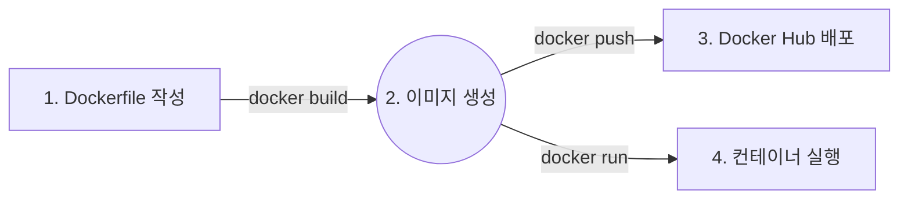
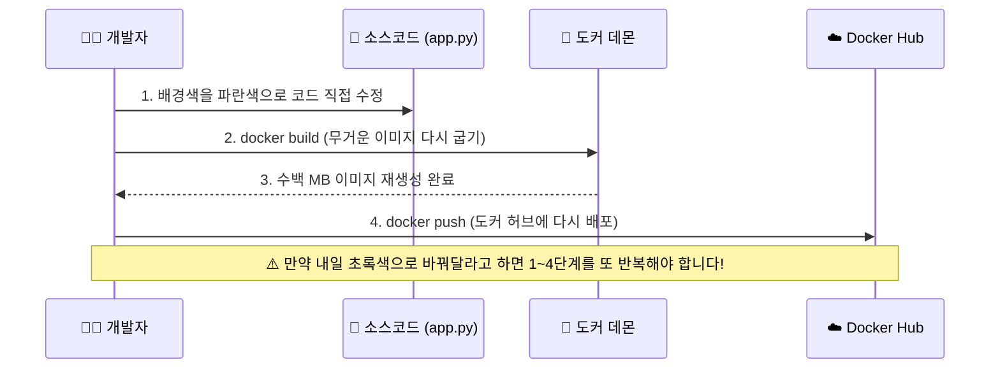

# Docker 완전 정복: Chapter 4-3. Environment Variables (환경 변수) 🌍

이번 챕터에서는 도커뿐만 아니라 현대 서버 개발(백엔드, 데브옵스)에서 가장 핵심적인 원칙 중 하나인 **환경 변수(Environment Variables)**에 대해 다룹니다.

### 💡 [이전 시간 복습] 우리가 지금까지 밟아온 여정
이전 챕터까지 우리는 코드로 인프라를 만들고 전 세계에 배포하는 3단계를 실습했습니다.

이제 이 여정 중 **'4. 컨테이너 실행(docker run)'** 단계에서 서버에 다양한 성격(상태)을 부여하는 **환경 변수**라는 마법을 배워보겠습니다.

---

## 🔬 1. [전공자 딥 다이브] 실무 환경에서의 환경 변수 아키텍처 (The Twelve-Factor App)

개발을 처음 배울 때, 우리는 소스 코드 안에 데이터베이스 비밀번호나 API 키, 혹은 이번 강의 예시처럼 배경색(`color = "red"`) 같은 값들을 직접 타이핑해 넣곤 합니다. 이를 프로그래밍 용어로 **하드코딩(Hard-coding)**이라고 부릅니다. 

하지만 실무 인프라 아키텍처에서 소스코드 안에 설정값을 하드코딩하는 것은 **가장 피해야 할 최악의 안티 패턴(Anti-Pattern)**입니다. 그 이유는 **불변 인프라(Immutable Infrastructure)** 원칙에 위배되기 때문입니다.

만약 우리가 소스코드 안에 데이터베이스 주소나 배경색을 하드코딩(고정)해버리면 어떤 끔찍한 일이 벌어지는지 아래 다이어그램으로 살펴볼까요?

**[❌ 안티 패턴: 하드코딩 시 발생하는 무한 반복 지옥]**

개발용 DB에서 운영용 DB로 접속 주소를 바꿀 때마다 코드를 고치고, 이미지를 다시 굽고, 다시 배포해야 한다면 이는 **불변 인프라(Immutable Infrastructure)** 원칙에 완전히 위배되는 최악의 비효율입니다.

그래서 현대 클라우드 네이티브 설계 원칙인 **'The Twelve-Factor App'**의 3원칙에서는 **"설정(Config)을 환경(Environment)에 저장하라"**고 명시하고 있습니다. 

즉, 도커 이미지는 한 번 구워내면 절대 변하지 않는 **무상태(Stateless)의 완벽한 붕어빵 틀**로 놔두고, 그 이미지를 컨테이너로 띄우는 **실행 시점(Runtime)**에 밖에서 주사기 꽂듯 설정값(상태, State)을 쫙 밀어 넣어주는 방식을 취합니다. 
이렇게 외부에서 주입하는 값들을 **환경 변수(Environment Variable)**라고 부릅니다.

**💡 실무에서 자주 쓰이는 환경 변수 대표 예시:**
* `DB_HOST`: 데이터베이스 접속 주소 (예: `dev-db.aws.com` 또는 `prod-db.aws.com`)
* `DB_PASSWORD`: 데이터베이스 비밀번호
* `JWT_SECRET`: 유저 인증(로그인)에 사용하는 암호화 키
* `PORT`: 웹 서버가 열어둘 포트 번호
* `APP_ENV`: 현재 환경이 개발용(`development`)인지 운영용(`production`)인지 구분하는 플래그

### 💡 실무 활용 예시 (개발 서버 vs 운영 서버)
동일한 도커 이미지(`my-webapp:latest`)를 사용하지만, 실행할 때 넣는 환경 변수만 다르게 줍니다.
* **개발자 노트북에서 띄울 때:** `docker run -e DB_HOST=localhost -e APP_COLOR=blue ...`
* **실제 운영(Production) 서버에서 띄울 때:** `docker run -e DB_HOST=aws-rds-database -e APP_COLOR=red ...`
👉 코드는 단 한 줄도 수정할 필요가 없고, 이미지도 다시 빌드할 필요가 없습니다!

---

## 🚀 2. 핵심 아키텍처 흐름 시각화 (Mermaid)

하드코딩 방식과 환경 변수 방식의 아키텍처 차이를 직관적으로 비교해 보겠습니다.


---

## 💻 3. 필수 명령어 가이드 및 해석

강의 영상에서 소개된 환경 변수를 다루는 두 가지 핵심 도커 명령어입니다.

### 3.1 컨테이너 실행 시 환경 변수 주입 (`-e`)
이전 실습 환경(포트 5001번, 태그명)에 맞추어 명령어를 작성해 보겠습니다.

```bash
docker run -d -p 5001:5000 -e APP_COLOR=blue shinwookkang03/my-simple-webapp
```
* `-e` (또는 `--env`): 컨테이너 내부로 환경 변수를 꽂아 넣겠다는 옵션입니다.
* `APP_COLOR=blue`: 컨테이너 내부 OS에 변수를 임시 저장합니다.

> **🚨 [자주 발생하는 에러 해결] "port is already allocated"**
> 명령어를 쳤을 때 터미널에 `Bind for 0.0.0.0:5001 failed: port is already allocated` 라는 빨간 줄 에러가 뜨셨나요?
> 이는 바로 앞 4-2 챕터 실습에서 켜두었던 `my-first-app` 컨테이너가 아직 살아서 5001번 포트를 꽉 쥐고 있기 때문입니다! (`docker ps`를 쳐보시면 `my-first-app`이 5001포트를 물고 실행 중인 게 보일 겁니다.)
> 👉 **명쾌한 해결 방법:** 기존 컨테이너를 강제로 끄고 삭제하거나(`docker rm -f my-first-app`), 아니면 포트 번호를 살짝 바꿔서 띄우면 됩니다(`-p 5002:5000`).

### 🛡️ [최신 트렌드] 실무 보안과 --env-file
터미널에 `-e DB_PASSWORD=1234` 처럼 비밀번호를 직접 치는 것은 매우 위험합니다. 누군가 서버에 몰래 접속해서 키보드의 윗방향키(↑)를 누르거나 `history` 명령어를 치면, 과거에 입력했던 비밀번호가 터미널 화면에 적나라하게 그대로 노출되기 때문입니다.

이를 해결하기 위해 최신 실무 환경에서는 **`.env` 파일**과 **`--env-file` 옵션**을 조합하는 방식을 표준으로 사용합니다. 아래 시각화 다이어그램으로 보안 아키텍처 원리를 완벽하게 이해해 보세요!

**[🔒 안전한 실무 환경 변수 관리 아키텍처]**
```mermaid
graph TD
    subgraph 내 컴퓨터 (Local)
        E[".env 파일 (비밀번호 모음)"]
        G[".gitignore 파일"]
        S["소스 코드 (app.py)"]
        
        E -.->|"1. .gitignore에 등록됨<br/>(Git 추적 원천 차단)"| G
    end

    subgraph Github (Public)
        GH[☁️ Github 저장소]
    end

    subgraph 도커 컨테이너 (서버)
        D(("🐳 실행 중인 컨테이너<br/>docker run --env-file .env"))
    end

    S ==>|"2. 코드만 Push 됨"| GH
    E -.->|❌ Github 업로드 절대 차단| GH
    E ==>|"3. Run 할 때 파일째로 통째 주입"| D
    S ==>|"이미지화"| D
    
    style E fill:#ffebee,stroke:#c62828
    style GH fill:#e3f2fd,stroke:#1565c0
    style D fill:#e8f5e9,stroke:#2e7d32
```

1. **`.env` 파일 작성:** 프로젝트 폴더에 `.env`라는 이름의 텍스트 파일을 만들고, 안에 `DB_PASSWORD=1234`를 적어둡니다.
2. **`.gitignore`에 등록:** 깃허브에 코드를 올릴 때 실수로 비밀 파일이 딸려 올라가지 못하도록, `.gitignore` 파일에 `.env`를 꾹꾹 눌러 적어줍니다. (해커의 접근 원천 차단!)
3. **`--env-file`로 안전하게 주입:** 컨테이너를 띄울 때 터미널에 `docker run --env-file .env my-simple-webapp` 이라고 칩니다. 터미널 명령어 기록(`history`)에는 단지 `.env`라는 파일 이름만 남을 뿐, 진짜 비밀번호(1234)는 절대 남지 않아 해킹으로부터 완벽하게 안전해집니다! 
(참고: AWS, 네이버, 카카오 같은 거대 기업 수준의 인프라에서는 한 발 더 나아가 아예 `AWS Secrets Manager`나 `HashiCorp Vault` 같은 "중앙 비밀번호 금고 서버"를 따로 구축해서 다이렉트로 연결하기도 합니다.)

### 3.2 런타임 환경 변수 확인하기 (`docker inspect`)
서버 인프라를 디버깅하다 보면, 현재 돌아가고 있는 컨테이너에 도대체 어떤 환경 변수가 들어가 있는지 확인해야 할 때가 있습니다. (예: "왜 디비 접속이 안 되지? 환경 변수에 오타가 났나?")
이때 CLI(터미널) 명령어인 **inspect(검사)** 를 쓰거나, 최신 **Docker Desktop UI**를 활용할 수 있습니다.

**방식 1: 터미널에서 확인하기 (CLI)**
```bash
# 1. 켜져 있는 컨테이너의 ID나 이름을 확인합니다.
docker ps

# 2. 해당 컨테이너의 모든 내부 속성값(json)을 뜯어봅니다.
docker inspect <컨테이너 ID 또는 이름>
```

**방식 2: Docker Desktop UI에서 직관적으로 확인하기 (최신 실무 트렌드)**
1. **Docker Desktop** 프로그램을 엽니다.
2. 좌측 메뉴의 **Containers** 탭으로 들어갑니다.
3. 현재 실행 중인 컨테이너 이름(예: `my-first-app-ui` 또는 임의 생성된 이름)을 마우스로 클릭합니다.
4. 상단 메뉴 탭 중에서 **[Inspect]** (검사) 탭을 클릭합니다.
5. 스크롤을 내리다 보면 **"Env"** 라는 섹션이 보입니다. 여기에 현재 컨테이너에 주입된 모든 환경 변수가 예쁜 표 형태로 깔끔하게 정리되어 있는 것을 볼 수 있습니다! (터미널의 복잡한 JSON을 볼 필요가 없습니다.)

명령어를 치면 터미널에 엄청나게 긴 JSON 데이터가 쏟아져 나오는데, 그중에서 `"Config"` 항목 밑에 있는 `"Env"` 리스트를 보시면, 컨테이너가 켜질 때 주입되었던 환경 변수(`APP_COLOR=blue` 등)가 그대로 기록되어 있는 것을 확인할 수 있습니다.

```json
// docker inspect 결과물 중 일부 (예시)
"Config": {
    "Hostname": "4c01db0b339c",
    "Domainname": "",
    "User": "",
    "AttachStdin": false,
    "AttachStdout": false,
    "AttachStderr": false,
    "ExposedPorts": {
        "5000/tcp": {}
    },
    "Tty": false,
    "OpenStdin": false,
    "StdinOnce": false,
    "Env": [
        "APP_COLOR=blue",
        "PATH=/usr/local/sbin:/usr/local/bin:/usr/sbin:/usr/bin:/sbin:/bin"
    ],
...
```

---

### 🎉 Summary
**환경 변수(Environment Variables)**는 소스코드와 설정값을 완벽하게 분리해 내는 클라우드 엔지니어링의 핵심 기법입니다. 소스 코드를 훼손하지 않으면서 런타임에 다양한 생명력을 불어넣는 `-e` 옵션은 실무에서 하루에도 수백 번씩 쓰게 될 가장 중요한 옵션 중 하나입니다!
