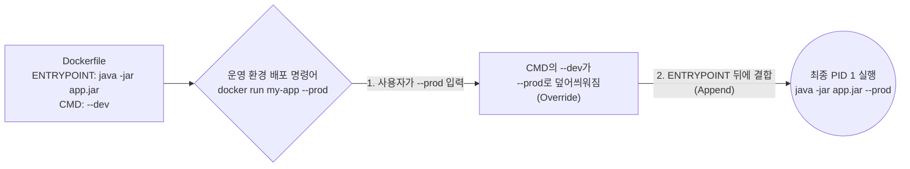
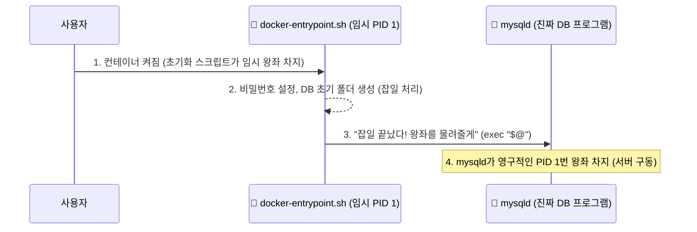

# Docker 완전 정복: Chapter 4-4. CMD vs ENTRYPOINT ⚔️

이번 챕터에서는 도커를 처음 접하는 사람들이 가장 헷갈려 하지만, 실무에서 완벽하게 이해하고 있어야 하는 두 가지 핵심 명령어 **CMD**와 **ENTRYPOINT**의 차이점에 대해 다룹니다.

---

## 🔬 1. [전공자 딥 다이브] 컨테이너의 본질과 생명주기 (PID 1)

강의 초반부에 `docker run ubuntu`를 실행했는데 컨테이너가 곧바로 종료(Exited)되어 버리는 현상을 보셨을 겁니다. 도대체 왜 이런 일이 발생할까요? 이 현상을 이해하려면 가상머신(VM)과 컨테이너(Container)의 근본적인 차이를 알아야 합니다.

**컨테이너는 운영체제(OS)가 아닙니다. 오직 '하나의 특정 프로그램(Process)'을 실행하기 위해 격리된 얇은 포장지에 불과합니다.**
이 말이 무슨 뜻인지 가상머신(VM)과 비교해 보겠습니다.

**[🖥️ 가상머신(VM) vs 🐳 컨테이너(Container) 아키텍처 비교]**


 
 **VM:** 컴퓨터 안에 또 다른 거대한 윈도우/리눅스를 통째로 설치합니다. 부팅만 한참 걸리며, 메인 관리자(PID 1)가 존재하고 내 프로그램은 그 밑에서 돕는 역할(PID 100)을 합니다. 내 프로그램이 죽어도 윈도우(OS)는 계속 켜져 있습니다.
* **컨테이너:** 내 컴퓨터(Host)의 OS를 그대로 빌려 쓰면서, 오직 내 프로그램(`app.py`) 하나만 딸랑 실행시킵니다. 즉, **내 프로그램 자체가 곧 시스템의 중심(PID 1)이 됩니다.**

리눅스 커널에서 **PID(Process ID) 1번**은 부모를 잃은 고아 프로세스들을 거둬주는 등 시스템 전체를 책임지는 '왕'입니다. 도커의 생명주기 규칙은 아주 단순하고 냉혹합니다. **"왕(PID 1번)이 죽으면, 그 나라(컨테이너)도 즉시 멸망(Exit)한다."**
(참고: PID 2번, 3번 같은 자식 프로세스들이 죽는 건 상관없습니다. 왕(PID 1)이 다시 살려내면 그만이니까요. 하지만 왕이 죽으면 끝입니다.)

우분투 공식 이미지의 `Dockerfile`을 까보면 가장 마지막 줄에 `CMD ["bash"]`라고 적혀 있습니다. 즉, 우분투 컨테이너가 켜질 때의 메인 프로세스(PID 1)는 `bash`(터미널 쉘) 프로그램입니다.

그런데 `bash`는 사용자의 키보드 입력(터미널)을 기다리는 프로그램입니다. 우리가 그냥 `docker run ubuntu`라고 치면 백그라운드(`-d`)로 명시하지 않아도, 기본적으로 컨테이너 내부에 사용자의 키보드(터미널)를 연결해주지 않습니다. 
`bash`는 "어? 내가 입력을 받을 화면이나 키보드가 없네? 그럼 할 일이 없으니 바로 종료할게!" 라며 즉시 스스로를 종료(Exit)해 버립니다. 왕(`bash`)이 스스로 목숨을 끊었으니, 나라인 컨테이너도 0.1초 만에 종료되는 것입니다.

**[💡 PID 1 종료 원리 시각화]**


따라서 컨테이너가 24시간 내내 살아서 돌아가게 하려면 Nginx(웹 서버), MySQL(DB 서버)처럼 **터미널 입력이 없어도 백그라운드에서 무한 루프를 돌며 요청을 기다리는 데몬(Daemon) 프로세스**를 PID 1번으로 실행시켜야 합니다. 이 PID 1번 프로세스를 결정하는 명령어가 바로 `CMD`와 `ENTRYPOINT`입니다.

---

## 🚀 2. 핵심 아키텍처 및 동작 원리 시각화 (Mermaid)

`CMD`와 `ENTRYPOINT`의 차이를 시각적으로 비교해 보겠습니다.


---

## 💻 3. CMD와 ENTRYPOINT 완벽 비교

### 3.1 CMD (Command)
컨테이너가 시작될 때 실행할 **기본 명령어 및 파라미터**를 지정합니다.
가장 큰 특징은 사용자가 `docker run` 뒤에 무언가를 치면 **완전히 덮어씌워진다(Override)는 점**입니다.
* **Dockerfile:** `CMD ["sleep", "5"]`
* **실행:** `docker run ubuntu-sleeper sleep 10`
* **결과:** 원래 있던 `sleep 5`는 쓰레기통에 버려지고, 사용자가 새로 덮어씌운 `sleep 10` 이라는 명령어가 PID 1번 왕좌에 앉게 됩니다. (참고: Dockerfile 자체가 PID를 가지는 게 아니라, Dockerfile에 적힌 명령어 문자열이 실제 프로세스가 되어 메모리에 올라갈 때 PID 1번을 받습니다.)

### 3.2 ENTRYPOINT
컨테이너가 시작될 때 실행할 **메인 실행 파일(Executable)**을 절대 변하지 않도록 고정합니다.
사용자가 `docker run` 뒤에 치는 값들은 덮어씌워지는 게 아니라, **ENTRYPOINT 뒤에 파라미터로 이어붙여집니다(Append).**
* **Dockerfile:** `ENTRYPOINT ["sleep"]`
* **실행:** `docker run ubuntu-sleeper 10`
* **결과:** 고정된 `sleep` 뒤에 사용자가 띄어쓰기와 함께 입력한 `10`이 붙어서 최종적으로 `sleep 10`이 실행됩니다. (만약 10을 안 치고 `docker run ubuntu-sleeper`만 치면, 파라미터가 없어서 `sleep`만 실행되고 리눅스가 "몇 초 잘 건지 안 알려줬잖아!(missing operand)" 라며 에러를 뿜습니다.)

> 🙋‍♂️ **개발자는 둘 중 뭘 써야 하나요? (아키텍처 설계의 영역)**
> * `우분투`처럼 사용자가 안에 들어와서 아무 명령어나 맘대로 칠 수 있는 범용적인 포장지를 만들 때는 쉽게 덮어써지는 **CMD**를 씁니다.
> * `ubuntu-sleeper`나 `DB 서버`처럼 목적이 100% 뚜렷한 포장지를 만들 때는, 사용자가 맘대로 프로그램을 바꾸지 못하도록 핵심 프로그램을 **ENTRYPOINT**로 박아버리는 것이 정석입니다.

### 3.3 [실무 표준] ENTRYPOINT와 CMD의 완벽한 조합
실무에서는 이 둘을 섞어 쓰는 것이 표준입니다. **ENTRYPOINT에는 고정된 실행 파일**을, **CMD에는 기본 파라미터(디폴트 값)**를 넣습니다.
```dockerfile
ENTRYPOINT ["sleep"]
CMD ["5"]
```
* **아무것도 안 칠 때:** `docker run ubuntu-sleeper` 👉 `sleep 5` 실행 (디폴트 값)
* **값을 줄 때:** `docker run ubuntu-sleeper 10` 👉 CMD의 `5`가 `10`으로 교체되어 `sleep 10` 실행

---

## 🛡️ 4. [최신 트렌드] 실무 환경에서의 조합 패턴 (Deep Dive)

단순한 `sleep`을 넘어서, 실제 Nginx, MySQL, Spring Boot 등 거대 IT 기업의 공식 이미지들은 이 두 가지를 어떻게 활용할까요?

### 패턴 1: Java Spring Boot 애플리케이션
Java로 짠 서버를 실행하려면 보통 `java -jar 내프로그램.jar` 라는 리눅스 명령어를 칩니다. 
여기에 추가로 `--spring.profiles.active=dev` 같은 옵션을 붙이면, 스프링 서버가 "아, 지금은 개발용(dev) DB에 붙어서 실행하라는 거구나!" 라고 알아듣고 모드를 바꿔서 켜집니다.

```dockerfile
# 앱의 핵심 실행 명령어(java -jar)는 절대 바뀌면 안 되니까 ENTRYPOINT로 고정
ENTRYPOINT ["java", "-jar", "/app.jar"]

# 아무 값도 안 주면 기본값으로 개발(dev) 프로필로 실행되게 CMD에 세팅
CMD ["--spring.profiles.active=dev"]
```

**[☕ Java Spring Boot 배포 원리 시각화]**

이처럼 틀(`java`)은 고정하고, 옵션(`--prod`)만 런타임에 주입하여 환경을 자유자재로 바꾸는 것이 실무의 정석입니다.

### 패턴 2: docker-entrypoint.sh 쉘 스크립트 활용 (고급 인프라)
MySQL이나 Postgres 같은 세계적인 공식 DB 이미지를 까보면 99% 이 방식을 씁니다.
`ENTRYPOINT`에 데이터베이스 프로그램(`mysqld`)을 바로 적지 않고, 도커 개발자들이 **직접 짠 쉘 스크립트(`docker-entrypoint.sh`) 파일**을 걸어둡니다.

**[🗄️ MySQL 컨테이너 초기화 원리 시각화]**


이 스크립트는 컨테이너가 켜지는 찰나의 순간에 임시로 PID 1번을 차지합니다. 사용자가 넘겨준 비밀번호를 읽어서 DB를 세팅하는 등 온갖 잡일(초기화)을 먼저 수행합니다. 초기화가 끝나면 스크립트 맨 마지막 줄에서 `exec "$@"`라는 리눅스 마법 명령어를 호출하여, 원래 실행하려던 `CMD`(`mysqld`)에게 자신의 육신과 PID 1번 왕좌를 통째로 넘겨주고 스크립트는 멋지게 퇴장합니다. 
이것이 바로 전 세계 수백만 명이 사용하는 도커 공식 이미지들의 숨겨진 아키텍처 비밀입니다!

---

### 🎉 Summary
* **VM vs Container:** VM은 거대한 OS를 통째로 돌리지만, 컨테이너는 내 프로그램(프로세스) 하나만 돌리는 얇은 껍데기입니다!
* **PID 1의 의미:** 내 프로그램이 곧 시스템의 '왕'입니다. 왕이 죽으면(종료되면) 컨테이너도 끝납니다.
* **CMD:** 덮어쓰기(Override) 가능한 기본 옵션.
* **ENTRYPOINT:** 덮어쓸 수 없는(Append) 불변의 메인 실행 파일.
* **실무 조합:** `ENTRYPOINT`로 틀을 잡고, `CMD`로 디폴트 값을 준 뒤, `docker run` 실행 시 파라미터를 던져 제어한다!
