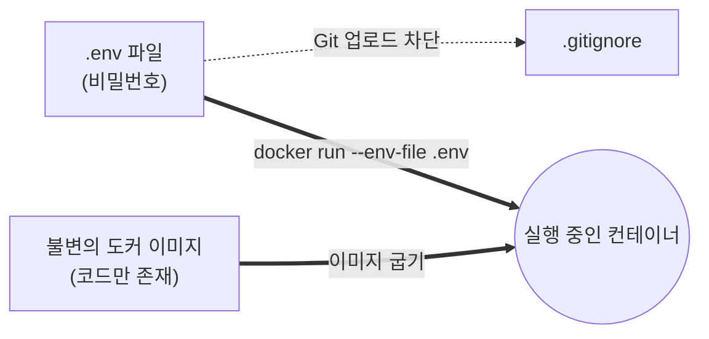
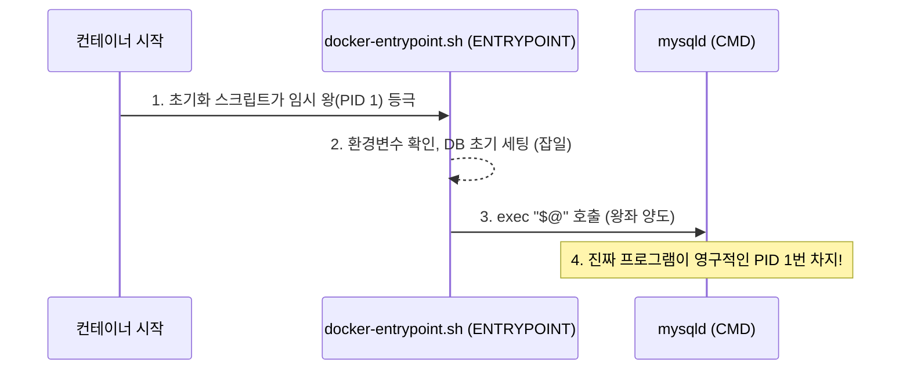

# Docker 완전 정복: Chapter 4 (Docker Images) 총정리 📚

지금까지 학습하신 **Chapter 4: Docker Images**는 도커의 꽃이자, 실무 인프라 엔지니어링의 뼈대가 되는 가장 중요한 챕터입니다. 
수동으로 툴을 설치하던 시대에서 벗어나, '코드로 인프라를 정의(IaC)'하고 전 세계에 '불변 인프라(Immutable Infrastructure)'를 배포하는 핵심 개념들을 총정리합니다.

---

## 🗺️ 1. 도커 이미지 전체 워크플로우 (아키텍처)

도커 이미지를 만들고, 배포하고, 실행하는 3단계 핵심 사이클입니다.

```mermaid
graph TD
    subgraph 1. 빌드 (Build)
        DF[📄 Dockerfile<br/>(인프라 설계도)] -->|docker build .| IM((🐳 도커 이미지<br/>내 컴퓨터))
        APP[💻 app.py<br/>(소스코드)] -.->|Build Context 전송| IM
    end
    
    subgraph 2. 배포 (Registry)
        IM -->|docker push| HUB[☁️ Docker Hub<br/>(변경된 Layer만 차분 업로드)]
    end
    
    subgraph 3. 실행 (Runtime)
        HUB -->|docker pull| SVR[🖥️ 운영 서버]
        SVR -->|docker run| C1[🟢 컨테이너 A]
        SVR -->|docker run| C2[🟢 컨테이너 B]
    end
    
    style DF fill:#f9fbe7,stroke:#827717
    style IM fill:#e0f7fa,stroke:#006064
    style HUB fill:#e3f2fd,stroke:#1565c0
    style C1 fill:#e8f5e9,stroke:#2e7d32
    style C2 fill:#e8f5e9,stroke:#2e7d32
```

---

## 🛠️ 2. Dockerfile 핵심 명령어 족집게 정리

도커 이미지를 굽기 위한 레시피(`Dockerfile`)에 들어가는 핵심 명령어들입니다.

| 명령어 | 역할 | 실무 비유 |
| :--- | :--- | :--- |
| `FROM` | 베이스 이미지 선언 | "우분투라는 텅 빈 방을 하나 빌려주세요." |
| `RUN` | 패키지 설치 및 리눅스 명령어 실행 | "그 방에 파이썬이랑 잡다한 도구들 좀 설치해 주세요." |
| `COPY` | 로컬 파일 ➡️ 컨테이너 내부 복사 | "내 맥북에 있는 app.py를 우분투 방 안으로 던져주세요." |
| `EXPOSE` | 사용할 포트 명시 (문서화 용도) | "이 방은 5000번 문으로 손님을 받을 예정입니다." |
| `ENTRYPOINT`| 절대 변하지 않는 메인 실행 파일 | "이 방의 심장(PID 1)은 무조건 'java' 프로그램입니다." |
| `CMD` | 덮어쓰기 가능한 파라미터 / 명령어 | "기본적으로 '--dev' 모드로 켤 건데, 맘에 안 들면 덮어쓰세요." |

---

## 🧠 3. 전공자 수준으로 끌어올리는 4대 핵심 인사이트

단순히 명령어를 외우는 것을 넘어, 시스템 내부에서 어떤 일이 일어나는지 이해하는 것이 실력의 차이를 만듭니다.

### ① 레이어 캐싱 (Layer Caching)
도커 이미지는 하나의 거대한 덩어리가 아니라 **수십 개의 층(Layer)**으로 쪼개져 있습니다. 
`docker push`를 할 때 수백 MB를 매번 올리는 것이 아니라, 도커 허브 서버에 이미 존재하는 층(예: Ubuntu 베이스)은 쿨하게 건너뛰고(`Mounted from library/ubuntu`), **내가 방금 수정한 아주 작은 파이썬 소스코드 층(Layer)만 차분 업로드**합니다. 이 덕분에 번개처럼 빠른 무중단 배포(CI/CD)가 가능합니다.

### ② 환경 변수와 보안 (The Twelve-Factor App)
데이터베이스 비밀번호나 배경색 같은 상태(State)를 소스코드에 **하드코딩**하면, 값이 바뀔 때마다 무거운 이미지를 다시 구워야 합니다(안티 패턴). 
실무에서는 이미지를 완벽한 '불변의 붕어빵 틀'로 놔두고, `docker run`을 하는 **실행 시점(Runtime)**에 주사기 꽂듯 `-e` 옵션이나 `--env-file .env`로 값을 밀어 넣습니다. 이 방식을 쓰면 깃허브가 털려도 비밀번호가 유출되지 않습니다!

**[🔒 실무 환경 변수 주입 아키텍처]**


### ③ 컨테이너의 본질과 PID 1
가상머신(VM)은 거대한 OS를 통째로 부팅시키지만, 컨테이너는 내 컴퓨터의 OS를 빌려 쓰며 **'내 프로그램 딱 하나'만 격리하는 얇은 포장지**입니다.
이 포장지 안에서 내 프로그램은 **PID 1번(시스템의 왕)**이 됩니다. 만약 내 프로그램(`bash`나 `app.py`)이 할 일이 없어서, 혹은 에러가 나서 죽게 되면, 컨테이너라는 나라도 그 즉시 파괴(Exited)됩니다.

### ④ ENTRYPOINT 와 CMD 의 실무 조합 (docker-entrypoint.sh)
세계적인 IT 기업들의 도커 이미지는 두 명령어를 결합하여 우아한 초기화 아키텍처를 만듭니다.


---

## ⚡ 4. Chapter 4 필수 명령어 치트시트

```bash
# 1. 이미지 빌드 (마지막 점(.)은 Build Context 전송을 의미)
docker build -t shinwookkang03/my-simple-webapp .

# 2. 도커 허브에 배포 (레이어 차분 업로드)
docker push shinwookkang03/my-simple-webapp

# 3. 환경 변수 주입 및 포트 맵핑하여 컨테이너 띄우기 (-d: 백그라운드)
docker run -d -p 5001:5000 -e APP_COLOR=blue shinwookkang03/my-simple-webapp

# 4. 안전하게 비밀 파일(.env) 통째로 넘겨서 띄우기
docker run -d -p 5001:5000 --env-file .env shinwookkang03/my-simple-webapp

# 5. 기존에 포트를 점유하고 있던 녀석 강제 삭제 (port is already allocated 에러 시)
docker rm -f my-first-app
```

> **🎉 축하합니다!** 여기까지 완벽하게 이해하셨다면, 당신은 이미 상위 1%의 기본기를 갖춘 인프라 엔지니어입니다. 다음 챕터에서 뵙겠습니다!
