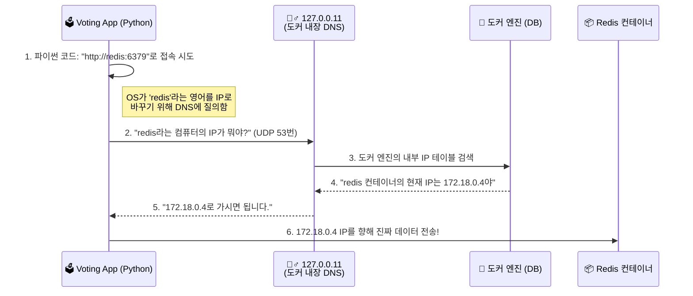

# Docker 완전 정복: Chapter 5. Docker Compose 🐙

지금까지는 `docker run` 명령어로 컨테이너를 **하나씩** 띄웠습니다. 하지만 실무의 애플리케이션은 절대 하나의 컨테이너로 굴러가지 않습니다. 웹 서버, DB, 캐시 등 수많은 서비스가 얽혀 있는 MSA(Microservices Architecture) 환경에서 수십 개의 컨테이너를 일일이 명령어로 띄우는 것은 불가능에 가깝습니다. 

이러한 다중 컨테이너 환경을 코드로 정의(IaC)하고, 명령어 한 줄로 통째로 띄웠다 내렸다 할 수 있게 해주는 마법의 오케스트레이션 도구, **Docker Compose**에 대해 깊이 파헤쳐 보겠습니다.

---

## 🔬 1. [전공자 딥 다이브] Docker Compose와 최신 트렌드

강의에서는 `docker-compose`라는 하이픈(-)이 들어간 명령어를 사용합니다. 하지만 실무 최신 트렌드에서는 많은 것이 바뀌었습니다.

* **V1 (Python) ➡️ V2 (Go):** 과거의 `docker-compose`(V1)는 파이썬으로 만들어진 별도의 외부 프로그램이었습니다. 하지만 현재는 도커 엔진 자체에 플러그인 형태로 완전히 내장된 **V2 (Go 언어 기반)**를 사용합니다. 명령어에서 하이픈이 빠진 **`docker compose up`**을 사용하는 것이 최신 글로벌 표준입니다.
* **version 명시 폐지:** 과거에는 YAML 파일 맨 위에 `version: '3'` 처럼 버전을 꼭 적어야 했지만, 최신 **Compose Specification**에서는 이 구문이 아예 삭제(Deprecated)되었습니다. 최신 문법에서는 `version`을 쓰지 않고 바로 `services:`부터 시작합니다.

---

## 🚀 2. Example Voting App 아키텍처 (실무 네트워킹)

도커 공식 데모 앱인 'Voting App'은 5개의 서로 다른 언어와 데이터베이스로 구성된 완벽한 마이크로서비스 예제입니다.
실무 환경에서는 보안을 위해 외부 사용자가 접근할 수 있는 망(Frontend)과 내부 DB들끼리만 통신하는 망(Backend)을 완벽하게 분리해야 합니다.

**[🌐 Voting App의 망 분리(Network Isolation) 아키텍처]**
```mermaid
graph TD
    User((🧑 사용자와 브라우저))
    
    subgraph 🟢 Frontend Network (외부 공개망)
        Vote[🗳️ Voting App<br/>(Python / Port 5000)]
        Result[📊 Result App<br/>(Node.js / Port 5001)]
    end
    
    subgraph 🔴 Backend Network (내부 폐쇄망)
        Redis[(📦 Redis<br/>In-memory Queue)]
        Worker[⚙️ Worker<br/>(.NET 백그라운드)]
        DB[(🗄️ PostgreSQL<br/>영구 DB)]
    end

    User -->|투표하기 (포트 5000)| Vote
    User -->|결과보기 (포트 5001)| Result
    
    Vote -->|1. 투표 데이터 빠르게 적재| Redis
    Redis -.->|2. Worker가 무한 루프 돌며 데이터 가져감| Worker
    Worker -->|3. 연산 후 영구 데이터베이스에 최종 저장| DB
    Result -->|4. 데이터베이스에서 최종 통계 조회| DB
    
    style Frontend fill:#e8f5e9,stroke:#2e7d32
    style Backend fill:#ffebee,stroke:#c62828
    style Vote fill:#fff,stroke:#333
    style Result fill:#fff,stroke:#333
    style Worker fill:#fff,stroke:#333
    style Redis fill:#fff,stroke:#333
    style DB fill:#fff,stroke:#333
```

**[🔍 딥 다이브: 백엔드 3대장(Redis, Worker, DB)은 어떻게 맞물려 돌아가는가?]**
이 데모 앱은 대용량 트래픽을 처리하는 실무 아키텍처의 축소판입니다.
1. **Redis (In-memory Queue):** 투표 앱(Python)이 유저의 클릭을 받을 때마다 곧바로 디스크(하드디스크)에 저장하면 속도가 너무 느려 서버가 터집니다. 그래서 메모리(RAM) 위에서 빛의 속도로 동작하는 Redis에 일단 "A에 1표" 라는 메시지를 가볍게 던져놓고(Queueing) 투표 앱은 바로 유저에게 성공 화면을 보여줍니다.
2. **Worker (.NET 데몬):** 24시간 내내 백그라운드에서 무한 루프를 돌고 있는 일꾼 프로세스입니다. 얘가 하는 일은 딱 하나, Redis에 쌓인 투표 메시지를 꺼내와서(Dequeue) 안전하게 정제한 뒤, 진짜 영구 저장소인 DB로 넘기는 것입니다. (실무에서는 트래픽이 몰리면 이 Worker 컨테이너만 10개, 100개로 복제해서 처리 속도를 올립니다.)
3. **PostgreSQL (Persistent DB):** 디스크에 데이터를 영구적으로 기록하는 정통 관계형 데이터베이스입니다. Worker가 건네준 정제된 데이터를 바탕으로 `CATS: 10표, DOGS: 5표` 형태로 테이블을 안전하게 업데이트하고 보관합니다. 결과 앱(Node.js)은 오직 이 DB만 바라보고 통계를 화면에 뿌려줍니다.

---

## 💻 3. 네트워크의 진화: `--link`의 죽음과 내부 DNS의 탄생

강의 초반부에 서로 다른 컨테이너를 연결하기 위해 `docker run --link` 옵션을 사용하는 것을 보셨을 겁니다. 
이 방식은 컨테이너 내부의 `/etc/hosts` 파일을 억지로 수정해서 IP를 박아 넣는 구시대적인 방식이며, 현재는 **공식적으로 폐기(Deprecated)된 기술**입니다.

### ✨ 모던 도커의 해결책: 사용자 정의 브릿지(Bridge)와 내장 DNS 서버

현재의 Docker Compose는 컨테이너들을 띄울 때 **'사용자 정의 브릿지 네트워크(Custom Bridge Network)'**를 자동으로 생성합니다.

**1. 사용자 정의 브릿지란 정확히 무엇인가요?**
호스트(내 맥북이나 우분투 서버)의 리눅스 커널 내부에 만들어지는 **순수 소프트웨어 기반의 가상 스위치(Virtual Switch)**입니다. 공유기를 하나 샀다고 생각하시면 됩니다.
Compose가 실행되면, 도커는 커널에 새로운 가상 네트워크 대역(예: `172.18.0.0/16`)을 할당받는 스위치 장비를 만듭니다. 그리고 띄워지는 컨테이너마다 가상 랜선(veth pair)을 꽂아 이 스위치에 연결해 줍니다. 
이렇게 연결된 컨테이너들은 호스트의 진짜 물리적 네트워크 카드(`eth0`)나 와이파이망과는 완벽히 격리된 채로, 오직 자기들끼리만 패킷을 주고받을 수 있는 폐쇄적인 L2/L3 네트워크를 형성하게 됩니다.

**2. 도커가 심어놓은 내장 DNS 서버(Embedded DNS)의 정체**
이 가상 스위치에 연결된 컨테이너들은 각각 `172.18.0.2`, `172.18.0.3` 같은 사설 IP를 부여받습니다. 하지만 컨테이너를 껐다 켤 때마다 이 IP는 계속 바뀝니다.
그래서 도커는 모든 컨테이너의 네트워크 공간 안에 **`127.0.0.11` 이라는 고정된 특수 IP로 작동하는 '경량화된 가짜 DNS 서버 데몬'**을 몰래 띄워놓습니다. (주의: `127.0.0.1`인 localhost가 아닙니다. 컨테이너 자기 자신을 가리키는 localhost와는 별개로, 도커 엔진이 가로채기 위해 예약해 둔 IP가 `127.0.0.11`입니다.)

**[🔍 도커 내장 DNS 패킷 해석 시퀀스 다이어그램]**


즉, 개발자는 IP 주소가 뭔지, 언제 바뀌는지 전혀 신경 쓸 필요 없이 **YAML 파일에 적힌 서비스 이름(Service Name)만으로 코딩**하면 됩니다. 파이썬 코드에서 단순히 `connect("redis")`라고만 적어두면, 도커의 내장 DNS(`127.0.0.11`)가 중간에서 이를 실시간으로 가로채어 현재 Redis가 살아 숨 쉬고 있는 정확한 내부 IP로 번역해 주는 위대한 아키텍처입니다.

---

## 🛡️ 4. [최신 트렌드] 실무형 `compose.yaml` 아키텍처

위의 복잡한 5개 애플리케이션을 최신 모던 문법으로 작성하면 다음과 같습니다. (더 이상 `version:`을 쓰지 않습니다.)

```yaml
# 최신 규격에서는 version: '3' 등을 생략합니다.
networks:
  frontend:    # 외부 노출용 네트워크
  backend:     # 내부 통신용 네트워크

services:
  vote:
    build: ./vote            # 로컬 폴더의 Dockerfile을 읽어 즉시 빌드!
    ports:
      - "5000:80"            # 호스트 5000 -> 컨테이너 80
    networks:
      - frontend             # 사용자와 맞닿는 망
      - backend              # Redis와 통신해야 하므로 백엔드 망도 양다리

  redis:
    image: redis:alpine      # 이미 만들어진 가벼운 공식 이미지 사용
    networks:
      - backend              # 철저히 내부망에만 고립시킴 (보안)

  db:
    image: postgres:15
    environment:
      POSTGRES_PASSWORD: password
    networks:
      - backend

  worker:
    build: ./worker
    depends_on:              # 의존성 및 실행 순서 제어 (최신 트렌드)
      redis:
        condition: service_started
      db:
        condition: service_started
    networks:
      - backend

  result:
    build: ./result
    ports:
      - "5001:80"
    networks:
      - frontend
      - backend
```

### 💡 딥 다이브: `depends_on`의 진화 (실행 순서 vs 헬스 체크)
과거에는 `depends_on`이 단순히 "DB 컨테이너를 먼저 켜라"는 뜻이었습니다. 하지만 DB 컨테이너가 켜졌다고 해서 데이터베이스가 당장 요청을 받을 수 있는 상태(Ready)인 것은 아닙니다. 
이러한 문제를 해결하기 위해 최신 도커에서는 **`condition: service_healthy`** 라는 강력한 기능을 도입했습니다. DB가 완전히 부팅되어 쿼리를 받을 준비가 끝난 것(Health check 통과)을 도커가 확인한 뒤에야, 비로소 백엔드 앱(Worker 등)을 실행시키는 완벽한 오케스트레이션이 가능해졌습니다.

---

## ⚡ 5. 실무 필수 명령어 치트시트

이 파일 하나만 있으면, 수십 개의 컨테이너를 단 한 줄로 지배할 수 있습니다. (하이픈이 없는 최신 명령어를 사용하세요!)

```bash
# 1. 5개의 컨테이너 전체 빌드 및 백그라운드 실행
docker compose up -d

# 2. 변경된 코드만 다시 빌드해서 띄우기 (캐시 무효화)
docker compose up -d --build

# 3. 5개 컨테이너의 실시간 로그를 한 화면에서 섞어서 보기
docker compose logs -f

# 4. 컨테이너 5개 + 내부 네트워크까지 한 번에 깔끔하게 삭제 (퇴근 전 필수!)
docker compose down
```
