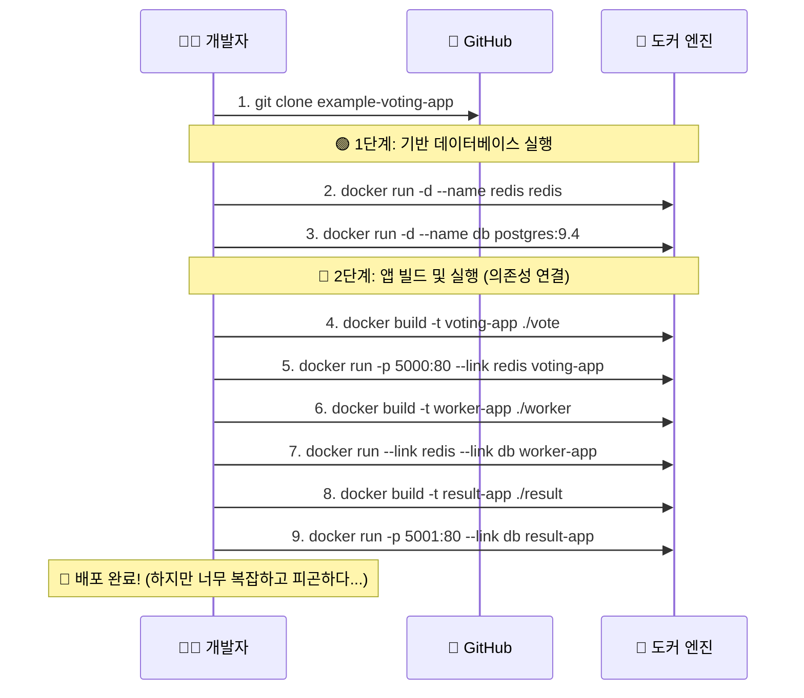

# Docker 완전 정복: Chapter 5-2. Voting App 수동 배포 데모 🏗️

이번 데모 강의에서는 Docker Compose를 배우기 **직전 단계**로, 5개의 마이크로서비스(Voting App)를 오직 순수 `docker build`와 `docker run` 명령어만 사용하여 일일이 수동으로 배포해 보는 '고통스러운(?)' 과정을 실습합니다. 

왜 굳이 이런 수동 배포를 해볼까요? **불편함을 뼈저리게 느껴봐야, 다음 강의에서 배울 Docker Compose가 얼마나 위대한 발명품인지 깨달을 수 있기 때문입니다!**

---

## 🔬 1. [전공자 딥 다이브] 마이크로서비스 수동 배포의 고통 (안티 패턴)

강의 영상에서 강사님이 5개의 컨테이너를 하나씩 띄우면서 겪은 문제점들을 살펴보면, 이것이 왜 **실무 아키텍처의 안티 패턴(Anti-pattern)**인지 명확히 알 수 있습니다.

1. **실행 순서(Dependency)의 늪:** 
   - 파이썬 투표 앱을 먼저 켰더니 에러(Internal Server Error)가 났습니다. 왜냐하면 데이터를 저장할 Redis가 아직 안 켜졌기 때문입니다.
   - 워커를 켤 때도 Redis와 Postgres가 둘 다 살아있어야만 합니다. 개발자가 이 **'부팅 순서'**를 머릿속으로 다 외우고 있어야 합니다.
2. **이름 충돌과 멱등성(Idempotency) 결여:** 
   - 강사님이 `-d`(백그라운드) 옵션을 깜빡하고 실행했다가, 다시 켜려고 하니 "이미 `redis`라는 이름의 컨테이너가 존재합니다"라며 에러가 발생했습니다.
   - 결국 `docker rm`으로 직접 지우고 다시 켜야 했습니다. 실무 자동화(CI/CD) 스크립트에서는 치명적인 약점입니다.
3. **거미줄처럼 엉킨 `--link` 옵션:**
   - 컨테이너끼리 연결하려고 `--link db:db` 같은 옵션을 주렁주렁 달아야 합니다. 컨테이너가 100개라면 어떻게 될까요? 끔찍한 관리 지옥(Spaghetti Network)이 펼쳐집니다.

---

## 🚀 2. Voting App 수동 배포 시퀀스 (Mermaid)

강사님이 영상에서 진행한 험난한(?) 수동 배포 과정을 시각화해 보았습니다.



---

## 💻 3. 핵심 명령어 및 발생했던 트러블슈팅 리뷰

강의 중에 발생했던 주요 명령어들과 트러블슈팅 사례를 되짚어봅니다.

### ① 포트 충돌(Port Conflict) 회피 아키텍처
투표 앱(`voting-app`)과 결과 앱(`result-app`)은 둘 다 컨테이너 내부에서 **80번 포트**를 사용합니다. 
이를 내 맥북(호스트)으로 가져올 때, 두 앱 모두 호스트의 80번 포트로 연결하려고 하면 충돌이 납니다. 따라서 강사님은 아래처럼 호스트 포트를 분리했습니다.
* **투표 앱:** `-p 5000:80` (호스트의 5000번 접속 시 -> 컨테이너의 80번으로 포워딩)
* **결과 앱:** `-p 5001:80` (호스트의 5001번 접속 시 -> 컨테이너의 80번으로 포워딩)

### ② `--link`를 이용한 통신
```bash
docker run -d --name worker-app --link redis:redis --link db:db worker-app
```
* 컨테이너가 서로 통신할 수 있도록 내부 DNS(/etc/hosts)를 조작하는 구식 명령어입니다. 현재는 **사용자 정의 네트워크(Custom Network)**로 완벽하게 대체되었습니다.

---

## 🛡️ 4. [최신 트렌드] 실무 환경에서의 시사점

실무 환경, 특히 최신 클라우드 네이티브(Cloud Native) 환경에서는 이번 강의처럼 일일이 명령어를 쳐서 배포하는 일은 **절대, 네버, 없습니다.**

1. **Infrastructure as Code (IaC)의 필수성:**
   수동 타이핑은 휴먼 에러(오타, 순서 헷갈림 등)를 유발합니다. 이 모든 명령어들의 묶음을 하나의 문서(`docker-compose.yml`)로 정의하여 깃허브에 코드로 저장해 두는 것이 필수입니다.
2. **선언적(Declarative) 배포:**
   "1번 켜고, 2번 켜고, 3번 켜라"라고 명령(Imperative)하는 것이 아니라, "나는 이 5개가 이런 연결 상태로 떠 있기를 원해!"라고 선언(Declarative)하면 도커가 알아서 현재 상태와 비교하여 없는 것만 켜주는 시스템이 필요합니다. 

이러한 모든 실무적 고민과 고통을 단 한 방에 해결해 주는 도구가 바로 다음 강의에 등장할 **Docker Compose**입니다! 
수동 배포의 고단함을 느끼셨다면, 이제 마법의 지팡이를 쥘 준비가 되셨습니다! 🎉
