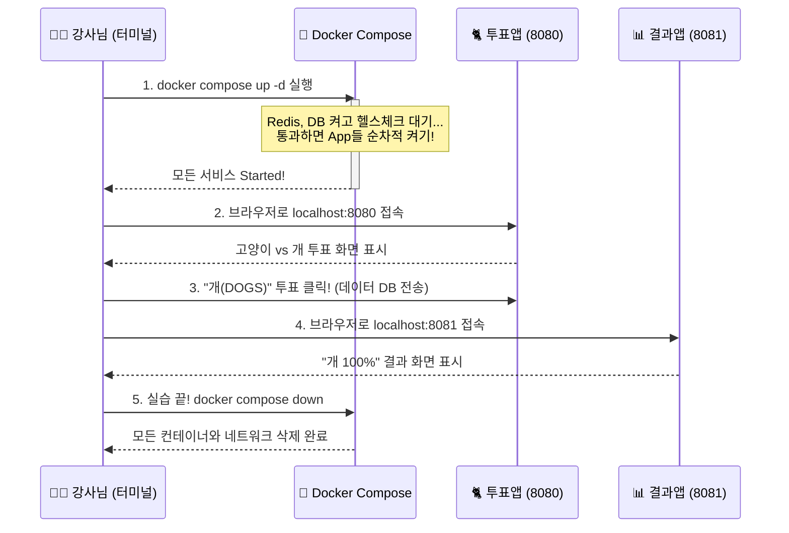

# Docker 완전 정복: Chapter 5-2. 최신 실무 코드 딥 다이브 🕵️‍♂️

강의 영상에서 본 `example-voting-app` 코드는 도커의 개념을 설명하기 위해 짜여진 초창기 버전(과거 버전)입니다. 하지만 방금 우리가 깃허브에서 직접 받아온 코드는 전 세계 수많은 엔지니어들의 피드백을 받아 **2026년 최신 클라우드 네이티브(Cloud Native) 실무 표준**으로 진화한 버전입니다. 

강의 영상의 과거 코드와 현재 깃허브의 최신 코드가 실무적으로 어떻게, 그리고 왜 달라졌는지 **전공자 수준의 4대 핵심 아키텍처**로 완벽하게 분석해 드립니다.

---

## 🔬 1. [실무 표준] Multi-stage Build (멀티 스테이지 빌드) 적용

과거 강의에서는 단순히 코드를 복사하고 끝냈습니다. 하지만 최신 `worker/Dockerfile`을 열어보면 다음과 같이 `FROM` 명령어가 두 번 등장합니다. 이를 **멀티 스테이지 빌드(Multi-stage Build)**라고 부릅니다.

```dockerfile
# 1단계: 컴파일 전용 (무거운 SDK 사용)
FROM mcr.microsoft.com/dotnet/sdk:7.0 AS build
WORKDIR /source
COPY . .
RUN dotnet publish -c release -o /app  # Worker.dll로 컴파일

# 2단계: 실행 전용 (가벼운 Runtime 사용)
FROM mcr.microsoft.com/dotnet/runtime:7.0
WORKDIR /app
COPY --from=build /app .               # 1단계에서 만든 dll만 쏙 빼옴!
ENTRYPOINT ["dotnet", "Worker.dll"]
```

* **과거의 문제점:** C# 앱을 빌드하려면 소스코드뿐만 아니라 컴파일러를 포함한 무거운 SDK가 필요합니다. 과거에는 이 무거운 SDK 환경 그대로 컨테이너 이미지를 만들었기 때문에 용량이 1GB를 훌쩍 넘었습니다.
* **최신 해결책 (멀티 스테이지):** 건물을 지을 때 공사장에 쓰던 크레인(SDK)을 입주민(앱)과 함께 놔두지 않듯이, 도커 이미지도 역할을 분리합니다.
  1. **빌드 스테이지(`AS build`):** 첫 번째 도커 환경에서는 무거운 SDK로 코드를 컴파일하여 `Worker.dll`이라는 실행 파일만 뚝딱 만들어냅니다.
  2. **런타임 스테이지:** 두 번째 환경은 아무것도 없는 가벼운 OS입니다. 여기서 `COPY --from=build` 명령어로 1단계에서 만든 `Worker.dll` 파일만 쏙 빼와서 붙여넣습니다. 그리고 1단계 환경은 통째로 버립니다! 
  이 기술을 통해 불필요한 컴파일러와 소스코드 쓰레기를 버리고, 이미지 용량을 800MB에서 80MB로 극적으로 다이어트시킵니다.

**[📦 멀티 스테이지 빌드 원리 시각화]**
```mermaid
graph LR
    subgraph 1. Build Stage (무거운 SDK 환경)
        SDK[mcr.microsoft.com/dotnet/sdk:7.0<br/>용량 800MB] -->|컴파일 수행| DLL(Worker.dll 생성)
    end
    
    subgraph 2. Production Stage (가벼운 실행 환경)
        RT[mcr.microsoft.com/dotnet/runtime:7.0<br/>용량 80MB] 
        DLL -.->|COPY --from=build| RT
        RT --> Final((최종 슬림 이미지))
    end
    
    style SDK fill:#ffebee,stroke:#c62828
    style RT fill:#e8f5e9,stroke:#2e7d32
```

---

## 🛡️ 2. 좀비 프로세스 방지: Node.js와 `tini`의 도입

최신 `result/Dockerfile`을 보면 강의에 없던 기이한 명령어들이 추가되어 있습니다.
```dockerfile
# 최신 코드
RUN apt-get install -y tini
ENTRYPOINT ["/usr/bin/tini", "--"]
CMD ["node", "server.js"]
```
이것은 실무 Node.js 도커 환경에서 필수적으로 쓰이는 **PID 1 (프로세스 아이디 1번) 권한 이양** 기술입니다. 

* **좀비 프로세스란?:** 리눅스에서 컨테이너를 강제 종료할 때, 도커는 컨테이너 내부의 대장(PID 1번)에게 "종료해(SIGTERM)"라는 신호를 보냅니다. 그런데 Node.js를 1번에 앉혀두면, Node.js는 이 신호를 무시해버리거나, 자기가 데리고 있던 자식 프로세스들을 제대로 종료시켜주지 않는(Reap하지 않는) 고질병이 있습니다. 부모를 잃고 죽지도 못하는 자식 프로세스들이 메모리를 갉아먹는 '좀비 프로세스'가 되어버리죠.
* **`tini`의 도입:** 이를 완벽히 해결하기 위해, 리눅스의 시그널을 기가 막히게 잘 처리하는 초경량 관리자 프로그램인 `tini`를 1번에 앉힙니다. 그리고 Node.js는 그 밑(PID 2번)에서 안전하게 일하게 만듭니다. 도커가 종료 신호를 보내면 `tini`가 받아서 Node.js를 우아하게 종료시키고, 남은 좀비들을 깨끗하게 청소해 줍니다.

**[🧟‍♂️ 좀비 프로세스 방지 시각화]**
```mermaid
graph TD
    subgraph 과거 (좀비 발생)
        Docker((도커 엔진)) -- "종료 신호(SIGTERM) 무시!" --> Node[Node.js (PID 1)]
        Node -.-> |종료 처리 못함| Child(자식 프로세스 = 좀비화)
    end
    
    subgraph 최신 실무 (tini 적용)
        Docker2((도커 엔진)) -- "안전한 종료 신호" --> Tini[tini (PID 1)]
        Tini -- "우아한 종료 지시" --> Node2[Node.js (PID 2)]
        Tini -- "남은 프로세스 강제 청소" --> Child2(자식 프로세스 정리 완료)
    end
    style Node fill:#ffebee,stroke:#c62828
    style Tini fill:#e3f2fd,stroke:#1565c0
    style Child fill:#212121,color:#fff
```

---

## ⏱️ 3. Healthcheck와 완벽한 `depends_on` 오케스트레이션

강의에서는 DB가 켜지기도 전에 파이썬 투표 앱이 켜져서 뻗어버리는 문제(Internal Server Error)가 있었습니다. 최신 `docker-compose.yml`은 이를 기가 막히게 해결했습니다.

```yaml
# 최신 docker-compose.yml의 일부
  worker:
    depends_on:
      db:
        condition: service_healthy 

  db:
    healthcheck:
      test: /healthchecks/postgres.sh
      interval: "5s"
```
단순히 "DB 컨테이너를 켜라"가 아니라, 도커가 5초마다 DB에 찔러봐서(healthcheck) **"데이터베이스가 온전히 쿼리를 받을 준비가 끝났습니다"라는 응답(healthy)이 떨어져야만** 비로소 Worker와 Vote 앱을 실행시킵니다. 시스템 부팅의 레이스 컨디션(Race Condition)을 원천 차단한 것입니다.

---

## 💾 4. 볼륨(Volumes) 마운트를 통한 데이터 영속성

강의 수동 데모에서는 컨테이너를 지우면(`docker rm`) 투표했던 데이터가 모두 허공으로 날아갔습니다. 도커 컨테이너 내부는 임시 저장소(Ephemeral Storage)라서 컨테이너가 죽으면 안에 있던 파일도 함께 소멸하기 때문입니다.

이를 해결하기 위해 최신 코드에서는 데이터를 컨테이너 외부(내 맥북 하드디스크)에 영구적으로 보존하는 **이름 지정 볼륨(Named Volumes)**을 도입했습니다.

```yaml
volumes:
  - "db-data:/var/lib/postgresql/data"
```

* **동작 원리:** 도커가 내 맥북 하드디스크 깊숙한 곳(예: `/var/lib/docker/volumes/`)에 `db-data`라는 이름의 안전한 진짜 폴더(금고)를 만듭니다. 그리고 이 금고를 뚫어서 DB 컨테이너 내부의 `/var/lib/postgresql/data` 폴더와 웜홀처럼 직접 연결(Mount)해버립니다.
* **실무적 관점:** DB가 쿼리를 받아 데이터를 쓰면, 컨테이너 내부에 저장되는 것이 아니라 웜홀을 타고 곧바로 내 맥북의 `db-data` 금고에 기록됩니다. 따라서 DB 컨테이너가 폭파되거나, 버전 업데이트를 위해 컨테이너를 지웠다 새로 켜더라도 데이터는 내 맥북에 100% 안전하게 살아남습니다!

**[💾 볼륨 웜홀 아키텍처 시각화]**
```mermaid
graph LR
    subgraph 컨테이너 환경 (소멸하기 쉬움)
        DB[(PostgreSQL 컨테이너)]
        Inside[/컨테이너 내부 경로: <br/>/var/lib/postgresql/data/]
        DB --> Inside
    end
    
    subgraph 내 맥북 (영구 보존)
        Disk[물리 하드디스크]
        Volume[(db-data 볼륨 폴더)]
        Disk --> Volume
    end
    
    Inside <==> |데이터 동기화 (Mount 웜홀)| Volume
    
    style DB fill:#e1f5fe,stroke:#0277bd
    style Volume fill:#fff3e0,stroke:#e65100
```

---

## 🔄 5. 소프트웨어 스택의 현대화 (버전 업그레이드)

강의 당시와 비교해 모든 언어와 DB가 최신 안정화 버전으로 대폭 업그레이드되었습니다. 과거 코드를 그대로 썼다면 심각한 보안 취약점과 실행 에러에 직면했을 것입니다.

| 컴포넌트 | 과거 강의 버전 | **방금 받은 최신 깃허브 버전** |
| :--- | :--- | :--- |
| **Python (Vote)** | Python 2.7 | **Python 3.11-slim** + Gunicorn |
| **.NET (Worker)** | .NET Core 구버전 | **.NET 7.0** (멀티 아키텍처 지원) |
| **Node.js (Result)** | Node 구버전 | **Node 18-slim** |
| **PostgreSQL (DB)** | Postgres 9.4 | **Postgres 15-alpine** |

> **🎉 요약:** 단순히 코드를 받아온 것이 아니라, 2026년 실무에서 컨테이너를 깎는 장인(Engineer)들이 **어떻게 용량을 줄이고(Multi-stage), 어떻게 시스템을 안정시키며(Tini, Healthcheck), 어떻게 최적화하는지** 교과서적인 정답을 방금 확인하신 겁니다!

---

## 🛠️ 6. [실습 가이드] 최신 코드로 직접 배포해보기

강의 영상에서는 `docker run`을 5번 치고 `--link`를 주렁주렁 매달아 고생했지만, 최신 `docker-compose.yml`이 세팅된 이 폴더에서는 명령어 단 한 줄이면 5개의 서비스 인프라가 마법처럼 솟아오릅니다. 지금 바로 터미널에서 따라 해보세요!

### 💻 1단계: 실습 폴더로 이동하기
가장 먼저 우리가 방금 다운로드한 코드가 있는 폴더로 들어가야 합니다. 터미널을 열고 아래 명령어를 복사해서 붙여넣고 엔터를 치세요.
```bash
cd /Users/shinwookkang/Desktop/DataEnginnering/Data_Engineering/Docker/practice/example-voting-app
```

### 🚀 2단계: 마법의 배포 명령어 실행하기
터미널 경로가 폴더로 바뀌었다면, 이제 Docker Compose 명령어를 사용해 백그라운드(`-d`)에서 모든 인프라를 실행합니다.
```bash
docker compose up -d
```
이 명령어를 치면 도커가 스스로 판단하여 "아, Redis부터 켜고 DB 켜야지. 그 다음에 헬스체크 통과하면 앱들을 켜야겠다!" 라며 똑똑하게 순서대로 배포를 진행합니다. (처음엔 이미지를 다운받느라 1~2분 정도 걸립니다)

### 🌐 3단계: 브라우저에서 결과 확인하기
터미널 창에 `Started` 문구가 주르륵 뜨면서 모든 컨테이너가 켜졌다면, 크롬이나 사파리를 열고 아래 주소로 접속해 보세요.
* **투표 화면 (Vote App):** [http://localhost:8080](http://localhost:8080)
* **결과 화면 (Result App):** [http://localhost:8081](http://localhost:8081)

투표 화면에서 고양이(CATS)나 개(DOGS)에 투표를 클릭한 뒤, 결과 화면을 새로고침 해보면 실시간으로 투표율 데이터가 처리되어 넘어간 것을 확인할 수 있습니다!

### 🧹 4단계: 실습 종료 및 깔끔하게 청소하기
실습이 다 끝났다면 켜져 있는 인프라를 다시 꺼야 합니다. 터미널에서 명령어 한 줄이면 만들어진 컨테이너와 네트워크가 흔적도 없이 깔끔하게 지워집니다.
```bash
docker compose down
```

**[✨ 실습 전체 워크플로우 시각화]**

