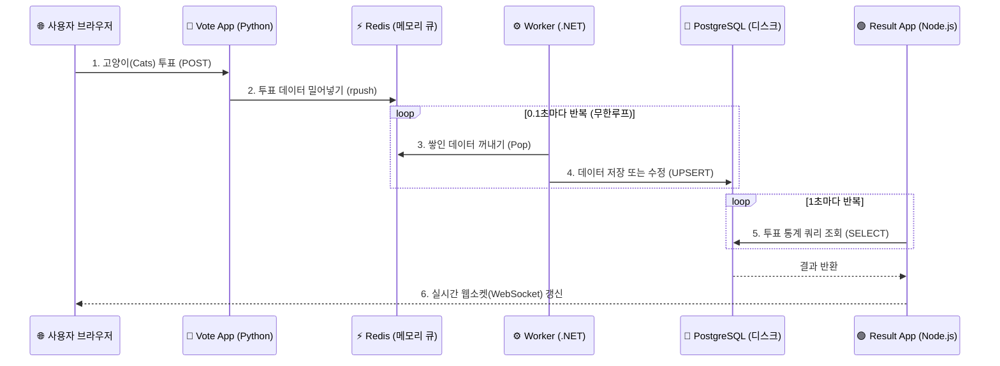

# Docker 완전 정복: Chapter 5-2. 소스 코드 아키텍처 실무 분석 💻

Voting App은 단순한 장난감 코드가 아니라, 실무에서 대용량 트래픽을 처리하는 **마이크로서비스(MSA)** 및 **비동기 큐(Queue)** 아키텍처의 정수를 담고 있습니다. 

어떻게 파이썬, C#, Node.js라는 완전히 다른 언어들이 도커 안에서 하나의 유기적인 시스템으로 동작하는지 각 코드의 핵심 비즈니스 로직을 전문가의 시선으로 뜯어보겠습니다.

---

## 🧭 전체 데이터 흐름 시각화 (Data Flow)

코드를 보기 전에, 데이터가 사용자로부터 출발해 어떻게 흘러가는지 전체 그림을 머릿속에 넣어두어야 합니다.



---

## 🐍 1. 투표 앱 (Vote App / Python Flask)
투표 앱은 사용자에게서 투표를 받아 **가장 빠르게 캐시 메모리(Redis)에 던져두고 빠지는 역할**을 합니다. 실무에서는 이러한 앱을 "API Gateway" 혹은 "Producer"라고 부릅니다.

### 🔍 핵심 로직 분석
1. **쿠키(Cookie)를 통한 유저 식별:** 사용자가 처음 접속하면 `voter_id`라는 고유 난수(ID)를 발급해서 브라우저 쿠키에 심어둡니다. (이 덕분에 내가 투표를 바꾸면 새 투표가 되는 게 아니라 기존 투표가 바뀝니다.)
2. **Redis List 구조 활용:** 사용자가 투표를 하면 DB에 접속하지 않고, Redis의 `votes`라는 리스트(배열)의 맨 오른쪽 끝에 데이터를 밀어 넣습니다(`rpush`).

### 💻 핵심 코드 (`app.py`)
```python
# 사용자에게 고유 voter_id 발급 (쿠키 활용)
voter_id = request.cookies.get('voter_id')
if not voter_id:
    voter_id = hex(random.getrandbits(64))[2:-1]

if request.method == 'POST':
    redis = get_redis()
    vote = request.form['vote'] # 'a' (Cats) 또는 'b' (Dogs)
    
    # 딕셔너리(JSON) 형태로 만들어서 Redis의 'votes' 리스트 끝에 추가(rpush)
    data = json.dumps({'voter_id': voter_id, 'vote': vote})
    redis.rpush('votes', data)
```

---

## ⚙️ 2. 백그라운드 워커 (Worker / .NET C#)
Worker는 24시간 내내 쉬지 않고 일하는 **"백그라운드 데몬(Daemon)"**입니다. 실무에서는 이 녀석을 "Consumer"라고 부릅니다.

### 🔍 핵심 로직 분석
1. **무한 루프와 CPU 최적화:** `while (true)`로 무한 루프를 돕니다. 하지만 CPU가 100%로 치솟는 것을 막기 위해 한 번 데이터를 가져올 때마다 `Thread.Sleep(100)`으로 0.1초씩 의도적으로 휴식합니다.
2. **큐에서 데이터 뽑아오기:** Redis의 `votes` 리스트 왼쪽에서부터 가장 오래된 데이터를 하나씩 꺼내옵니다(`ListLeftPopAsync`). (이것을 FIFO, First-In-First-Out 구조라고 합니다.)
3. **UPSERT (Insert or Update) 로직:** 이게 가장 중요합니다! 만약 사용자가 이미 투표를 한 사람(voter_id가 DB에 존재)인데 투표를 개에서 고양이로 바꿨다면? 워커는 먼저 `INSERT`를 시도하고, 에러(`DbException`)가 나면 잽싸게 `UPDATE` 쿼리로 방향을 틉니다.

### 💻 핵심 코드 (`Program.cs`)
```csharp
while (true)
{
    // 1. CPU 폭주 방지 (0.1초 휴식)
    Thread.Sleep(100);

    // 2. Redis 큐에서 가장 오래된 데이터 하나 꺼내기 (Pop)
    string json = redis.ListLeftPopAsync("votes").Result;
    
    if (json != null)
    {
        var vote = JsonConvert.DeserializeAnonymousType(json, definition);
        
        try {
            // 3. 첫 투표라면 INSERT 실행
            command.CommandText = "INSERT INTO votes (id, vote) VALUES (@id, @vote)";
            command.ExecuteNonQuery();
        }
        catch (DbException) {
            // 4. 이미 투표한 사람이라면 에러 발생 -> UPDATE로 마음 바뀐 투표 반영!
            command.CommandText = "UPDATE votes SET vote = @vote WHERE id = @id";
            command.ExecuteNonQuery();
        }
    }
}
```

---

## 🟢 3. 결과 앱 (Result App / Node.js Express)
결과 앱은 오직 DB에서 통계만 뽑아내서 화면에 뿌려주는 "조회 전용(Read-only)" 앱입니다.

### 🔍 핵심 로직 분석
1. **집계 쿼리 (GROUP BY):** `SELECT vote, COUNT(id) FROM votes GROUP BY vote` 라는 SQL을 사용해 DB 자체적으로 개표 계산을 완료한 깔끔한 통계표를 가져옵니다.
2. **실시간 웹소켓 통신 (Socket.io):** 실습할 때 브라우저에서 '새로고침(F5)'을 누르지 않아도 투표 결과 50:50이 실시간으로 100:0으로 바뀌는 것을 보셨을 겁니다. Result 앱 내부에서 1초마다 무한으로 DB를 조회(`setTimeout`)한 뒤, 바뀐 값이 있으면 웹소켓을 통해 접속해 있는 모든 브라우저 화면에 실시간으로 수치를 '푸시(Push)' 해주기 때문입니다.

### 💻 핵심 코드 (`server.js`)
```javascript
// 1초마다 무한 반복하는 함수
function getVotes(client) {
  // 1. DB에서 '종류별 득표수' 집계 쿼리 실행
  client.query('SELECT vote, COUNT(id) AS count FROM votes GROUP BY vote', [], function(err, result) {
    
    // 2. 예쁘게 파싱 (예: {a: 5, b: 3})
    var votes = collectVotesFromResult(result);
    
    // 3. 접속 중인 모든 사용자(웹 브라우저)에게 실시간으로 결과 발사! (WebSocket)
    io.sockets.emit("scores", JSON.stringify(votes));

    // 4. 1초 뒤에 자기 자신을 또 호출 (무한 반복)
    setTimeout(function() {getVotes(client) }, 1000);
  });
}
```

---

> **💡 실무 인사이트 요약:** 
> 만약 투표 앱 쪽에 사용자가 폭주해서 Redis에 데이터가 1억 개가 밀려 있어도, Worker는 자기 페이스대로 0.1초에 하나씩 안전하게 DB에 옮깁니다. 그 사이 DB는 절대로 죽지 않으며, Result 앱은 그저 DB에 지금까지 저장된 결과만 편안하게 읽어서 보여주면 됩니다. **이것이 바로 실무에서 컨테이너와 큐(Queue)를 결합하여 만든 무중단 아키텍처의 비밀입니다.**
