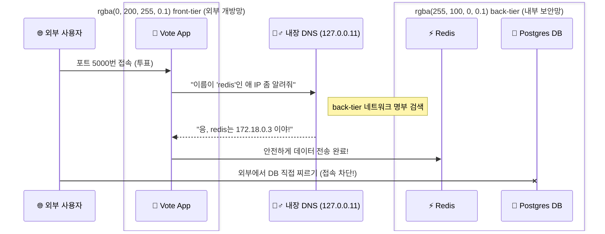
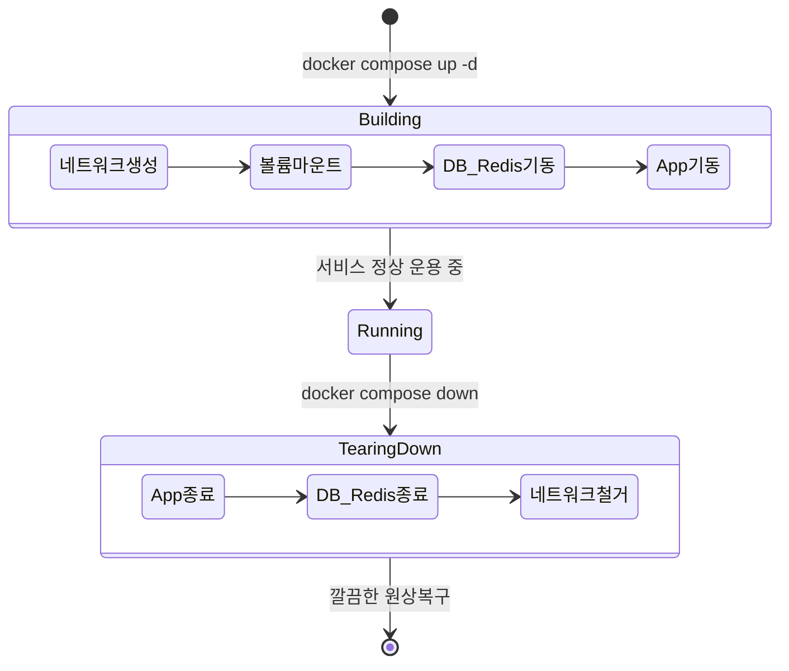

# Docker 완전 정복: Chapter 5-3. Docker Compose 실전 데모 🚀

이전 데모(5-2)에서 우리는 `docker run` 명령어를 5번이나 치고, `--link` 옵션을 거미줄처럼 엮어가며 고통스러운 수동 배포를 경험했습니다. 이번 강의에서는 그 모든 고통을 단 하나의 파일(`docker-compose.yml`)과 단 한 줄의 명령어로 끝내버리는 **Docker Compose의 마법**을 실습합니다.

과거 초창기 도커의 복잡했던 설정 방식(`links` 등)을 모두 걷어내고, **현재 실무에서 100% 사용하고 있는 최신 모던 아키텍처(Modern Architecture) 기준**으로 Docker Compose의 동작 원리와 작성법을 딥 다이브 해보겠습니다.

---

## 🛠️ 1. 최신 실무 버전의 `docker-compose.yml`

현대적인 Docker Compose 파일은 크게 3가지 블록(`services`, `networks`, `volumes`)으로 구성됩니다. 예전처럼 억지로 IP를 엮는 `links` 명령어는 완전히 폐기(Deprecated)되었으며, 그 자리를 **네트워크(Networks)**와 **볼륨(Volumes)**이 완벽하게 대체했습니다.

아래는 Voting App을 현대식으로 완벽하게 재구성한 실무용 Compose 코드입니다.

```yaml
# 최신 문법에는 버전을 명시하지 않거나 최상단에 구조체만 선언합니다.
services:
  vote:
    image: dockersamples/examplevotingapp_vote
    ports:
      - "5000:80"
    networks:
      - front-tier  # 사용자가 접속하는 프론트엔드 망
      - back-tier   # Redis와 통신하는 백엔드 망

  result:
    image: dockersamples/examplevotingapp_result
    ports:
      - "5001:80"
    networks:
      - front-tier
      - back-tier

  worker:
    image: dockersamples/examplevotingapp_worker
    depends_on:     # db와 redis가 먼저 켜진 후에 켜지도록 순서 제어
      - redis
      - db
    networks:
      - back-tier   # 외부 접속 불가, 철저히 백엔드 망에만 격리

  redis:
    image: redis:alpine
    networks:
      - back-tier

  db:
    image: postgres:15-alpine
    environment:
      POSTGRES_USER: postgres
      POSTGRES_PASSWORD: postgres
    volumes:
      - db-data:/var/lib/postgresql/data # DB 데이터 영구 보존 (볼륨 마운트)
    networks:
      - back-tier

# 사용할 가상 네트워크들을 선언
networks:
  front-tier:
  back-tier:

# 사용할 가상 하드디스크(볼륨)를 선언
volumes:
  db-data:
```

---

## 🌐 2. 현대적 아키텍처의 핵심: 격리(Isolation)와 내장 DNS

위 코드를 보면 앱들이 `front-tier`와 `back-tier`라는 두 개의 네트워크로 나뉘어 있습니다. 실무에서는 보안을 위해 외부와 통신하는 망과 내부 DB 망을 철저히 분리합니다.

### ✨ 내장 DNS 자동 변환 원리
예전처럼 `links: - redis`를 쓰지 않아도, 도커는 자신이 만든 `back-tier` 네트워크망 안에 **숨겨진 내장 DNS 서버(`127.0.0.11`)**를 몰래 띄워놓습니다. 

**[네트워크 격리 및 DNS 해결 시각화]**

사용자는 `vote` 컨테이너에는 접속할 수 있지만, `back-tier`에만 속해있는 `DB`에는 절대 직접 접속할 수 없게 설계된 완벽한 보안 아키텍처입니다.

---

## 🪄 3. 마법의 오케스트레이션 명령어 (`up` & `down`)

수동으로 하나씩 컨테이너를 켜고 끄던 시절은 끝났습니다. 이제 터미널에서 단 두 개의 명령어만 기억하면 됩니다.

### 🟢 기동: `docker compose up -d`
명령어를 치는 순간, Compose 엔진은 YAML 파일의 설계도를 읽고 **의존성 순서에 맞춰** 백그라운드(-d)에서 거대한 인프라 공사를 시작합니다.

1. **사전 공사:** `networks`와 `volumes`를 먼저 만듭니다.
2. **우선순위 기동:** `depends_on` 옵션을 읽고 뼈대가 되는 `db`와 `redis`를 먼저 켭니다.
3. **후순위 기동:** 뼈대가 완성되면 그 위에 `vote`, `result`, `worker` 앱들을 동시에 켭니다.

### 🔴 철거: `docker compose down`
실무에서 가장 감탄하는 명령어입니다. 프로젝트를 종료할 때, 켜져 있는 5개의 컨테이너를 안전하게 종료하고, **우리가 만들었던 가상 네트워크 망까지 흔적 없이 깔끔하게 철거**해 줍니다. (단, 데이터 보존을 위해 `volumes` 하드디스크는 지우지 않고 남겨둡니다.)

**[오케스트레이션 라이프사이클 시각화]**


---

## 🎯 4. 실무적 관점: IaC (Infrastructure as Code)의 위력

이 모든 과정의 핵심은 **"인프라를 코드로 관리한다(IaC)"**는 철학에 있습니다.

1. **문서화가 필요 없는 인프라:** 신입 개발자가 와도 워드 문서로 된 "로컬 환경 세팅 가이드"를 줄 필요가 없습니다. 그저 깃허브에서 코드를 클론 받고 `docker compose up` 한 줄만 치면, 선배 개발자와 100% 똑같은 DB와 앱 환경이 노트북에 30초 만에 구축됩니다.
2. **멱등성(Idempotency)의 마법:** `docker compose up -d`를 실수로 100번 치더라도, YAML 파일에 적힌 설정과 현재 상태가 일치한다면 도커는 아무 짓도 하지 않고 평온함을 유지합니다. 멱등성이란 "몇 번을 실행해도 결과가 동일함"을 의미하며, 이는 시스템을 파괴하지 않는 가장 안전한 관리 방법입니다.

수동 타이핑의 늪에서 벗어나, 완벽하게 통제되는 클라우드 네이티브의 오케스트레이션 세계로 진입하신 것을 환영합니다! 🎉

---

## 💡 5. [Q&A 딥 다이브] 실무자가 궁금해하는 핵심 질문들

### Q1. 앱을 '삭제'하면 하드디스크(볼륨) 데이터도 날아갈까?
결론부터 말씀드리면 **"일반적인 삭제 명령어로는 절대 안 날아갑니다!"**

`docker compose down`이나 Docker Desktop에서 휴지통 버튼을 눌러 앱을 삭제하면, 컨테이너(실행 환경)와 가상 네트워크(통신망)는 흔적도 없이 사라집니다. 하지만 우리가 `volumes`로 선언해둔 하드디스크(`db-data`)는 도커 엔진 깊숙한 곳에 **특별 대우를 받으며 안전하게 보존**됩니다.
* **이유:** 실수로 컨테이너를 지웠다고 해서 고객들의 소중한 투표 데이터가 날아가면 대형 사고이기 때문입니다.
* **데이터 완전 삭제 방법:** 만약 진짜로 데이터를 싹 밀어버리고 싶다면 터미널에서 `docker compose down -v` (`-v`는 volume까지 지우라는 강력한 옵션)를 치거나, Docker Desktop 좌측의 **[Volumes] 탭**에 들어가서 해당 볼륨을 직접 수동으로 삭제해야 합니다.

### Q2. 도커 이미지 이름의 비밀 (저작권/네임스페이스)
`dockersamples/...` 와 `redis:alpine` 처럼 이름 형태가 다른 것은 도커 허브(Docker Hub)의 **'공식 인증' 등급 차이** 때문입니다.

* **`dockersamples/examplevotingapp_vote`:** 전 세계 누구나 이미지를 올릴 수 있기 때문에, 이름 중복을 막기 위해 앞에 `<계정명(Namespace)>/`을 붙입니다. `dockersamples`는 도커 본사가 교육용으로 만든 공식 기관 계정입니다.
* **`redis:alpine` (계정명이 없는 경우):** Redis, Postgres, Ubuntu 같은 전 세계구급 유명 소프트웨어들은 도커 허브에서 **"Official Image (공식 이미지)"** 특권을 부여받습니다. 도커 본사 보안팀이 직접 검수하고 취약점이 없음을 100% 보증하는 가장 믿고 쓸 수 있는 안전한 이미지라는 뜻입니다.

### Q3. `POSTGRES_USER` 비밀번호는 어떻게 자동으로 세팅된 걸까?
내가 DB에 접속해서 `CREATE USER` 명령어를 친 적이 없는데 어떻게 계정이 만들어졌을까요? 이것은 Postgres 공식 이미지 제작자들이 만들어둔 **'최초 부팅 자동화 스크립트(Entrypoint Script)'**의 마법입니다.

1. 도커가 Postgres 컨테이너를 **태어나서 처음으로 딱 한 번** 켤 때, 내부에 있는 쉘 스크립트가 실행됩니다.
2. 이 스크립트는 우리가 `environment`에 적어둔 환경 변수를 읽어옵니다.
3. 그리고 도커 컨테이너 내부에서 사용자(강사님)를 대신해서 자체적으로 DB 초기화(계정/비밀번호 생성) 명령어를 백그라운드에서 실행해 줍니다.

즉, **"환경 변수(Environment Variables)는 컨테이너가 처음 부팅될 때 어떻게 세팅해야 하는지 알려주는 주문서(Instruction)"** 역할을 합니다. 실무에서는 소스 코드 안에 비밀번호를 하드코딩하지 않고, 이렇게 Compose 파일의 환경 변수를 통해 주입(Injection)하는 것이 기본 원칙입니다.
