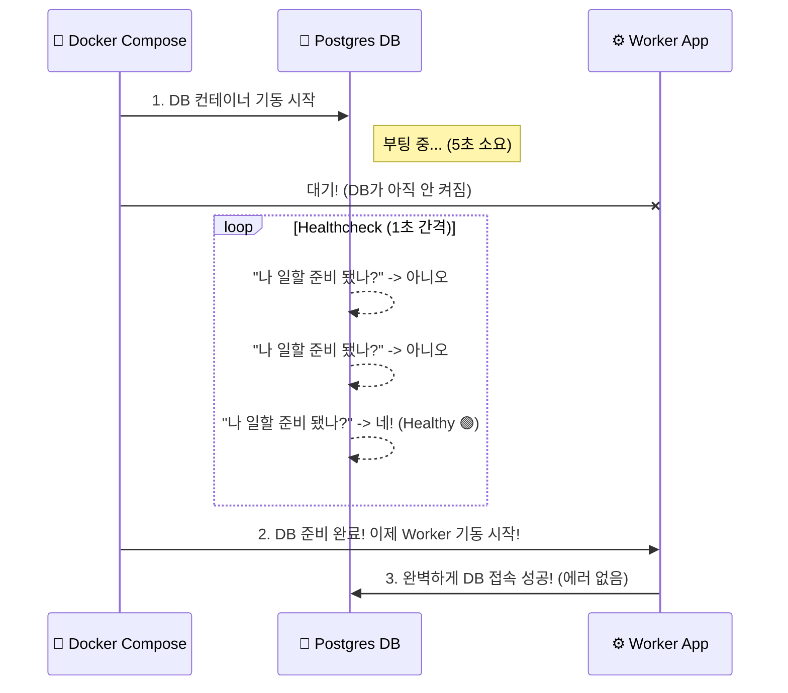

# Docker 완전 정복: Chapter 5-4. Docker Compose 버전 업그레이드 및 트러블슈팅 🛠️

이번 데모 영상(5-4)에서는 초창기(V1) Compose 파일을 최신 포맷(V3)으로 업그레이드하는 과정과, 실무에서 아주 흔하게 겪는 **"DB 초기화 실패로 인한 연쇄 장애(Cascading Failure)"** 트러블슈팅 과정을 다루고 있습니다.

우리가 이전 문서(5-3)에서 이미 최신 버전을 선제적으로 적용해보았기 때문에, 이번 문서에서는 영상에서 발생한 **에러의 원인과 실무적인 완벽한 해결책**에 집중하여 딥 다이브 해보겠습니다.

---

## 🚀 1. Compose 파일 구조의 진화 (V1 ➡️ V3)

영상 초반부에서 강사님이 기존 파일의 내용을 탭(Tab)으로 밀어 넣고 상단에 `version: '3'`과 `services:`를 추가하는 장면이 나옵니다. 

**왜 이런 거대한 구조적 변화(V1 ➡️ V3)가 생겼을까요?**

초창기 도커(V1)의 목적은 아주 단순했습니다. "여러 개의 컨테이너를 한 번에 켜자!" 였습니다. 그래서 파일 구조도 단순히 컨테이너 이름들을 쭉 나열하는 1차원적인 평면(Flat) 구조였습니다. 

하지만 도커가 전 세계적으로 쓰이면서 시스템 아키텍처가 점점 복잡해졌습니다. 단순한 실행을 넘어, **보안을 위해 네트워크(Networks) 망을 쪼개고, 데이터 영구 보존을 위해 독립적인 하드디스크(Volumes)를 관리**해야 하는 거대한 "인프라 설계(Orchestration)"의 영역으로 진화한 것입니다.

이러한 고차원적인 인프라 설계를 기존의 평면 구조 파일로는 도저히 감당할 수 없었습니다. 그래서 도커 팀은 과감하게 **최상단(Root Level)을 3개의 커다란 방(`services`, `networks`, `volumes`)으로 쪼개는 구조적 계층화(Hierarchical) 작업**을 단행했습니다. 

**[📦 Compose V1 (과거) vs V3 (현대) 파일 구조 비교 시각화]**


이제 모든 앱(컨테이너)들은 `services`라는 전용 방 안에 깔끔하게 격리되어 모이게 되었고, 이 앱들이 밖으로 나와 동급 레벨에 있는 `networks`와 `volumes`를 가져다 쓰는 **객체 간의 완벽한 분업화와 모듈화**가 이루어진 것입니다. 이것이 우리가 `version: '3'`을 쓰면서 반드시 탭(Tab)으로 들여쓰기를 해야 했던 진짜 이유입니다.

*(참고: 최신 2026년 실무 표준(Compose Spec)에서는 `version` 명시 자체를 아예 생략하는 것이 트렌드입니다. 최신 도커 엔진이 알아서 최신 문법으로 해석해 줍니다.)*

---

## 💥 2. [실무 딥 다이브] DB 에러와 연쇄 장애 (Cascading Failure)

영상 중반부에 `docker-compose up`을 쳤더니, 갑자기 Worker와 Result 앱에서 `No such device or address` 및 `Waiting for db` 라는 에러를 뿜어내는 장면이 나옵니다.

### 🕵️‍♂️ 에러의 근본 원인 (Root Cause)
1. **보안 정책의 강화:** Postgres 데이터베이스 공식 이미지가 업데이트되면서, 관리자 비밀번호(`POSTGRES_PASSWORD`)를 강제로 설정하지 않으면 아예 DB 서버가 켜지지 않고 스스로 자폭(Crash)하도록 보안 정책이 변경되었습니다.
2. **연쇄 장애 발생:** DB가 자폭해버리니, DB에 접속해야만 일을 할 수 있는 Worker 앱과 Result 앱도 갈 곳을 잃고 줄줄이 에러를 뿜어내며 멈춰버린 것입니다. 이를 마이크로서비스 환경에서 가장 경계해야 하는 **연쇄 장애(Cascading Failure)**라고 부릅니다.

### 💊 영상 속의 1차 해결책 (환경 변수 주입)
강사님은 `db` 서비스 항목에 `environment` 속성을 추가하여 이 문제를 해결했습니다. (우리가 앞선 Q&A에서 배운 그 원리입니다!)

```yaml
  db:
    image: postgres:9.4
    environment:
      POSTGRES_USER: postgres
      POSTGRES_PASSWORD: postgres # 👈 DB가 기동될 때 이 비밀번호로 초기화됨!
```

---

## ✨ 3. 현대적인 완벽한 해결책: 상태 체크 (Healthcheck)

영상에서는 비밀번호를 넣어주는 것으로 무사히 넘어갔지만, **실제 실무 환경에서는 저것만으로는 부족합니다.** 

DB 컨테이너가 켜지는 데는 보통 5~10초가 걸리지만, Worker 앱 컨테이너는 0.1초 만에 켜집니다. 결국 Worker 앱은 DB가 아직 준비도 안 됐는데 먼저 접속하려고 시도하다가 에러를 뿜게 됩니다(Race Condition).

이를 완벽하게 막기 위해 최신 Compose에서는 **"DB가 완전히 부팅될 때까지 다른 애들은 대기해!"**라고 지시할 수 있는 강력한 기능이 추가되었습니다.

**[🚀 최신 실무 Healthcheck & Depends_on 방어 로직]**
```yaml
services:
  db:
    image: postgres:15-alpine
    environment:
      POSTGRES_USER: postgres
      POSTGRES_PASSWORD: postgres
    # 1. DB 스스로 1초마다 자기가 정상인지 진찰(Healthcheck)합니다.
    healthcheck:
      test: ["CMD-SHELL", "pg_isready -U postgres"]
      interval: 1s
      timeout: 5s
      retries: 5

  worker:
    image: dockersamples/examplevotingapp_worker
    # 2. Worker는 무작정 켜지지 않고, DB가 '건강함(healthy)' 판정을 받을 때까지 숨죽여 기다립니다.
    depends_on:
      db:
        condition: service_healthy 
```

**[오케스트레이션 실행 순서 시각화]**


이번 영상은 아주 단순한 데모 같아 보이지만, **"컨테이너 간의 의존성과 부팅 순서를 어떻게 완벽하게 통제할 것인가"**라는 실무 인프라 엔지니어링의 핵심 과제를 넌지시 던져주고 있습니다. 이 흐름을 이해하셨다면 클라우드 네이티브 아키텍트의 자질을 충분히 갖추신 겁니다! 🎉
