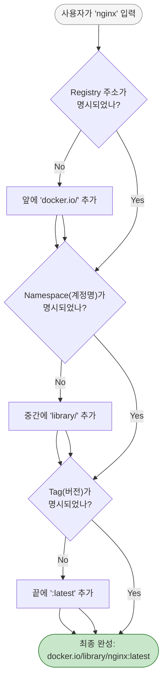

# Docker 완전 정복: Chapter 6-1. Docker Registry ☁️

이번 챕터에서는 도커 생태계의 거대한 구름이자 핵심 저장소인 **Docker Registry(도커 레지스트리)**에 대해 다룹니다. 강사님은 "컨테이너가 비(Rain)라면, 레지스트리는 그 비를 내리게 하는 구름(Cloud)"이라고 비유하셨죠. 

### 💡 [Q&A] "구름(Cloud)과 비(Rain)" 비유의 진짜 의미는?
이 비유는 **"소스의 근원지"**를 설명하기 위한 것입니다. 하늘에 구름이 없으면 땅에 비가 내릴 수 없듯이, 어딘가에 **이미지를 모아둔 거대한 구름(Registry)**이 있어야만 내 노트북(땅)에 **컨테이너(비)**를 내리게(다운로드) 할 수 있다는 뜻입니다. 즉, **Registry = 전 세계 도커 이미지들이 떠 있는 구름 창고** 입니다.

### 🧭 [총정리] Docker Compose, Hub, Registry 생태계 연결도
지금까지 배운 개념들이 헷갈리실 텐데, 일상생활의 **"밀키트 요리"**에 비유하면 아주 쉽습니다.
* **Docker Image (밀키트 상자):** 프로그램이 실행되기 위한 모든 재료가 담긴 상자.
* **Docker Registry (거대한 물류창고):** 밀키트 상자들을 보관하는 창고 시스템 자체.
* **Docker Hub (이마트):** 전 세계 누구나 접근할 수 있는 가장 크고 유명한 Public Registry(물류창고)의 이름.
* **Docker Engine (요리사):** 내 컴퓨터 안에서 밀키트를 다운받아 요리(실행)해 주는 녀석.
* **Docker Compose (레시피 매니저):** 요리사에게 "A밀키트 까고, B밀키트 까서 둘이 섞어!" 라고 적어둔 주문서(`docker-compose.yml`).

**[🌐 생태계 개념 완벽 연결도]**

---

## 🏷️ 1. 도커 이미지 이름의 진짜 비밀 (Naming Convention)

터미널에서 무심코 쳤던 `docker run nginx` 명령어 뒤에는 아주 정교하게 생략된 규칙들이 숨어 있습니다. 

### 💡 [Q&A] `nginx`가 도대체 무엇이고 실무에서 어떻게 쓰이나요?
`nginx`(엔진엑스)는 전 세계에서 가장 많이 쓰이는 **"웹 서버(Web Server)"** 및 **"문지기(Reverse Proxy)"** 프로그램입니다. 
실무에서는 사용자가 웹사이트에 접속할 때 가장 먼저 만나는 **"최전방 수문장"** 역할을 합니다. 뒷단에 있는 투표 앱(Python)이나 결과 앱(Node.js)을 외부 해커로부터 보호하고, 트래픽이 몰릴 때 여러 앱으로 분산시켜 주는 필수 요소입니다.

**[🧱 Nginx의 실무 아키텍처 역할]**

### 🔍 이미지 이름이 길어지는 마법의 분기(Flow)
우리가 `nginx`라고 짧게 쳐도 도커가 알아서 인터넷에서 이미지를 찾아오는 이유는, 내부에 **자동 이름 채우기(Auto-fill) 로직**이 있기 때문입니다. 도커 엔진 내부에서는 다음과 같이 해석됩니다.

**[🔍 이미지 이름 자동 해석 분기 다이어그램]**

* **Registry URL (`docker.io`):** 생략되면 무조건 **Docker Hub**(`docker.io`)에서 찾습니다.
* **Namespace (`library`):** 생략되면 공식 이미지 전용 공간인 `library` 계정에서 찾습니다. 일반 유저는 `shinwookkang/nginx` 처럼 계정명을 써야 합니다.
* **Repository (`nginx`):** 실제 애플리케이션의 이름입니다.
* **Tag (`latest`):** 버전을 생략하면 가장 최신 버전(`latest`)을 가져옵니다.

---

## 🏢 2. 퍼블릭(Public) vs 프라이빗(Private) 레지스트리

누구나 무료로 다운받을 수 있는 Public Registry(Docker Hub 등)와 달리, 회사 소스코드가 담긴 이미지는 철저한 권한 관리가 적용된 Private Registry에 보관합니다.

### 💡 [Q&A] 클라우드 Registry의 진짜 차이점 (GitHub, AWS, GCP)
초보자분들이 가장 많이 헷갈리시는 "내 데이터를 남의 땅 어디에 보관할 것인가?"의 문제입니다.

* **GitHub vs GitHub Container Registry (GHCR):**
  * 깃허브는 원래 "소스 코드(텍스트)"만 올리는 곳이었습니다.
  * 개발자들이 "코드 빌드해서 도커 이미지(압축파일) 만들었는데, 이것도 깃허브에 같이 저장해줘!"라고 요구해서 만들어진 기능이 **GHCR(이미지 보관함)**입니다. 코드가 있는 곳에 결과물(이미지)도 함께 보관할 수 있어 편합니다.

  > 💡 **[초보자 주의] `docker-compose.yml`을 깃허브에 올린다고 이미지가 보관되는 건가요?**
  > **절대 아닙니다!** 
  > * `docker-compose.yml`이나 `app.py`, `Dockerfile` 같은 파일들은 단순한 **"텍스트 글자(요리 레시피)"**일 뿐입니다. 이 파일들은 기존의 일반적인 **GitHub 소스코드 저장소(Repository)**에 올라갑니다. (용량: 수 킬로바이트)
  > * 반면, **도커 이미지(Image)**는 이 레시피를 바탕으로 도커 엔진이 만들어낸 거대한 **"완성품(냉동 밀키트 박스)"**입니다. (용량: 수백 메가바이트)
  > * 즉, 코드를 깃허브에 Push 한다고 해서 이미지가 저절로 만들어져서 올라가는 것이 아닙니다. 개발자가 컴퓨터에서 직접 `docker build`로 이미지를 구워낸 다음, `docker push ghcr.io/...` 명령어를 따로 쳐야만 깃허브의 숨겨진 거대한 이미지 창고(GHCR)에 무거운 완성품이 보관되는 것입니다.
* **AWS ECR vs GCP GAR (클라우드 저장소):**
  * 회사의 실제 서버 컴퓨터를 아마존(AWS)에서 빌렸다면? 구글에서 이미지를 다운받아오면 인터넷 요금(트래픽 비용)이 비싸고 속도도 느립니다.
  * 그래서 **아마존 서버를 쓰면 아마존 저장소(ECR)를, 구글 서버를 쓰면 구글 저장소(GAR)를 쓰는 것**이 같은 건물 안에서 데이터를 옮기는 셈이 되어 훨씬 빠르고 공짜이기 때문입니다.

---

## 🔑 3. 프라이빗 레지스트리 로그인과 보안 (Authentication)

프라이빗 레지스트리에 있는 회사 코드를 다운받거나 올리려면 **반드시 신분증 검사**를 거쳐야 합니다. 

1. **`docker login` 명령어 실행:** 아이디와 패스워드(또는 토큰) 입력.
2. 인증에 성공하면, 도커 엔진은 내 컴퓨터의 `~/.docker/config.json` 비밀 금고에 인증 티켓을 저장합니다.
3. 이후부터는 도커가 프라이빗 주소를 볼 때마다 금고에서 티켓을 꺼내서 자동으로 인증 문을 통과합니다.

*(참고: 실무에서는 `docker login` 시 쌩 패스워드 대신 AWS IAM 토큰이나 GitHub PAT 같은 일회용/기간 한정 토큰(Credential Helper)을 사용하여 보안을 극대화합니다.)*

---

## 🏠 4. 사내망(On-Premise) 로컬 레지스트리 직접 구축하기

### 💡 [Q&A] `registry:2`를 내 맥북에 띄우면 나 혼자만 쓰는 거 아닌가요?
정확합니다! 강사님 맥북에서 `localhost:5000`으로 띄우면 강사님 혼자만 쓸 수 있습니다. 
하지만 실제 회사에서는 강사님의 맥북이 아니라, **"회사의 24시간 켜져 있는 공용 리눅스 서버(예: 192.168.1.100)"**에 도커를 깔고 이 명령어를 실행합니다. 그러면 사내 와이파이에 연결된 모든 직원이 `192.168.1.100:5000` 주소로 접속해서 그 서버를 Registry로 쓸 수 있게 되는 원리입니다.

1. **사내 서버에서 기동:** `docker run -d -p 5000:5000 --name registry registry:2`
2. **태깅(Tagging):** 방금 만든 내 앱 `my-app`에 도착지 주소를 적은 스티커를 붙여줍니다. (`docker tag my-app localhost:5000/my-app`)
3. **푸시(Push):** `docker push localhost:5000/my-app` 명령어를 치면 스티커에 적힌 주소로 이미지를 쏘아 보냅니다.

### 💡 [Q&A] Harbor(하버)나 Nexus(넥서스)는 외부 라이브러리인가요?
아닙니다! **Nginx가 '웹 서버 프로그램'인 것처럼, Harbor는 '기업용 Registry 프로그램'의 이름입니다.**

날것의 `registry:2` 이미지는 까만 터미널 창밖에 없어서 회사에서 다 같이 쓰기 너무 불편합니다. 그래서 실무에서는 오픈소스인 Harbor를 다운받아 사내 공용 서버에 설치합니다. **결론적으로 사내망에 깃허브나 도커 허브 같은 예쁜 웹사이트를 직접 차리는 것**입니다.

**[🚢 엔터프라이즈 Registry (Harbor) 구조]**

