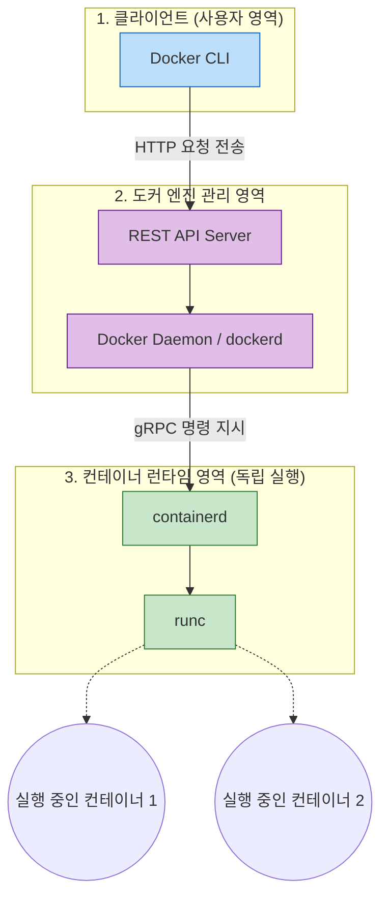
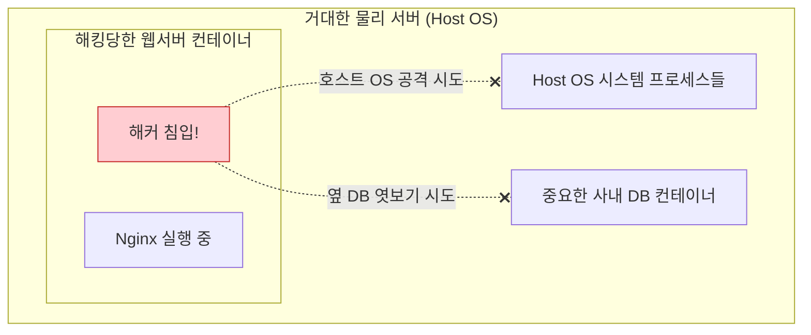

# Docker 완전 정복: Chapter 7-1. Docker Engine ⚙️

이번 챕터부터는 "도커가 내부적으로 어떻게 작동하는가?"에 대한 근본적인 아키텍처를 파헤칩니다. 기초적인 사용법을 넘어, 시스템 인프라 엔지니어로서 도커의 뼈대(Engine)와 격리 기술(Namespaces, cgroups)을 이해하는 매우 중요한 시간입니다.

강의의 기본 개념을 충실히 담아내면서, 헷갈리실 수 있는 원격 제어 자원 문제와 격리의 진짜 목적을 시각화하여 딥 다이브 해보겠습니다.

---

## 🏗️ 1. Docker Engine의 3단 구조와 최신 분리(Decoupled) 아키텍처

강의에서는 도커 엔진을 `Docker CLI`, `REST API`, `Docker Daemon` 3가지 컴포넌트로 설명합니다. 이들이 어떻게 역할을 분담하는지 기술적으로 명확하게 알아보겠습니다.

### ⚙️ 핵심 컴포넌트의 역할
1. **Docker CLI:** 우리가 터미널에 입력하는 `docker run` 같은 명령어 도구입니다. CLI 자체는 컨테이너를 실행할 능력이 없으며, 사용자의 명령을 텍스트 형태의 HTTP 요청으로 포장해서 API로 전송하는 역할만 합니다.
2. **REST API:** CLI가 보낸 HTTP 요청을 수신하여 데몬에게 전달하는 통신 인터페이스입니다. (우리가 파이썬 코드 등으로 직접 도커를 제어할 때 이 API를 직접 호출할 수도 있습니다.)
3. **Docker Daemon (`dockerd`):** 도커의 핵심 프로세스입니다. 이미지 다운로드, 네트워크 구성, 볼륨 할당 등 도커 객체들의 상태를 관리하고 통제하는 두뇌 역할을 합니다.

### 💡 [Q&A] 최신 실무의 '분리(Decoupled)' 아키텍처란 무엇인가요?
과거에는 `Docker Daemon`이 컨테이너의 생성, 실행, 관리 등 모든 작업을 혼자서 독점했습니다. 이 구조의 치명적인 단점은, 도커 데몬을 업데이트하거나 데몬 프로세스가 크래시(다운)될 경우, 그 위에서 돌고 있던 모든 운영 중인 컨테이너도 함께 죽어버린다는 것이었습니다.

그래서 현대의 도커는 실제 컨테이너를 띄우고 실행하는 '실무 런타임' 영역을 별도의 컴포넌트로 분리(Decoupled)했습니다.

* **`containerd`:** 컨테이너의 생애주기(시작/정지)를 전담 관리하는 업계 표준 데몬입니다.
* **`runc`:** 실제로 리눅스 커널과 소통하며 컨테이너 프로세스를 생성하는 실행기입니다.

**결과적으로, 이제는 `Docker Daemon`이 죽거나 재시작되어도 `containerd`가 컨테이너들의 실행 상태를 굳건히 유지시켜 주어 무중단 서비스가 가능해졌습니다.**

**[⚙️ 최신 Docker Engine 아키텍처 시각화]**

---

## 📡 2. 원격 도커 제어 (Remote Docker)와 `-H` 옵션

도커 CLI는 반드시 데몬과 같은 컴퓨터에 설치되어 있을 필요가 없습니다. `-H` (Host) 옵션을 사용하면, 내 노트북(클라이언트)에서 저 멀리 있는 고성능 서버의 도커 데몬에게 명령을 내릴 수 있습니다.
`docker -H=10.123.2.1:2375 run nginx`

### 💡 [Q&A] 다른 서버에서 실행명령을 내려도, 결국 내 맥북의 CPU/RAM을 쓰는 것 아닌가요?
**전혀 쓰지 않습니다! 이것이 바로 클라이언트-서버(Client-Server) 아키텍처의 핵심입니다.**

내 맥북의 Docker CLI는 말 그대로 **"명령어를 담은 아주 작은 텍스트 메시지(명령서)"**를 인터넷 선을 통해 원격 서버(10.123.2.1)로 날려보내는 역할만 합니다. 
* **내 맥북의 소모 자원:** 텍스트 메시지를 보내는 데 필요한 단 몇 KB의 메모리와 0.1초의 통신뿐입니다.
* **원격 서버의 소모 자원:** 명령을 수신한 원격 서버의 도커 데몬이 **원격 서버의 CPU와 128GB RAM을 온전히 사용**하여 이미지를 다운받고 Nginx 컨테이너를 가동합니다.

따라서 명령을 내린 직후 내 맥북의 전원을 꺼버려도, 원격 서버에서는 Nginx 컨테이너가 아무 문제 없이 100% 성능으로 계속 돌아가게 됩니다.

---

## 🛡️ 3. 도커 격리의 마법 1: Namespaces (PID 격리)

컨테이너가 가상머신(VM)과 가장 큰 차이를 보이는 곳이 바로 **Namespaces(네임스페이스)** 기술입니다.

리눅스 시스템이 켜지면 제일 처음 실행되는 뿌리 프로세스는 항상 `PID 1`을 가집니다. 컨테이너 내부의 프로세스(예: Nginx) 역시 자기가 이 세상의 첫 번째이자 유일한 프로세스(`PID 1`)라고 생각합니다.
하지만 호스트 OS 입장에서 보면 그저 수만 개의 프로세스 중 하나인 `PID 15023`일 뿐입니다. 하나의 프로세스가 바깥 세상(Host)과 안쪽 세상(Container)에서 두 개의 다른 프로세스 아이디(PID)를 가지게 만드는 기술이 Namespace입니다.

### 💡 [Q&A] 자기가 독립된 시스템(VM)이라고 착각하게 만들면 무엇이 좋은가요?
가장 큰 이점은 **"보안(Security)과 상호 간섭 차단"**입니다. 

PID Namespace로 시야를 격리해버리면, 컨테이너 내부에 있는 프로그램은 **자신의 컨테이너 밖에서 무슨 프로그램들이 돌아가고 있는지 아예 볼 수단이 사라집니다.**

**[보안 격리 효과 시각화]**

만약 해커가 웹서버 컨테이너를 뚫고 들어왔다고 가정해 보겠습니다.
* **격리가 없다면:** 해커는 서버의 전체 프로세스 목록을 확인하고, 옆에서 돌아가고 있는 사내 DB 프로그램을 강제로 종료하거나 메모리를 엿볼 수 있습니다.
* **Namespace가 있다면:** 해커가 프로세스 목록(`ps` 명령어)을 조회해도 자기 자신(Nginx) 밖에 보이지 않습니다. 볼 수 없으니 끄거나 공격할 수도 없습니다. 

이처럼 무겁고 느린 가상머신(VM)을 설치하지 않고도, **소프트웨어적인 눈가리개(Namespace)**만으로 가상머신과 동급 수준의 안전한 독립 환경을 제공하는 것이 도커의 가장 위대한 혁신입니다.

---

## ⚖️ 4. 도커 격리의 마법 2: cgroups (자원 할당량 제한)

Namespaces가 "시야 격리(보안)" 라면, **cgroups(Control Groups)**는 "하드웨어 자원 격리(생존)" 입니다.

기본적으로 컨테이너는 호스트 컴퓨터의 모든 CPU와 RAM을 100% 다 쓸 수 있습니다. 만약 하나의 컨테이너에 메모리 누수(Memory Leak) 버그가 발생해서 서버의 모든 RAM을 집어삼키면, 호스트 컴퓨터 전체가 멈춰버리는 대형 사고(OOM, Out Of Memory)가 발생합니다.

이를 막기 위해 우리는 도커 엔진을 통해 하드웨어 자원의 상한선(Limit)을 강제합니다:
* `--cpus="0.5"` : 호스트 CPU 1개 코어의 딱 50%까지만 사용하도록 물리적 제한.
* `--memory="100m"` : RAM은 최대 100 메가바이트까지만 사용 가능. (이 한도를 넘어서려 하면 커널이 해당 컨테이너 프로세스를 핀셋처럼 집어서 강제 종료시킵니다.)

최신 리눅스와 쿠버네티스(k8s) 환경에서는 이를 더욱 정교하게 발전시킨 **cgroups v2**를 표준으로 사용하며, 하나의 무한 루프 앱이 전체 클러스터를 무너뜨리지 못하게 방어하는 가장 핵심적인 인프라 기술입니다.
