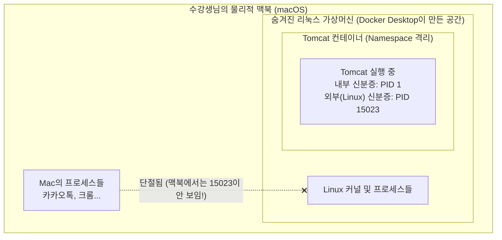

# Docker 완전 정복: Chapter 7-2. Demo - Docker PID Namespaces 🔍

이전 강의(7-1)에서 우리는 **"컨테이너는 자기가 1번 프로세스(PID 1)라고 착각하게 만드는 눈가리개(Namespace) 마법을 쓴다"**고 배웠습니다. 
이번 데모에서는 실제로 톰캣(Tomcat) 웹 서버를 띄워놓고, **안쪽 세상과 바깥 세상에서 프로세스 ID(PID)가 어떻게 다르게 보이는지** 직접 증명해 보겠습니다.

특히 제공해주신 최신 톰캣 공식 문서를 반영하고, **수강생님의 Mac 환경에서 실습할 때 반드시 알아야 할 함정(VM)**까지 실무 딥 다이브로 완벽히 짚어드리겠습니다.

---

## 🚀 1단계: Tomcat 웹 서버 컨테이너 실행하기

도커 허브(Docker Hub)의 공식 Tomcat 이미지를 가져와 백그라운드(`-d`)로 실행합니다.

```bash
# 8888번 포트로 접속하면 컨테이너의 8080 포트로 연결되도록 실행합니다.
docker run -d --name my-tomcat -p 8888:8080 tomcat:latest
```

실행 후 `docker ps`를 입력하면 컨테이너가 정상적으로 돌아가고 있는 것을 확인할 수 있습니다.

> 💡 **[최신 실무 딥 다이브] 톰캣 접속 시 404 에러가 뜨는데요?**
> 제공해주신 최신 도커 허브 문서에 아주 중요한 문구가 있습니다: *(returning a 404 since there are no webapps loaded by default)*
> 과거 버전에서는 접속 시 고양이가 그려진 환영 페이지가 나왔지만, **최신 톰캣 이미지들은 보안을 위해 기본 샘플 앱(webapps)을 모두 비워두고 출시됩니다.** 따라서 브라우저에서 `http://localhost:8888`로 접속했을 때 404 에러 페이지가 뜬다면, 컨테이너가 아주 정상적으로 잘 작동하고 있다는 뜻입니다! (응답을 톰캣이 해준 것이기 때문입니다.)

---

## 🕵️‍♂️ 2단계: 컨테이너 '내부' 세상에서 PID 확인하기 (눈가리개를 쓴 상태)

이제 컨테이너 안으로 몰래 들어가서, 톰캣이 스스로를 몇 번 프로세스라고 생각하는지 확인해 보겠습니다.

```bash
# my-tomcat 컨테이너 내부에서 프로세스 목록(ps -eaf)을 조회하라는 명령입니다.
docker exec my-tomcat ps -eaf
```

**[실행 결과 예시]**
```text
UID        PID  PPID  C STIME TTY          TIME CMD
root         1     0  1 09:00 ?        00:00:02 /usr/local/openjdk-17/bin/java -Djava.util.logging.config.file...
```
결과를 보면 `CMD`에 Java(Tomcat) 프로세스가 보이고, **가장 중요한 PID(Process ID) 항목이 `1`로 되어 있습니다!**
톰캣 입장에서는 이 컨테이너 세상에 자신을 실행시켜 줄 부모(PPID=0) 외에는 아무도 없으며, 자기가 이 세상의 첫 번째이자 유일한 창조물(`PID 1`)이라고 굳게 믿고 있습니다.

---

## 🌍 3단계: 컨테이너 '외부' (Host OS) 세상에서 PID 확인하기

강의(데모)에서는 이제 리눅스 서버(Host)의 터미널로 돌아와서 프로세스를 검색해 봅니다.

```bash
# 호스트 컴퓨터 전체에서 돌아가는 프로세스 중 tomcat(또는 java)을 검색합니다.
ps -eaf | grep tomcat
```

**[리눅스 호스트 실행 결과 예시]**
```text
UID        PID  PPID  C STIME TTY          TIME CMD
root     15023  2045  1 09:00 ?        00:00:02 /usr/local/openjdk-17/bin/java -Djava.util.logging.config.file...
```
바깥 세상(Host)에서 똑같은 프로세스를 찾아보니, **PID가 `1`이 아니라 `15023` 등 전혀 다른 큰 숫자**로 나옵니다! 

이로써 동일한 하나의 프로그램이 **"바깥 세상(PID 15023)과 안쪽 세상(PID 1)에서 서로 다른 2개의 신분증을 가지게 된다"**는 Namespace 격리 기술이 실존함을 눈으로 증명했습니다.

---

## ⚠️ 4단계 [Mac 유저 필수 딥 다이브]: 내 맥북에서는 3단계가 안 되는데요?!

**이 부분이 이 데모에서 가장 중요합니다.** 수강생님은 현재 Mac을 사용 중이십니다. 
만약 수강생님의 맥북 터미널에서 위 3단계(`ps -eaf | grep tomcat`)를 입력하시면 **아무런 결과도 나오지 않을 것입니다.** (강의 영상의 강사는 원시 리눅스 서버를 쓰고 있기 때문에 가능한 것입니다.)

### 🤔 왜 내 맥북에서는 프로세스가 안 보일까요?
맥북(macOS)이나 윈도우는 리눅스가 아닙니다. 도커는 '리눅스 커널의 Namespace 기술'을 써야만 작동합니다.
그래서 Docker Desktop을 설치하면, **맥북 안쪽에 아주 작고 투명한 '가상 리눅스 서버(Linux VM)'를 몰래 하나 만들어 두고**, 그 안에서 도커 데몬과 컨테이너들을 돌립니다.

**[Mac 환경의 도커 아키텍처 시각화]**


* 톰캣의 진짜 외부 신분증(`PID 15023`)은 맥북이 아니라, **숨겨진 리눅스 가상머신 안에서 발급**된 것입니다.
* 따라서 맥북의 기본 터미널에서 프로세스를 검색해 봤자 리눅스 안쪽의 세상은 보이지 않는 것입니다.

**[요약]**
이 데모의 핵심은 **"PID Namespace라는 기술이 컨테이너에게 완벽한 착각(시야 격리)을 심어주어 독립성을 보장한다"**는 사실을 이해하는 것입니다. 실무에서 굳이 호스트 PID를 찾아낼 일은 거의 없으므로, 개념만 완벽히 가져가시면 됩니다!
