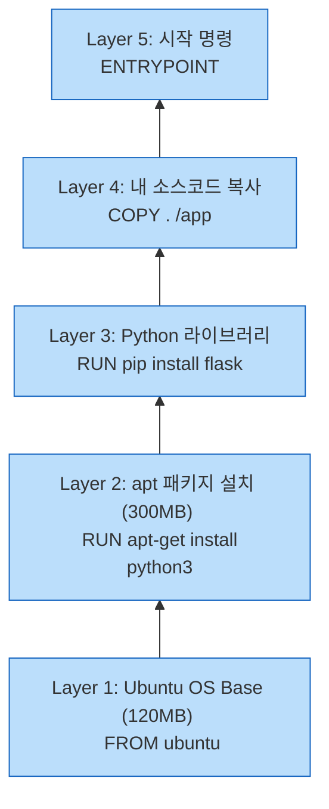
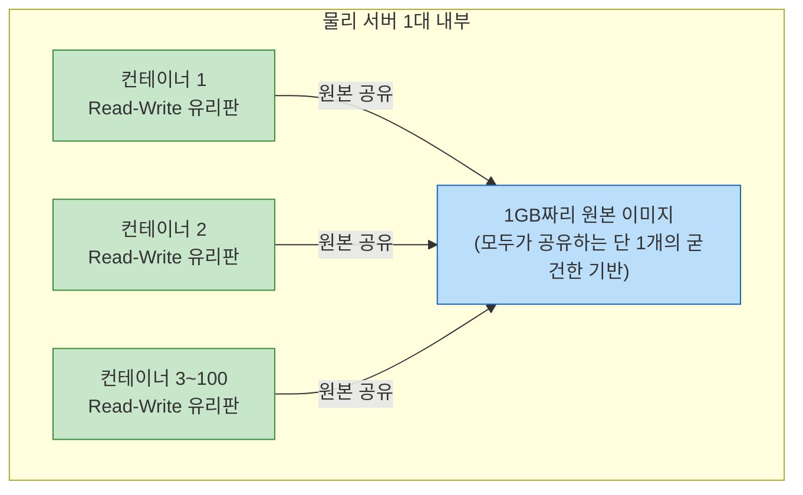
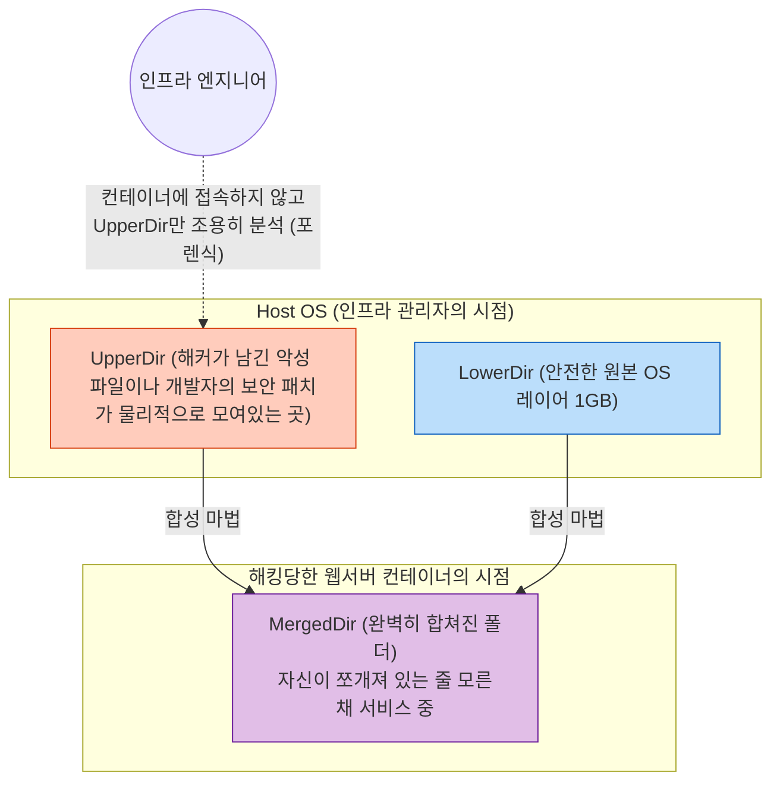

# Docker 완전 정복: Chapter 7-3. Docker Storage 💾

이번 강의에서는 **도커가 데이터를 어디에, 어떻게 저장하는지**, 그리고 **이미지의 용량을 획기적으로 줄이는 마법(레이어 아키텍처)**에 대해 딥 다이브 해보겠습니다.

특히 강의 영상에 나오는 구형 스토리지 드라이버(AUFS) 내용을 과감히 걷어내고, **최신 2026년 실무 표준인 `overlay2`와 `--mount` 문법**을 중심으로 현대적인 가이드를 제공합니다.

---

## 📁 1. 도커의 물리적 저장 위치

도커를 리눅스 시스템에 설치하면, 기본적으로 모든 데이터(이미지, 컨테이너, 볼륨 등)는 아래 경로에 저장됩니다.
👉 **`/var/lib/docker`**

이 폴더 안에 들어가면 `containers/`, `image/`, `volumes/`, `overlay2/` 등 역할별로 폴더가 나뉘어 있습니다.

> 💡 **[Mac 유저 실무 딥 다이브] 내 맥북에는 저 폴더가 없는데요?**
> 이전 7-2 챕터에서 배웠듯이, Mac의 Docker Desktop은 맥북(macOS) 위에 '숨겨진 리눅스 가상머신(VM)'을 띄워서 도커를 돌립니다. 따라서 맥북의 파인더나 터미널에서 `/var/lib/docker`를 찾아도 나오지 않습니다. 저 폴더는 **맥북 안쪽에 띄워져 있는 투명한 리눅스 가상머신 내부**에 존재합니다!

---

## 🥞 2. 도커 이미지의 핵심: 레이어(Layer) 아키텍처

도커가 100개의 컨테이너를 띄워도 하드디스크 용량이 꽉 차지 않는 이유, 그리고 빌드가 엄청나게 빠른 이유가 바로 **"레이어(Layer) 아키텍처"** 덕분입니다.

Dockerfile의 각 명령어(`FROM`, `RUN`, `COPY` 등)는 핫케이크를 쌓듯 하나의 층(Layer)을 만듭니다.

**[🥞 이미지 레이어 시각화]**


* **재사용성 (캐싱):** 만약 내가 `COPY . /app` (소스코드) 부분만 살짝 수정해서 다시 빌드(`docker build`)하면 어떻게 될까요? 도커는 영리하게도 밑에 있는 1~3번 레이어는 다시 다운받거나 설치하지 않고 **기존의 것을 100% 재사용(Cache)**합니다. 소스코드가 있는 4번 레이어부터만 새로 만드므로 빌드가 1초 만에 끝납니다!
* **Read-Only (읽기 전용):** 한 번 구워진 이미지 레이어들(1~5번)은 절대 수정할 수 없는 **읽기 전용(Read-Only) 상태**로 굳어집니다.

---

## ✍️ 3. 컨테이너 런타임 레이어와 Copy-on-Write (CoW)

### 💡 [Q&A] 이미지 수정이 안 되는데 어떻게 파일을 만들고 저장하나요?
이해하기 쉽게 **'설계도'와 '투명 유리판'**으로 비유해 보겠습니다.
* **이미지 레이어 (Read-Only):** 도장까지 찍혀서 절대 수정할 수 없는 원본 '건축 설계도' 종이들입니다.
* **컨테이너 레이어 (Read-Write):** 도커가 컨테이너를 실행할 때, 이 굳게 닫힌 설계도 종이들 맨 위에 아무것도 그려지지 않은 **'얇고 투명한 유리판(Read-Write Layer)'**을 한 장 덮어줍니다.

컨테이너 안에서 새로운 파일을 만들거나 로그를 남기면, 그 글씨들은 원본 종이(이미지)에 적히는 것이 아니라 **맨 위의 투명 유리판(컨테이너 레이어)에 보드마카로 적히게 됩니다.** 
우리가 위에서 내려다보면 원본 설계도와 유리판의 글씨가 겹쳐서 하나의 완벽한 시스템처럼 보입니다. 하지만 컨테이너를 지우면(종료하면), 도커는 이 **투명 유리판만 쏙 빼서 쓰레기통에 버리기 때문**에 원래의 굳건한 이미지(설계도)는 전혀 타격을 입지 않는 원리입니다.

### 💡 [실무 딥 다이브] 이 얇은 유리판 구조가 실무에서 왜 그렇게 대단한가요?
이 구조 덕분에 현대 클라우드의 핵심인 **'수평 확장(Scale-out)'**과 **'불변성(Immutability)'**이 가능해졌습니다.

* **초고속 복제 (Scale-out):** 쿠팡이나 토스 같은 대형 서비스에서 트래픽이 폭주하여 웹 서버 컨테이너를 1대에서 100대로 늘려야 한다고 가정해 봅시다. 만약 1GB짜리 원본 이미지를 100번 복사해야 한다면 복사 시간만 한참 걸리고 하드디스크도 100GB가 필요할 것입니다. 
하지만 도커는 **1GB짜리 원본 설계도(Read-Only Image)를 100대의 컨테이너가 100% 공유**합니다. 도커는 단지 무게가 0에 가까운 '빈 투명 유리판' 100장만 0.1초 만에 각각 얹어줄 뿐입니다. 덕분에 디스크 용량 낭비 없이 1초 만에 100대의 서버를 띄울 수 있습니다.
* **불변성 (자가 치유):** 만약 해커가 컨테이너를 해킹해서 랜섬웨어를 깔았다 하더라도, 그 모든 악성코드는 '투명 유리판(Read-Write)' 위에만 깔립니다. 실무자는 그냥 그 오염된 유리판(컨테이너)을 깨서 쓰레기통에 버리고(`docker rm`), 깨끗한 원본 설계도 위에서 새 유리판을 얹어 즉시 서비스를 복구합니다.

**[Scale-out 실무 아키텍처 시각화]**


---

## 💾 4. 영구 데이터 저장: Volumes vs Bind Mounts

위에서 배운 투명 유리판(컨테이너 레이어)은 컨테이너가 폭파되면 쓰레기통에 같이 버려집니다. 
컨테이너가 지워져도 DB 데이터나 중요한 파일을 영구 보존하려면 **마운트(Mount)** 기술을 써야 합니다. 크게 두 가지 방식이 있습니다.

### A. Volume Mount (도커가 알아서 관리)
도커가 통제하는 호스트의 안전한 구역에 빈 폴더(볼륨)를 만들고 컨테이너와 연결합니다. 실무 표준 방식입니다.

### 💡 [Q&A] `docker volume create data_volume` 명령어의 실제 동작 과정
이 명령어를 치면 백그라운드에서는 어떤 일이 일어날까요? 단순히 텍스트 명령어가 아니라, 호스트 서버와 컨테이너 사이의 '비밀 통로'를 개척하는 과정입니다.

1. **명령어 입력:** 사용자가 `docker volume create data_volume`을 칩니다.
2. **물리적 공간 생성:** 도커 데몬(주방장)이 호스트(내 물리적 서버)의 하드디스크 깊숙한 곳(`/var/lib/docker/volumes/data_volume/_data`)에 진짜 물리적인 빈 폴더를 하나 만듭니다.
3. **볼륨 장부 기록:** 도커 데몬이 자기 장부에 "data_volume이라는 안전 금고를 만들었다"고 기록해 둡니다.
4. **마운트 (파이프 연결):** 나중에 컨테이너를 실행할 때 이 볼륨을 지정하면, 도커가 컨테이너 안쪽 폴더(예: `/var/lib/mysql`)의 바닥에 구멍을 뚫고, 아까 만들어둔 호스트의 물리적 폴더를 파이프로 꽉 연결해 줍니다. 

### B. Bind Mount (내가 직접 경로 지정)
내 컴퓨터(Host)에 있는 특정 폴더(예: `/Users/shinwookkang/Desktop/data`)를 컨테이너 안쪽 폴더와 다이렉트로 연결합니다.

### 💡 [Q&A] 라이브 리로딩(Live Reloading)이 뭔가요?
개발자가 코드를 한 줄 칠 때마다 도커 이미지를 새로 빌드(`docker build`)하고 컨테이너를 껐다 켜는 것은 엄청난 시간 낭비입니다.
**라이브 리로딩**은 소스 코드가 변경되면, 브라우저나 서버가 그것을 즉시 감지하고 **자동으로 새로고침**하여 변경 사항을 바로 띄워주는 마법 같은 개발 환경을 말합니다. (예: React 개발, Node.js의 Nodemon 등)

Bind Mount를 사용하면 내 맥북의 소스코드 폴더와 컨테이너 안의 폴더가 실시간 거울처럼 동기화됩니다. 
내가 맥북 VSCode에서 `Ctrl+S`로 코드를 저장하는 순간, 컨테이너 안의 파일도 동시에 변경됩니다! 컨테이너 내부의 프로세스는 파일 변경을 감지하고 0.1초 만에 서버를 재시작시켜 주므로, 우리는 쾌적하고 빠르게 개발할 수 있습니다.

### 💡 [실무 딥 다이브] 대규모 실무 인프라에서 `--mount`를 필수적으로 고집하는 진짜 이유 (Fail-Fast)
`--mount`는 `docker run` 시 사용하는 연결 옵션입니다. 기존의 `-v` 옵션은 '너무 친절해서' 운영 서버에서 대형 사고를 유발합니다.

* **`-v`의 치명적 단점 (조용한 실패):** `docker run -v /data/mysql:/var/lib/mysql mysql`
만약 운영 서버 하드디스크에 `/data/mysql` 폴더가 실수로 지워져서 존재하지 않는다고 해봅시다. `-v` 옵션은 에러를 뿜는 대신, **자기가 임의로 빈 폴더를 몰래 하나 만들어서 연결해 버립니다.** 개발자는 에러가 안 났으니 성공한 줄 알고 넘어갔다가, 나중에 DB 데이터가 텅텅 비어있는 대참사를 맞이합니다.

* **`--mount`의 완벽한 안전성 (Fail-Fast):**
```bash
docker run -d \
  --mount type=bind,source=/data/mysql,target=/var/lib/mysql \
  mysql
```
`--mount`는 매우 엄격합니다. 만약 호스트에 `/data/mysql` 폴더가 없다면, 도커는 자의적으로 판단하지 않고 즉시 **FATAL ERROR(치명적 에러)**를 뿜으며 컨테이너 실행을 멈춰버립니다. 인프라 세계에서는 이처럼 "문제가 있으면 즉시 크게 소리쳐서 멈추는 것(Fail-Fast)"이 대형 사고를 막는 가장 완벽한 방패입니다.

---

## ⚙️ 5. Storage Drivers (최신 동향: overlay2)

**스토리지 드라이버(Storage Driver)**란, 위에서 배운 "읽기 전용 레이어(설계도)와 쓰기 전용 레이어(투명 유리판)를 하나로 겹쳐서 컨테이너에게 보여주는 마술사" 역할을 하는 리눅스 커널의 핵심 프로그램입니다. 과거의 AUFS 등을 제치고, 현재는 압도적인 성능의 **`overlay2`**가 업계 절대 표준입니다.

`overlay2`는 물리적으로 완전히 분리된 두 개의 폴더를, 사용자(컨테이너) 눈에는 **'마치 원래 하나의 폴더였던 것처럼'** 완벽하게 겹쳐서(Merge) 보여줍니다.

* **LowerDir (하단 폴더):** 절대로 변하지 않는 굳건한 도커 이미지 원본입니다.
* **UpperDir (상단 폴더):** 컨테이너가 실행되면서 생기는 임시 변경사항(수정된 파일, 새 파일)이 담기는 곳입니다.
* **MergedDir (결합 폴더):** 컨테이너 안에 있는 Nginx나 웹 서버는 아래 쪽에 두 개의 폴더가 쪼개져 있다는 사실조차 모릅니다. 그저 찰흙처럼 완벽하게 합쳐진 `MergedDir` 하나만 존재하는 줄 착각하고 편하게 파일을 읽고 씁니다.

### 💡 [실무 딥 다이브] `overlay2`의 폴더 융합 기술이 실무에서 엄청난 위력을 발휘하는 예시
왜 굳이 폴더를 쪼개놓고 하나처럼 합쳐서 뷰를 제공할까요? 이는 **'무중단 장애 추적(디지털 포렌식)'**과 **'초고속 보안 패치'**에서 엄청난 힘을 발휘합니다.

**1. 번개같은 보안 패치 (네트워크 대역폭 절약)**
버전 1.0의 거대한 OS 이미지(LowerDir, 1GB)를 띄워 놨는데 보안 패치를 적용해야 합니다. 개발자가 컨테이너 안에서 패치 파일을 1개 수정하면 이는 UpperDir(5KB)에만 저장됩니다.
이후 도커 이미지를 새로 만들 때, 도커는 전체 1GB를 굽는 게 아니라 수정된 5KB짜리 UpperDir만 똑 떼어서 새로운 레이어로 얹어줍니다. 결과적으로 다른 서버에 이 패치를 배포할 때 **겨우 5KB의 트래픽만 소모**하므로 배포가 수 초 만에 끝납니다.

**2. 무중단 장애 추적 (디지털 포렌식)**
웹 서버가 해킹을 당해서 악성 파일이 심어진 것 같습니다. 하지만 해커가 알아챌까 봐 컨테이너 안으로 접속(`docker exec`)하기가 꺼려집니다.
이때 `overlay2` 아키텍처를 아는 인프라 엔지니어는, 컨테이너에 접속할 필요 없이 호스트 서버의 `/var/lib/docker/overlay2/<해시값>/diff/` 경로(실제 UpperDir)를 직접 뒤져서 해커가 무슨 파일을 썼는지 밖에서 조용히 증거를 수집할 수 있습니다!

**[실무 포렌식 아키텍처 시각화]**

