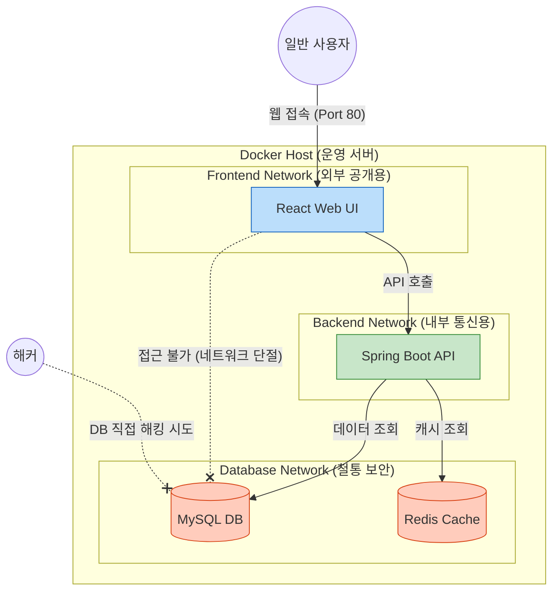

# Docker 완전 정복: Chapter 7-5. Docker Networking 🌐

이번 챕터에서는 도커 컨테이너들이 어떻게 서로 통신하고, 외부 세계(인터넷)와 연결되는지 **Docker Networking**의 핵심 아키텍처를 파헤쳐 봅니다.

단순한 명령어 암기를 넘어, **실무 인프라 환경에서 마이크로서비스(MSA)를 설계할 때 네트워크를 어떻게 분리하고 구성하는지** 깊이 있고 전문적인 관점에서 완벽하게 정리해 드리겠습니다.

---

## 🏗️ 1. 도커의 3가지 기본 네트워크 모드

도커를 설치하면 기본적으로 3개의 네트워크가 자동 생성됩니다. (`docker network ls` 로 확인 가능)

### 1) Bridge 모드 (기본값)
컨테이너를 띄울 때 아무 옵션을 주지 않으면 무조건 이 `bridge` 네트워크(내부 IP 대역: `172.17.0.x`)에 연결됩니다. 
도커 호스트(내 컴퓨터) 안에 가상의 공유기(Switch)가 생기고, 컨테이너들이 랜선으로 이 공유기에 꽂히는 구조입니다.

* **실무적 특징:** 외부(브라우저)에서 이 컨테이너에 접속하려면 반드시 **포트 포워딩(`-p 8080:80`)**을 해서 호스트의 포트와 컨테이너의 포트를 뚫어주어야 합니다.

### 2) Host 모드 (`--network host`)
컨테이너가 자신만의 격리된 네트워크 환경을 갖는 것을 포기하고, **호스트(내 컴퓨터/서버)의 네트워크 환경을 그대로 빌려 쓰는 모드**입니다.
만약 컨테이너 안에서 5000번 포트로 웹서버를 띄우면, 포트 포워딩(`-p`) 옵션 없이도 호스트의 5000번 포트로 바로 접속이 가능합니다.

* **실무 활용도:** 포트 포워딩을 거치지 않으므로 네트워크 속도가 미세하게 가장 빠릅니다. 따라서 **초당 수만 건의 트래픽을 처리해야 하는 초고성능 API 게이트웨이나 네트워크 패킷 분석기**를 띄울 때 실무에서 종종 사용합니다. (단, 포트 충돌에 주의해야 합니다.)

### 3) None 모드 (`--network none`)
랜선이 아예 뽑혀 있는 완벽한 **네트워크 단절 상태**입니다. 외부와 통신할 수도 없고, 다른 컨테이너와 통신할 수도 없습니다.
* **실무 활용도:** 외부 해킹의 위험을 100% 차단해야 하는 **초고도 보안 환경(예: 암호화폐 지갑 키 생성기, 폐쇄망 백업 스크립트)**에서 실행 후 즉시 종료되는 배치(Batch) 작업을 돌릴 때 사용합니다.

---

## 🚀 2. [실무 딥 다이브] Default Bridge의 한계와 User-Defined Bridge

강의에서는 컨테이너끼리 통신할 때 내부 IP(`172.17.0.3`)를 쓸 수 있다고 하지만, **실무에서는 내부 IP를 하드코딩해서 통신하는 짓은 절대 금기사항**입니다. 컨테이너가 재시작될 때마다 IP가 랜덤하게 바뀌기 때문입니다.

그럼 어떻게 해야 할까요? IP 대신 **'컨테이너 이름(Name)'**으로 통신해야 합니다. (예: `ping mysql`)
하지만 도커 설치 시 기본 제공되는 기본 `bridge` 네트워크는 치명적인 단점이 있습니다. **컨테이너 이름으로 IP를 찾아주는 DNS 기능이 기본적으로 꺼져 있습니다.**

따라서 실무에서는 무조건 개발자가 직접 **사용자 정의 브릿지(User-Defined Bridge)** 네트워크를 만들어서 사용합니다. 사용자 정의 네트워크 안에서는 도커의 내장 DNS 서버(`127.0.0.11`)가 작동하여, 컨테이너 이름만으로 통신이 가능해집니다.

```bash
# 1. 사용자 정의 네트워크 생성 (실무 표준)
docker network create my-custom-net

# 2. 이 네트워크에 DB와 Web을 소속시킴
docker run -d --name mysql-db --network my-custom-net mysql
docker run -d --name web-server --network my-custom-net nginx
```
이제 `web-server` 안에서 DB에 접속할 때 IP를 몰라도 `mysql-db:3306` 이라는 이름만 적어주면 도커가 알아서 IP를 찾아 연결해 줍니다! (이 원리가 바로 다음 장에서 배울 `docker-compose`의 핵심입니다.)

---

## 🏛️ 3. [실무 설계] 마이크로서비스(MSA) 네트워크 격리 아키텍처

실무에서 대규모 서비스를 구축할 때는 보안을 위해 네트워크를 용도별로 철저히 쪼갭니다(Isolation).
예를 들어 웹 서버(Frontend), 비즈니스 로직(Backend), 데이터베이스(DB)가 있을 때 이를 하나의 네트워크에 묶지 않습니다.

**[실무 MSA 네트워크 격리 시각화]**


**네트워크 설계의 핵심 (Zero Trust):**
1. 사용자는 오직 `Frontend Network`의 React 서버에만 접속할 수 있습니다.
2. React 서버는 `Backend Network`에 속한 Spring 서버와만 통신할 수 있습니다.
3. 오직 Spring 서버만이 `Database Network`에 접근해 DB를 조회할 수 있습니다.
4. **만약 해커가 React 서버를 해킹해서 탈취하더라도, React 컨테이너는 Database 네트워크와 랜선 자체가 단절되어 있으므로 절대로 DB를 해킹할 수 없습니다.**

실무에서는 이처럼 `docker network create frontend-net`, `docker network create backend-net` 등으로 네트워크를 세밀하게 분리하여 아키텍처의 보안과 안정성을 극대화합니다.

---

## 🛠️ 4. 도커 네트워킹의 숨겨진 기술 (Under the Hood)

도커는 도대체 리눅스 안에서 어떻게 가상의 네트워크를 만들어 내는 걸까요? 이 마법은 리눅스 커널의 두 가지 핵심 기술로 구현됩니다.

### 1) Network Namespace (네트워크 격리 방)
이전 7-2 챕터에서 배운 PID Namespace(프로세스 격리)와 유사합니다. 리눅스 커널은 컨테이너가 뜰 때마다 **완전히 독립된 '네트워크 방(Network Namespace)'**을 만들어 줍니다. 이 방 안에는 자신만의 고유한 IP 주소, 라우팅 테이블, 방화벽(iptables) 규칙이 존재합니다.

### 2) Veth Pairs (가상 이더넷 랜선)
각각의 방(컨테이너)이 격리되어 있다면 서로 통신은 어떻게 할까요? 리눅스는 **Virtual Ethernet (veth) Pair**라는 가상의 랜선 1쌍을 제공합니다.
* 랜선의 한쪽 끝(`eth0`)은 컨테이너 방 안쪽 벽에 꽂습니다.
* 랜선의 반대쪽 끝(`veth-xxx`)은 도커 호스트(서버)에 있는 가상의 공유기(`docker0` 브릿지)에 꽂습니다.

**[Veth Pair 작동 원리 시각화]**
```mermaid
graph LR
    subgraph "Docker Host (리눅스 서버)"
        Bridge[docker0 (가상 공유기)<br>IP: 172.17.0.1]
        
        subgraph "Container 1 (격리된 방)"
            Eth1[eth0<br>IP: 172.17.0.2]
        end
        
        subgraph "Container 2 (격리된 방)"
            Eth2[eth0<br>IP: 172.17.0.3]
        end
        
        Bridge == "Veth Pair (가상 랜선)" === Eth1
        Bridge == "Veth Pair (가상 랜선)" === Eth2
    end
    
    style Bridge fill:#e1bee7,stroke:#6a1b9a
    style Eth1 fill:#c8e6c9,stroke:#388e3c
    style Eth2 fill:#c8e6c9,stroke:#388e3c
```
이 가상의 랜선(Veth Pair)을 통해 컨테이너 안에서 보낸 데이터 패킷이 공유기(`docker0`)를 타고 다른 컨테이너로 가거나, 공유기를 거쳐 인터넷 밖으로 나가게 되는 완벽한 물리적 네트워크 모사가 이루어집니다.

---

## 💡 요약
* **Bridge:** 기본 랜선 연결 모드. 실무에서는 기본 브릿지 대신 반드시 **사용자 정의 브릿지(User-Defined Bridge)**를 만들어 컨테이너 이름(DNS)으로 통신한다.
* **Host:** 네트워크 격리를 부수고 서버의 포트를 직결하는 초고성능 모드.
* **None:** 해킹을 원천 차단하는 완전 격리 폐쇄망 모드.
* 실무 아키텍처는 네트워크를 논리적으로 쪼개어 컨테이너 간의 불필요한 접근을 막는 **네트워크 격리(Isolation)**를 통해 보안을 달성한다.
