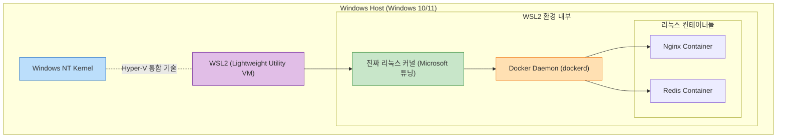
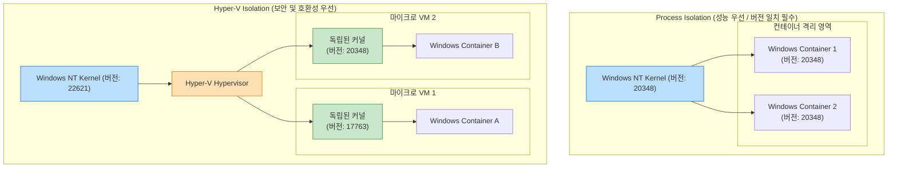

# Docker 완전 정복: Chapter 8-1. Docker on Windows 🪟

이번 챕터에서는 **Windows 환경에서 도커가 구동되는 아키텍처와 기술적 원리**를 깊이 있게 파헤칩니다. 과거의 레거시 방식부터 2026년 현재 실무에서 사용되는 최신 아키텍처(WSL2)까지, 그리고 리눅스 컨테이너와 윈도우 네이티브 컨테이너의 차이점을 명확하게 규명합니다.

> 🚨 **[최신화 가이드]** 강의 영상은 2016~2018년 기준의 레거시 아키텍처(Docker Toolbox, 구형 Hyper-V 백엔드)를 다루고 있습니다. 본 문서는 이를 2026년 인프라 실무 표준인 **WSL2 백엔드 아키텍처**와 **최신 Windows Container 격리 모델**로 완전히 재작성하여 기술적으로 매우 깊은 통찰을 제공합니다.

---

## 🧠 1. OS 커널 종속성의 원칙 (The Kernel Dependency Principle)

도커 아키텍처를 이해하기 위한 가장 중요한 대전제는 **"컨테이너는 호스트 운영체제의 커널(Kernel)을 공유한다"**는 사실입니다. 

리눅스 컨테이너 안에서 실행되는 프로세스는 리눅스 커널의 시스템 콜(System Call)을 호출하여 하드웨어를 제어합니다. 반면, Windows 운영체제는 NT 커널을 사용하며 리눅스 시스템 콜을 전혀 이해하지 못합니다. 
따라서 **Windows 호스트 위에서는 리눅스 컨테이너를 네이티브하게(직접) 실행할 수 없으며, 그 반대도 마찬가지입니다.** Windows 환경에서 도커를 사용하기 위해서는 리눅스 커널을 Windows 위에 어떻게든 우회해서 띄워야만 하는 기술적 과제가 발생합니다.

---

## 🏛️ 2. Windows 상의 도커 아키텍처 진화 과정

이러한 커널의 한계를 극복하기 위해 Windows용 도커는 세 번의 거대한 아키텍처 진화를 거쳤습니다.

### 1세대: Docker Toolbox (레거시/단종)
강의에서 언급된 가장 초창기 모델입니다. Windows 자체 가상화 기술이 부족했던 시절, Oracle VirtualBox나 VMware 같은 타사 Type-2 하이퍼바이저를 설치하여 강제로 리눅스 가상머신(Boot2Docker)을 띄운 뒤, 그 안에서 도커 데몬을 실행했습니다. 
* **기술적 한계:** 가상머신 구동으로 인한 막대한 메모리 오버헤드, I/O 디스크 성능 저하, 호스트와 컨테이너 간 네트워크 브릿지의 복잡성 등으로 인해 현재 실무에서는 100% 폐기된 아키텍처입니다.

### 2세대: Docker Desktop with Hyper-V Backend
VirtualBox를 걷어내고 Windows의 네이티브 Type-1 하이퍼바이저인 **Hyper-V**를 사용하여 `MobyLinuxVM`이라는 경량 리눅스 가상머신을 띄우는 방식입니다.
* **기술적 한계:** VirtualBox보다는 빠르지만 여전히 가상머신(VM) 기반이므로 부팅 시간이 길고 시스템 자원 소모가 컸습니다. 또한 Hyper-V 기능이 포함된 Windows 10 Pro / Enterprise 에디션에서만 구동된다는 치명적인 접근성 문제가 있었습니다.

### 3세대: Docker Desktop with WSL2 Backend (2026년 실무 표준)
마이크로소프트가 **WSL2 (Windows Subsystem for Linux 2)**를 발표하면서 Windows용 도커 아키텍처는 혁명을 맞이했습니다. WSL2는 무거운 기존 가상머신 방식이 아니라, Windows NT 커널 바로 옆에 실제 리눅스 커널(Actual Linux Kernel)을 마이크로 VM 형태로 극도로 가볍고 밀착되게 탑재한 기술입니다.

* **기술적 장점 (WSL2):**
  1. **네이티브에 가까운 성능:** 기존 Hyper-V 기반 VM보다 파일 시스템 I/O 속도가 최대 20배 빠릅니다.
  2. **동적 메모리 할당:** VM처럼 메모리를 미리 점유하지 않고, 도커가 필요한 만큼만 Windows 메모리를 동적으로 가져다 쓰고 즉시 반환합니다.
  3. **완벽한 통합:** 1초 만에 도커 데몬이 부팅되며, Windows Home 에디션에서도 완벽하게 동작합니다. 

현재 실무에서 Windows 노트북이나 데스크탑으로 개발할 때, 도커는 100% **WSL2 백엔드**를 통해 리눅스 컨테이너를 구동합니다.

**[Windows + WSL2 기반 Docker 아키텍처 시각화]**

---

## 🪟 3. Windows Containers (네이티브 윈도우 컨테이너)

지금까지 설명한 것은 "Windows 호스트에서 리눅스 컨테이너를 돌리기 위한 우회 기술"이었습니다. 하지만 기업 환경에서는 `.NET Framework`, `IIS (Internet Information Services)` 기반으로 작성된 거대한 레거시 Windows 애플리케이션들이 존재합니다. 이들은 리눅스에서 절대 구동될 수 없습니다.

이를 해결하기 위해 마이크로소프트는 도커와 협력하여 **네이티브 윈도우 컨테이너(Windows Containers)** 기술을 발표했습니다. 이는 가상머신(WSL2나 LinuxVM)을 전혀 거치지 않고, **Windows NT 커널을 직접 공유하여 Windows 네이티브 프로세스를 컨테이너 형태로 격리하여 실행**하는 기술입니다.

### Windows 컨테이너의 두 가지 베이스 이미지
리눅스 세계에 `Ubuntu`, `Alpine` 같은 베이스 이미지가 있듯, 윈도우 세계에는 목적에 맞게 철저히 분리된 두 가지 공식 베이스 이미지가 존재합니다.

1. **Windows Server Core**
   * **특징:** 기존의 방대한 Windows API와 레거시 구성요소(IIS, .NET Framework 4.x)를 대부분 포함한 무거운 이미지입니다. (용량 약 수 GB)
   * **실무 활용:** 기존 온프레미스(물리 서버)에서 돌던 10년 된 거대한 레거시 Windows 시스템을 소스코드 수정 없이 그대로 컨테이너로 감싸서(Lift and Shift 전략) 클라우드로 마이그레이션할 때 핵심적으로 사용됩니다.
2. **Nano Server**
   * **특징:** 컨테이너 구동에 필요한 극소수의 커널 API와 필수 요소만 남기고 모든 UI와 레거시를 덜어낸 초경량 헤드리스(Headless) 이미지입니다. (용량 약 수십~수백 MB, 리눅스의 Alpine 역할)
   * **실무 활용:** 플랫폼 독립적인 최신 `.NET Core` 기반의 클라우드 네이티브 마이크로서비스 애플리케이션을 Windows 환경에서 구축할 때 사용됩니다.

---

## 🛡️ 4. [실무 딥 다이브] Windows Container의 두 가지 격리 모드 (Isolation Modes)

리눅스 컨테이너는 커널의 `Namespace`와 `cgroups`를 사용하여 프로세스를 격리합니다. Windows 역시 유사한 기술(Job Objects, Server Silos)을 도입했지만, 완벽한 보안과 호환성을 위해 **두 가지 완전히 다른 격리 모드**를 제공합니다. 이 개념은 Windows 환경 인프라 설계의 핵심입니다.

### 1) Process Isolation (프로세스 격리 모드)
* **작동 원리:** 리눅스 컨테이너와 정확히 동일한 방식입니다. 호스트 Windows 서버의 NT 커널 1개를 모든 컨테이너가 직접적으로 공유합니다.
* **장점:** 속도가 극도로 빠르고 디스크/메모리 오버헤드가 거의 없습니다.
* **치명적 단점 (실무 주의사항):** 커널을 직접 공유하므로, **호스트의 Windows 커널 버전(Build Number)과 컨테이너 베이스 이미지의 버전이 정확하게 100% 일치해야만 실행됩니다.** (예: 호스트가 Windows Server 2019라면 컨테이너 이미지도 반드시 Windows Server 2019 기반이어야 함). 
* **실무 환경:** 철저하게 통제되고 버전 관리가 엄격한 엔터프라이즈 내부 서버망에서 주로 사용됩니다.

### 2) Hyper-V Isolation (Hyper-V 격리 모드)
* **작동 원리:** 각 컨테이너를 실행할 때마다 눈에 보이지 않는 초경량, 초고속의 마이크로 가상머신(Utility VM)을 순간적으로 띄우고, 그 안에서 컨테이너를 실행합니다. 즉, 컨테이너마다 자신만의 독립된 커널 복제본을 가지게 됩니다.
* **장점:** 호스트 커널과 컨테이너 커널이 분리되므로, **버전이 전혀 달라도 실행이 가능**합니다. (예: Windows 11 호스트에서 Windows Server 2016 컨테이너 실행 가능). 또한 완전한 가상머신 수준의 하드웨어 격리가 이루어지므로 해킹 시도가 호스트 커널로 전이되지 못하는 **완벽한 보안 경계**를 제공합니다.
* **단점:** 프로세스 격리보다 부팅 속도가 수 초 더 걸리고, 메모리와 CPU 오버헤드가 발생합니다.
* **실무 환경:** 다수의 알 수 없는 사용자가 코드를 실행하는 퍼블릭 클라우드 환경(Azure Container Instances)이나, 버전 파편화가 심한 환경에서 필수적으로 사용됩니다. (참고로 Windows 10/11 Desktop 버전에서는 보안을 위해 모든 Windows 컨테이너가 무조건 Hyper-V Isolation 모드로만 강제 실행됩니다.)

**[Process Isolation vs Hyper-V Isolation 아키텍처 비교 시각화]**

---

## 🎯 5. 실무 활용 요약 (Summary for Enterprise)

1. **Linux 컨테이너 구동 (Windows Desktop):** 레거시 VirtualBox나 Hyper-V 백엔드는 폐기되었으며, 극도로 빠르고 가벼운 **WSL2 아키텍처**를 통해 리눅스 환경과 100% 동일하게 개발을 진행합니다.
2. **Windows 애플리케이션 컨테이너화:** 기존의 거대한 레거시 윈도우 시스템(.NET Framework)을 클라우드로 이관할 때는 **Windows Server Core** 베이스 이미지를 활용하여 네이티브 윈도우 컨테이너로 묶어 배포합니다.
3. **격리 수준 설계:** 완벽히 통제된 인프라 환경에서는 최고 성능의 **Process Isolation**을 사용하고, 보안이 최우선이거나 커널 버전이 파편화된 환경에서는 가상머신 수준의 보안을 제공하는 **Hyper-V Isolation**을 적용하여 아키텍처를 설계합니다.
