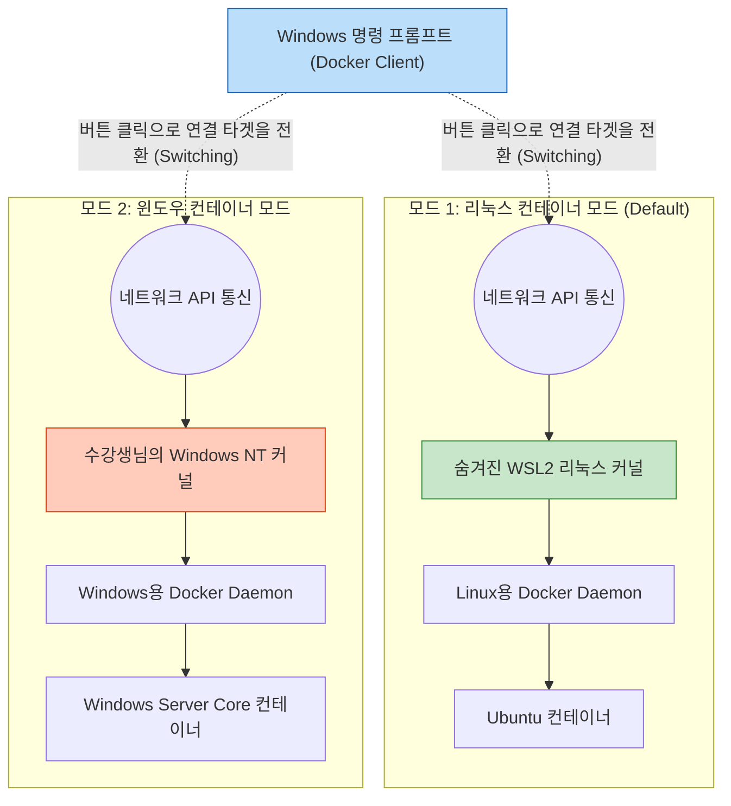

# Docker 완전 정복: Chapter 8-2. Demo - Docker on Windows 🪟

이번 데모에서는 **Windows 환경에서 도커 데스크탑(Docker Desktop)을 설치하고, 리눅스 컨테이너 모드와 윈도우 컨테이너 모드를 넘나들며 아키텍처의 변화를 직접 눈으로 확인**합니다.

> 🚨 **[최신 실무 가이드]** 
> 강의 영상은 Windows Server 2016 환경에서 구형 **Hyper-V (MobyLinuxVM)**를 사용하는 과정을 보여줍니다. 
> 본 문서에서는 영상의 맥락을 완벽히 짚어주면서도, 수강생님이 현재 사용 중인 **2026년 최신 WSL2 기반 Windows 10/11 환경**에서는 어떻게 다르게 나타나는지 실무 딥 다이브를 통해 명확히 대조해 드립니다.

---

## 🚀 1단계: Docker Desktop 설치 및 필수 기능 활성화

Windows 시스템에 도커를 설치하면, 도커는 단순히 프로그램 파일만 복사하는 것이 아니라 호스트의 **OS 커널 가상화 기능**을 건드리게 됩니다.

1. **설치 파일 실행:** Docker Store(현재의 Docker Hub)에서 다운로드한 `Docker Desktop for Windows` 설치 파일을 실행합니다.
2. **필수 기능(Feature) 활성화 경고:** 
   * **[영상 속 2016년 상황]:** 설치 후 도커가 실행될 때 *"Hyper-V feature is not enabled"* 라는 경고가 뜹니다. 도커가 백그라운드에서 리눅스 가상머신을 띄우려면 Hyper-V가 반드시 필요하기 때문입니다. `OK`를 누르면 시스템이 재부팅되며 Hyper-V가 활성화됩니다.
   * **[💡 최신 2026년 실무 상황]:** 오늘날의 도커 데스크탑은 Hyper-V 대신 **WSL2(Windows Subsystem for Linux 2)**를 기본 백엔드로 사용합니다. 따라서 최신 환경에서는 *"WSL 2 installation is incomplete."* 라는 메시지가 뜨며, WSL2 커널 업데이트 패키지를 설치하라고 안내합니다.

---

## 🕵️‍♂️ 2단계: 리눅스 컨테이너 모드 아키텍처 확인 (Client vs Server)

재부팅 후 도커 아이콘이 시스템 트레이(우측 하단)에 정상적으로 나타나고 `"Docker is running"` 상태가 되면, 명령 프롬프트(CMD)를 열어 다음 명령어를 입력합니다.

```bash
docker version
```

**[실행 결과의 핵심 분석]**
출력 결과를 보면 크게 `Client` 부분과 `Server` 부분으로 나뉘어 있습니다.

* **Client (도커 클라이언트):** `OS/Arch: windows/amd64`
  * 내가 방금 명령어를 친 `docker.exe` 실행 파일은 Windows용 프로그램이 맞습니다.
* **Server (도커 엔진/데몬):** `OS/Arch: linux/amd64` (★핵심)
  * 하지만 내 명령을 받아서 실제로 컨테이너를 띄워줄 백그라운드의 도커 서버(데몬)는 **Linux** 환경에서 돌고 있습니다!

> **💡 [실무 통찰] 왜 Client와 Server의 OS가 다를까요?**
> 도커 클라이언트(명령어 창)와 도커 데몬(실행기)은 한 몸이 아니라 서로 분리된 프로그램(Client-Server 아키텍처)입니다. 
> 사용자가 Windows 터미널에서 명령을 내리면, 이 명령이 네트워크 API를 타고 **숨겨져 있는 리눅스 가상머신(Hyper-V 또는 WSL2) 내부의 도커 데몬**으로 전달되는 구조입니다.

---

## 🌍 3단계: 리눅스 컨테이너 실행 및 숨겨진 백엔드 추적

이제 리눅스용 우분투 컨테이너를 하나 실행해 봅니다.

```bash
docker run ubuntu
```

이 컨테이너는 분명히 Windows 노트북에서 실행명령을 내렸지만, 내부적으로는 리눅스 커널 위에서 돌고 있습니다. 이 "숨겨진 리눅스 커널"의 정체를 파헤쳐 봅시다.

### 🔍 숨겨진 리눅스 백엔드 직접 확인하기
* **[영상 속 2016년 방식 - Hyper-V Manager]:**
  강사가 `서버 관리자(Server Manager)` -> `Hyper-V 관리자`를 엽니다. 그곳을 보면 내가 만들지도 않은 **`MobyLinuxVM`** 이라는 이름의 가상머신이 백그라운드에서 실행 중인 것을 볼 수 있습니다. 방금 실행한 우분투 컨테이너는 내 Windows가 아니라 바로 저 `MobyLinuxVM` 안에서 구동된 것입니다.
* **[💡 최신 2026년 실무 방식 - WSL2 확인]:**
  수강생님의 Windows 터미널(PowerShell)에서 다음 명령어를 쳐보세요.
  ```powershell
  wsl -l -v
  ```
  **결과:** `docker-desktop`과 `docker-desktop-data`라는 이름의 리눅스 배포판이 `Running` 상태인 것을 확인할 수 있습니다. 이것이 낡은 `MobyLinuxVM`을 대체한 초경량, 초고속의 최신 마이크로 리눅스 커널입니다.

---

## 🔀 4단계: Windows 컨테이너 모드로 전환 (Switch to Windows Containers)

지금까지는 Windows 위에서 '우회하여' 리눅스 컨테이너를 돌렸습니다. 이제 진짜 네이티브 **Windows 애플리케이션(.NET Framework 등)**을 돌리기 위해 모드를 전환합니다.

1. **모드 전환:** 우측 하단 시스템 트레이의 도커 아이콘을 우클릭하고 **`Switch to Windows containers...`**를 클릭합니다.
2. **Windows Containers 기능 활성화:** *"Containers feature is not enabled"* 경고가 뜹니다. 네이티브 윈도우 컨테이너를 돌리려면 Windows OS 자체의 `Containers` 기능(프로세스 격리 기능)이 켜져야 합니다. `OK`를 누르고 컴퓨터를 재부팅합니다.

### 재부팅 후 아키텍처의 변화 확인
다시 터미널을 열고 버전을 확인해 봅니다.

```bash
docker version
```

* **Client:** `OS/Arch: windows/amd64`
* **Server:** `OS/Arch: windows/amd64` (★리눅스에서 윈도우로 변경됨!)

이제 숨겨져 있던 리눅스 가상머신(WSL2/Hyper-V)과의 연결이 끊어지고, 도커 클라이언트가 **수강생님의 진짜 Windows NT 커널 위에서 직접 도는 도커 데몬**과 연결되었습니다.

---

## 🏢 5단계: 거대한 Windows 네이티브 컨테이너 실행

이제 리눅스용 이미지가 아닌, 철저히 윈도우 전용으로 만들어진 이미지를 다운받고 실행해 봅니다. (앞선 8-1 챕터에서 배운 거대한 레거시용 베이스 이미지입니다.)

```bash
docker run -it mcr.microsoft.com/windows/servercore:ltsc2022 powershell
```

**[실행 시 관찰 포인트]**
1. **막대한 용량과 다운로드 시간:** 수십 MB에 불과했던 리눅스 `hello-world`나 `ubuntu`와 달리, `servercore` 이미지는 기가바이트(GB) 단위입니다. Windows API와 레거시 라이브러리가 통째로 들어있기 때문입니다.
2. **PowerShell 진입:** 다운로드가 끝나고 컨테이너 내부로 진입하면, 리눅스의 `bash` 쉘이 아니라 Windows의 `PowerShell` 프롬프트가 떨어집니다. 이 공간은 완벽히 격리된 독립적인 Windows 환경입니다.

---

## 🎯 6. 데모 요약 (아키텍처 토글 시각화)

도커 데스크탑의 `Switch to Windows / Linux containers` 버튼 하나를 누를 때마다, 백그라운드에서는 통신하는 **운영체제 커널의 대상이 완전히 뒤바뀌는 거대한 아키텍처 스위칭**이 발생합니다.



이로써 하나의 Windows 컴퓨터에서, **리눅스 마이크로서비스(WSL2)**와 **거대한 레거시 윈도우 애플리케이션(Server Core)**을 번갈아가며 컨테이너화하고 테스트할 수 있는 완벽한 개발 환경이 구성되었습니다!
