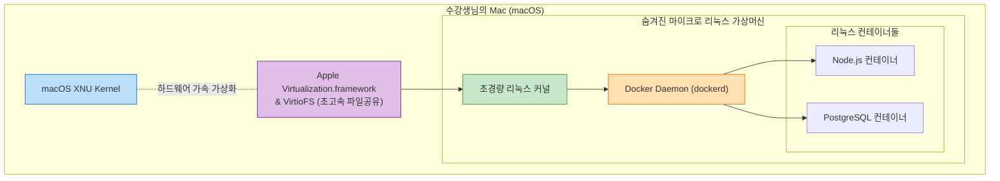
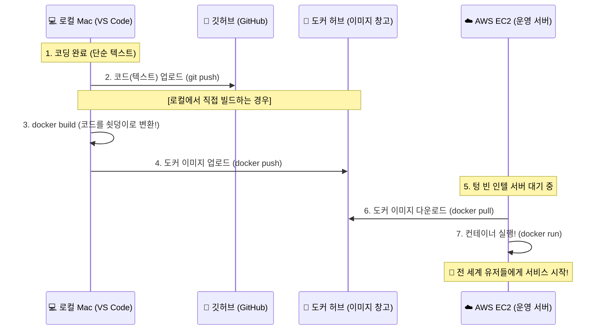

# Docker 완전 정복: Chapter 8-3. Docker on Mac 🍎

이번 챕터에서는 **macOS 환경에서 도커가 구동되는 아키텍처의 진화 과정과 최신 기술적 원리**를 낱낱이 파헤칩니다.

> 🚨 **[최신 실무 가이드]** 
> 강의 영상은 2016~2018년 시절 인텔(Intel) Mac 기반의 구형 `HyperKit` 아키텍처를 다루고 있습니다. 
> 본 문서에서는 영상의 핵심을 짚어내면서도, 현재 수강생님이 사용하시는 **Apple Silicon (M1/M2/M3 등) 기반의 최신 2026년 실무 표준 아키텍처(`Virtualization.framework` 및 `VirtioFS`)**와 **크로스 아키텍처(ARM vs x86) 이슈**까지 완벽하게 최신화하여 다룹니다.

---

## 🧠 1. 변하지 않는 대전제: Mac 커널과 리눅스 커널의 불일치

Windows와 마찬가지로, Mac 역시 리눅스와 커널이 다릅니다. macOS는 `XNU 커널`이라는 독자적인 유닉스 기반 커널을 사용합니다. 따라서 리눅스 커널의 시스템 콜을 요구하는 리눅스 컨테이너는 Mac에서 네이티브하게(직접) 실행될 수 없습니다.

* **핵심 사실:** 도커 생태계에 "Mac OS를 담고 있는 컨테이너(Mac 기반 이미지)"라는 것은 존재하지 않으며, 오직 **Mac 위에서 리눅스 컨테이너를 돌리기 위한 목적**으로만 Docker on Mac이 존재합니다. 이를 위해 Mac 내부에 숨겨진 리눅스 환경을 띄워야만 합니다.

---

## 🏛️ 2. Docker on Mac 아키텍처의 거대한 진화 과정

Mac에서 리눅스 커널을 구동하기 위한 백엔드 기술은 크게 3단계로 진화했습니다.

### 1세대: Docker Toolbox (레거시/단종)
초창기에는 타사 가상화 소프트웨어인 `Oracle VirtualBox`를 Mac에 설치하고, 그 위에 `Boot2Docker`라는 가벼운 리눅스 가상머신을 띄웠습니다.
* **단점:** VirtualBox 자체가 무겁고 느렸으며, Mac 호스트와 리눅스 가상머신 간의 폴더 공유(Volume Mount) 속도가 절망적으로 느려 현재는 완전히 폐기된 방식입니다.

### 2세대: Docker Desktop with HyperKit (영상 속 아키텍처 / 구형 Intel Mac)
타사 프로그램(VirtualBox)을 버리고, Apple이 macOS 내부에 자체적으로 내장한 가상화 프레임워크인 `Hypervisor.framework`를 기반으로 만든 **HyperKit**을 사용했습니다.
* **특징:** 백그라운드에서 가벼운 Linux VM을 띄웠으며, 속도와 안정성이 크게 개선되었습니다.
* **단점:** 여전히 Mac과 리눅스 VM 간에 파일을 주고받는 과정(`osxfs` 방식 사용)에서 엄청난 I/O 병목이 발생하여 소스코드가 많은 프로젝트 빌드 시 치명적인 지연이 있었습니다.

### 3세대: Virtualization.framework + VirtioFS (2026년 실무 표준)
Apple Silicon(M시리즈)의 등장과 함께 아키텍처가 완전히 뜯어고쳐졌습니다. 현재 도커 데스크탑은 Apple의 최신 **`Virtualization.framework`**를 사용하여 네이티브에 가까운 속도로 Linux VM을 구동합니다.
* **VirtioFS의 도입:** Mac의 파일시스템과 리눅스 VM의 파일시스템을 완전히 동기화하는 최신 캐싱 기술(`VirtioFS`)이 도입되어 파일 읽기/쓰기 속도가 기존 대비 최대 50배 향상되었습니다.

**[최신 Docker on Mac (Apple Silicon/Intel) 아키텍처 시각화]**

---

## 🛡️ 3. [실무 딥 다이브] Mac 개발자가 겪는 2가지 치명적 문제와 해결책

오늘날 실무 현장에서 수많은 개발자들이 Mac(특히 Apple Silicon)을 사용합니다. 이들이 도커를 실무에 적용할 때 맞닥뜨리는 가장 거대한 두 가지 문제와 그 해결 아키텍처를 상세히 짚어드립니다.

### ① CPU 아키텍처 불일치 문제 (ARM vs x86)
Mac이 인텔(Intel) 칩을 버리고 자체 칩(M1, M2 등)을 사용하면서, CPU의 명령어 집합 아키텍처가 `x86_64(AMD64)`에서 `ARM64`로 완전히 바뀌었습니다.

* **💡 실무 장애 상황 예시:** 
  A개발자가 자신의 최신 맥북(M3, ARM64 아키텍처)에서 아주 완벽하게 작동하는 도커 컨테이너 이미지를 빌드했습니다. 그리고 이 이미지를 실제 서비스가 돌아가는 AWS 클라우드의 운영 서버(Intel x86_64 아키텍처)에 배포했습니다. 그런데 배포 직후 **서버가 에러를 뿜으며 즉시 뻗어버립니다(Crash).** 
* **원인 분석:** A개발자가 만든 컨테이너 내부에 들어있는 실행 파일(Binary)들은 ARM64 CPU 전용 명령어들로 가득 차 있습니다. Intel CPU는 이 명령어들을 전혀 알아듣지 못하기 때문에 실행 자체가 불가능한 것입니다.
* **도커의 해결책 (Cross-Compilation & Rosetta 2):**
  이 치명적인 문제를 해결하기 위해 최신 도커 데스크탑은 두 가지 강력한 무기를 제공합니다.
  1. **멀티 아키텍처 빌드 (`docker buildx`):** 맥북에서 도커 이미지를 구울 때 `--platform linux/amd64` 옵션을 주면, 도커가 에뮬레이터를 돌려서 강제로 Intel 서버용 컨테이너 이미지를 만들어줍니다.
  2. **Rosetta 2 통합:** 반대로 인터넷에서 다운받은 구형 Intel 전용 도커 이미지를 내 맥북에서 실행해야 할 때, Apple의 `Rosetta 2` 번역기를 리눅스 VM 내부에 꽂아 넣어 Intel 리눅스 바이너리를 실시간으로 번역하여 내 맥북(ARM64)에서 쌩쌩 돌아가게 만들어 줍니다.

### ② 볼륨 마운트(Volume Mount) 파일 동기화 지연 문제
호스트(Mac)의 소스코드 폴더를 컨테이너 내부로 연결(Mount)하여, 밖에서 코드를 수정하면 안쪽 서버에 실시간으로 반영되게 하는 것은 개발의 기본입니다.

* **💡 실무 장애 상황 예시 (과거):**
  B개발자가 Mac에서 수십만 개의 파일이 들어있는 `node_modules`(JavaScript 패키지 폴더)를 컨테이너와 연결했습니다. 코드를 한 줄 수정하고 저장했는데, 컨테이너 내부의 서버가 이를 인지하고 새로고침하는 데 무려 10초가 넘게 걸립니다. 원인은 Mac의 파일시스템 시스템 콜을 리눅스의 시스템 콜로 하나하나 무겁게 번역(osxfs)했기 때문입니다.
* **도커의 해결책 (VirtioFS):**
  현재의 `VirtioFS` 아키텍처는 무거운 번역 과정을 거치지 않습니다. Mac OS의 메모리 영역(Page Cache)과 리눅스 가상머신의 메모리 영역을 **물리적으로 직접 공유(Direct Memory Sharing)**해 버립니다. 덕분에 Mac에서 파일을 수정하는 즉시, 0.001초의 지연도 없이 컨테이너 내부에서 파일이 수정된 것으로 완벽히 동기화되어 극한의 개발 퍼포먼스를 낼 수 있습니다.

---

## 🎯 4. 챕터 8 요약 (Windows & Mac)

결론적으로, Windows 사용자이든 Mac 사용자이든, 그들의 컴퓨터 바탕화면이 다를지언정 **"도커 데스크탑이 백그라운드에 가장 완벽하고 가벼운 진짜 리눅스 커널을 몰래 숨겨놓고, 나와 동료와 운영 서버가 완벽히 동일한 리눅스 환경에서 코드를 실행하도록 보장해 준다"**는 점이 바로 현대 도커 아키텍처의 위대한 점입니다.

---

## 🛠️ 5. [Special Q&A] 로컬 코드, 깃허브, 도커, 그리고 AWS의 관계 완벽 정리

수강생님이 남겨주신 두 가지 질문은 인프라와 데브옵스(DevOps)를 처음 접할 때 누구나 겪는 **가장 핵심적인 혼란**입니다. 이 흐름을 이해하면 실무 배포 파이프라인의 90%를 이해한 것과 같습니다.

### Q1. M3 맥북에서 만든 도커 이미지를 AWS(Intel)에 올리면 정말로 뻗어버리나요?
**A. 네, 정확합니다! 100% 뻗어버립니다.** (이것이 실무에서 주니어 개발자들이 가장 많이 겪는 배포 사고입니다.)
수강생님의 M3 맥북은 **ARM 아키텍처**라는 언어를 씁니다. 여기서 `docker build`를 하면, ARM 언어로 번역된(컴파일된) 실행 파일이 도커 이미지 안에 담깁니다.
그런데 내가 돈을 주고 빌린 일반적인 AWS EC2 서버는 **Intel(x86_64) 아키텍처** 언어를 씁니다. AWS 서버가 이 이미지를 다운받아 실행하려고 하면, *"나는 영어(Intel)밖에 모르는데 왜 아랍어(ARM)로 된 파일을 주지?"* 하며 즉시 **에러(Crash)**를 뿜고 죽어버립니다. 
> **해결책:** 앞서 설명한 `docker buildx --platform linux/amd64` 명령어를 사용해서, 맥북에서 강제로 Intel 언어로 번역된 이미지를 굽거나, 아래 설명할 **CI/CD 서버(GitHub Actions)**를 통해 빌드를 대신 수행해야 합니다.

### Q2. 내 로컬(VS Code) ➡️ 깃허브 ➡️ 도커 이미지 ➡️ AWS의 흐름이 도대체 어떻게 되는 건가요?

각각의 역할과 흐름을 명확히 정의해 드립니다.

1. **로컬 환경 (VS Code / IntelliJ):** 수강생님이 타이핑을 치는 곳입니다. 이곳에 있는 코드는 단순한 **'텍스트(글자)'**일 뿐입니다. 혼자서는 실행될 수 없습니다.
2. **깃허브 (GitHub):** 텍스트(코드)를 안전하게 백업하고 동료와 공유하는 **'구글 드라이브(저장소)'**입니다. 깃허브는 코드를 보관만 할 뿐, 서버를 돌려주지는 않습니다.
3. **도커 이미지 (Docker Image):** 이 단순한 텍스트(코드)를 가져다가, 실행에 필요한 파이썬, 우분투 OS, 라이브러리 등을 전부 섞어서 **'절대 변하지 않는 굳건한 쇳덩이(실행 가능한 바이너리)'**로 꽝! 하고 뭉쳐낸 결과물입니다. 이 쇳덩이는 `Docker Hub`나 `AWS ECR` 같은 **이미지 전용 창고**에 보관됩니다.
4. **AWS (클라우드 서버):** 아마존이 돈을 받고 빌려주는 **'텅 빈 물리적 컴퓨터'**입니다. 이 컴퓨터는 내 코드가 뭔지 전혀 모릅니다. 단지 내가 명령을 내리면, 이미지 전용 창고에서 **도커 이미지(쇳덩이)를 다운받아서 그대로 실행(`docker run`)**해 주는 무식하고 강력한 일꾼일 뿐입니다.

**[실무 배포 파이프라인 (CI/CD Workflow) 시각화]**

**[💡 실무 자동화 (CI/CD) 팁]**
요즘 실무에서는 내 M3 맥북에서 직접 `docker build`를 하지 않습니다(아키텍처 충돌 위험 때문입니다). 
대신, 깃허브에 코드(텍스트)를 올리기만 하면, **GitHub Actions**라는 클라우드 로봇이 내 코드를 가져다가 **AWS와 똑같은 Intel 환경에서 대신 `docker build`를 수행하고 도커 허브로 올려주는 자동화 공장**을 구축합니다. 이것이 바로 그 유명한 **CI/CD 파이프라인**입니다.
