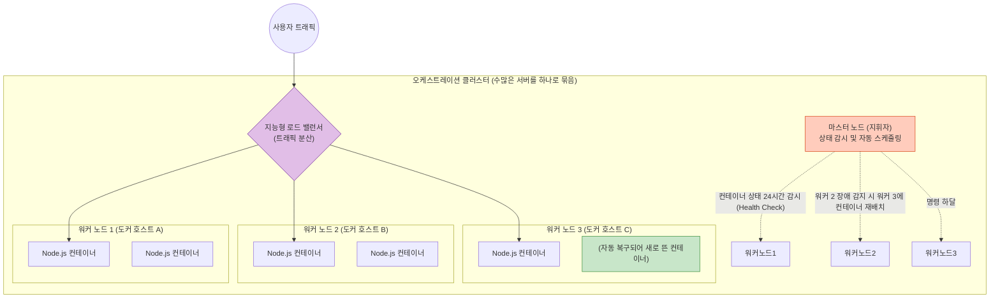
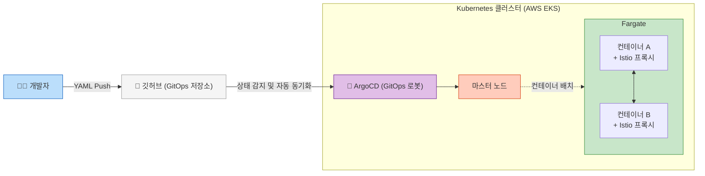

# Docker 완전 정복: Chapter 9-1. Container Orchestration 🎼

지금까지 우리는 내 PC나 단일 서버(Docker Host)에서 `docker run` 명령어를 통해 단일 컨테이너를 띄우는 방법을 배웠습니다. 하지만 이는 테스트 환경에 불과합니다. **수십만 명의 유저가 접속하는 거대한 실무 서비스 환경**에서는 단일 도커 호스트만으로는 결코 버틸 수 없습니다. 

이러한 한계를 극복하기 위해 탄생한 기술이 바로 **컨테이너 오케스트레이션(Container Orchestration)**입니다.

---

## 🚨 1. [문제 제기] 단일 Docker Host의 3가지 치명적 한계

수강생님이 만든 Node.js 애플리케이션을 단 한 대의 AWS 서버(Docker Host)에 띄웠다고 가정해 봅시다. 실무에서는 곧바로 다음과 같은 재앙에 직면하게 됩니다.

### ① 트래픽 폭주로 인한 스케일 아웃(Scale-Out)의 한계
* **상황:** 갑자기 이벤트가 터져서 유저 접속량이 100배로 폭증했습니다. 1개의 Node.js 컨테이너로는 요청을 처리할 수 없어 CPU가 100%를 치고 응답이 지연됩니다.
* **수동 대처:** 엔지니어가 헐레벌떡 터미널을 열고 `docker run` 명령어를 100번 쳐서 컨테이너를 100개로 늘려야 합니다. 유저가 빠져나가면 다시 명령어를 쳐서 99개를 꺼야 합니다.

### ② 애플리케이션(컨테이너) 크래시 (Single Point of Failure)
* **상황:** 코드에 버그가 있어 메모리 누수가 발생했고, 컨테이너가 갑자기 죽어버렸습니다.
* **수동 대처:** 엔지니어가 24시간 모니터링 모니터를 쳐다보고 있다가, 알림이 울리면 접속해서 죽은 컨테이너를 삭제하고 다시 `docker run`을 실행해 주어야 합니다.

### ③ 도커 호스트(물리 서버) 자체의 장애
* **상황:** 컨테이너가 죽은 게 아니라, 그 컨테이너들이 떠 있는 AWS EC2 서버 자체의 메인보드가 타버리거나 네트워크 선이 끊어졌습니다.
* **결과:** 그 서버 안에서 돌고 있던 100개의 컨테이너가 동시에 증발합니다. 서비스는 즉각 '접속 불가(503 Error)' 상태가 됩니다.

**결론:** 수백, 수천 개의 컨테이너를 운영하는 실무 환경에서 엔지니어가 스크립트를 짜거나 수동으로 명령어를 쳐서 이 모든 상태를 관리하는 것은 **물리적으로 불가능**합니다.

---

## 🤖 2. 컨테이너 오케스트레이션이란? (5대 핵심 기능)

이러한 문제를 해결하기 위해, 수십~수천 대의 도커 호스트(서버)들을 마치 **'하나의 거대한 컴퓨터'**처럼 묶어서(Clustering), 그 위에 수만 개의 컨테이너를 자동으로 배치하고 관리해 주는 지휘자(오케스트레이터) 소프트웨어가 등장했습니다.

오케스트레이션 툴이 제공하는 실무의 5대 핵심 기능은 다음과 같습니다.

1. **자동 복구 (Self-Healing):**
   * 특정 컨테이너가 죽으면 오케스트레이터가 이를 즉시 감지하고, 0.1초 만에 다른 서버에 똑같은 컨테이너를 새로 띄워버립니다.
2. **오토 스케일링 (Auto-Scaling):**
   * 트래픽이 몰리면 사전에 설정해 둔 임계치(예: CPU 80% 이상)에 따라 컨테이너 개수를 자동으로 100개, 1000개로 늘립니다. 트래픽이 빠지면 자동으로 줄입니다. 심지어 컨테이너를 담을 '물리 서버'의 대수까지 자동으로 늘렸다 줄입니다.
3. **지능형 로드 밸런싱 (Intelligent Load Balancing):**
   * 100개의 컨테이너가 여러 대의 호스트에 흩어져 있어도, 외부에서 들어오는 유저의 요청(트래픽)을 가장 여유 있는 컨테이너로 똑똑하게 분산시켜 줍니다.
4. **고급 네트워킹과 스토리지 공유:**
   * 물리적으로 완전히 분리된 A서버의 컨테이너와 B서버의 컨테이너가 마치 같은 컴퓨터에 있는 것처럼 안전하게 내부 통신을 할 수 있게 해줍니다.
5. **선언적 설정 (Declarative Configuration):**
   * 엔지니어가 "명령어"를 치는 것이 아니라, "나는 A컨테이너가 항상 3개 떠 있었으면 좋겠어"라고 yaml 파일로 선언(상태를 정의)만 해두면, 오케스트레이터가 알아서 그 상태를 유지시킵니다.

**[실무 오케스트레이션 클러스터 아키텍처 시각화]**

*(위 다이어그램에서 워커 노드 2의 물리 서버가 불타버리더라도, 마스터 노드는 즉각 워커 노드 3에 새로운 컨테이너를 띄우므로 사용자는 서비스 장애를 느끼지 못합니다.)*

---

## 🏆 3. 오케스트레이션 툴 비교 및 2026년 실무 표준

영상에서는 3가지 도구를 언급하고 있으나, 현재 인프라 업계의 판도는 완전히 정리되었습니다.

### 1. Docker Swarm (도커 스웜)
* **특징:** 도커에서 자체적으로 만든 오케스트레이션 툴입니다. 기존 `docker` 명령어와 호환되어 설정이 압도적으로 쉽고 가볍습니다.
* **한계:** 세밀한 오토 스케일링이나 대규모 프로덕션 급의 복잡한 네트워크 요구사항을 충족시키지 못합니다. 현재는 소규모 프로젝트나 학습용으로만 간신히 명맥을 유지하고 있습니다.

### 2. Apache Mesos
* **특징:** 과거 트위터 등에서 사용했던 강력한 분산 시스템 관리 도구로, 설정이 극도로 어렵지만 다양한 기능을 제공했습니다.
* **[2026년 현황]:** 현재 클라우드 네이티브 생태계에서는 **완벽하게 사장(Dead)된 기술**입니다. 실무에서는 더 이상 고려되지 않습니다.

### 3. Kubernetes (쿠버네티스, K8s) 👑
* **특징:** 구글(Google)이 15년간 전 세계 1위의 트래픽을 처리하며 쌓은 노하우(Borg)를 오픈소스로 공개한 것입니다. 학습 곡선(Learning Curve)이 살인적으로 가파르고 초기 설정이 어렵지만, 세상의 모든 인프라 요구사항을 커스텀할 수 있는 무한한 유연성을 제공합니다.
* **[2026년 실무 표준]:** 오케스트레이션 전쟁의 **최종 승리자**입니다. 전 세계 99%의 엔터프라이즈 기업과 스타트업이 쿠버네티스를 사용합니다. 클라우드 서비스 제공자들 역시 **EKS(AWS), GKE(Google Cloud), AKS(Azure)**라는 이름으로 쿠버네티스 전용 관리형 서비스를 핵심 상품으로 팔고 있습니다. 

---

## 🔥 4. [2026년 최신 실무 트렌드] 오케스트레이션 생태계의 고도화

단순히 쿠버네티스를 띄우는 것을 넘어, 현재 실무(엔터프라이즈) 환경에서는 다음과 같은 3가지 최신 기술이 오케스트레이션과 결합되어 사용됩니다.

### ① 서버리스 컨테이너 (Serverless Containers)
* **트렌드:** 아무리 오케스트레이터가 훌륭해도, 그 밑바탕이 되는 '워커 노드(물리 서버)' 자체는 누군가 업데이트하고 관리해야 합니다. 최근 실무에서는 이마저도 귀찮아서 **서버리스 컨테이너 서비스(AWS Fargate 등)**를 적극 도입합니다.
* **실무 적용:** 개발자는 "서버"를 빌릴 필요 없이, 쿠버네티스에게 "내 컨테이너 좀 띄워줘"라고 던지기만 하면 AWS가 알아서 남는 자원에 컨테이너를 띄우고 사용한 0.1초 단위의 요금만 청구합니다.

### ② 깃옵스 (GitOps) 기반 자동화 (ArgoCD / Flux)
* **트렌드:** 예전에는 엔지니어가 직접 마스터 노드에 접속해서 배포 명령어를 쳤습니다. 이제는 **모든 인프라와 컨테이너 상태를 '텍스트(YAML)'로 적어서 깃허브(GitHub)에 올립니다.**
* **실무 적용:** 쿠버네티스 내부에 설치된 로봇(ArgoCD)이 24시간 깃허브를 감시하다가, 코드가 바뀌면 알아서 깃허브의 텍스트 상태와 실제 서버의 컨테이너 상태를 똑같이 맞춰줍니다(Sync). 개발자는 서버에 원격 접속할 필요 없이 깃허브만 관리하면 알아서 배포가 끝납니다.

### ③ 서비스 메시 (Service Mesh - Istio / Linkerd)
* **트렌드:** 수천 개의 컨테이너가 서로 통신(API 호출)을 하다 보면, 어디서 병목이 발생했는지 추적하기가 불가능해지고, 해킹의 위험도 커집니다.
* **실무 적용:** 컨테이너마다 아주 가벼운 '네트워크 대리인(프록시)'을 옆에 붙여서, 모든 내부 통신을 자동 암호화(mTLS)하고 트래픽을 완벽하게 추적, 통제하는 서비스 메시 기술이 쿠버네티스의 필수 짝꿍으로 자리 잡았습니다.

**[최신 클라우드 네이티브 아키텍처 요약]**

---

이어지는 9-2장과 9-3장에서는 이 오케스트레이션 기술의 두 축인 Docker Swarm의 기본 동작 방식과, 압도적 제왕인 Kubernetes의 실무 핵심 개념에 대해 본격적으로 다루게 됩니다.
