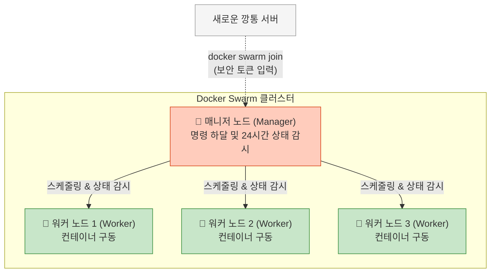
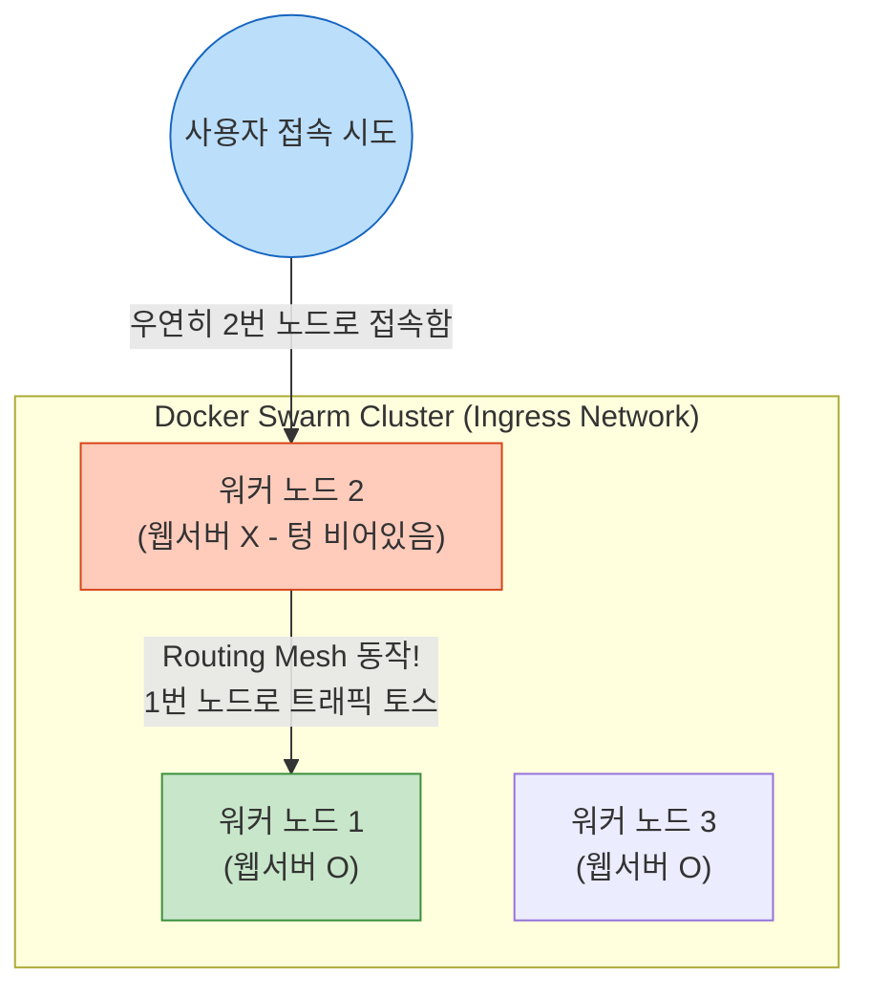

# Docker 완전 정복: Chapter 9-2. Docker Swarm 🐝

앞선 챕터에서 단일 호스트의 한계를 극복하기 위해 오케스트레이션이 등장했음을 배웠습니다. 이번 챕터에서는 도커 엔진(Docker Engine) 자체에 기본적으로 내장되어 있어 가장 쉽고 빠르게 클러스터를 구축할 수 있는 오케스트레이터, **도커 스웜(Docker Swarm)**의 핵심 아키텍처와 실무 활용법을 알아봅니다.

---

## 🏛️ 1. Swarm 클러스터 아키텍처: Manager와 Worker

여러 대의 도커 호스트(서버)를 묶어서 하나의 거대한 클러스터로 만들려면, 각 서버들에게 **명확한 역할(Role)**을 부여해야 합니다. 스웜은 서버들을 크게 두 가지 역할로 나눕니다.

### ① 매니저 노드 (Manager Node / Master)
* **역할:** 클러스터 전체의 두뇌이자 지휘자입니다. 클러스터의 상태를 관리하고, 워커 노드들에게 작업을 할당(스케줄링)하며, 죽은 컨테이너가 없는지 24시간 감시합니다.
* **실무 특징:** 고가용성(HA)을 위해 실무에서는 매니저 노드를 1대가 아닌 3대, 5대 등 홀수 개수로 구성하여 한 대의 매니저가 죽어도 클러스터 전체가 멈추지 않도록 설계합니다.

### ② 워커 노드 (Worker Node / Slave)
* **역할:** 매니저 노드가 내린 명령을 받아 묵묵히 컨테이너를 실행(run)하는 일꾼들입니다. 
* **실무 특징:** 실제 사용자의 막대한 트래픽을 온몸으로 받아내는 곳이므로, 서비스 규모가 커지면 워커 노드(물리 서버)의 대수를 수십~수백 대로 늘려나갑니다.

### 💡 클러스터 구축 과정 (Initialization & Join) 실제 명령어 흐름

클러스터를 구축하는 과정은 놀랍도록 간단합니다. 단 두 줄의 명령어로 끝납니다.

**1. 매니저 노드 승격 (첫 번째 서버에서 실행)**
첫 번째 서버(예: 호스트명 `manager-node`)의 터미널을 열고 아래 명령어를 입력하여 스스로를 매니저로 승격시킵니다.
```bash
$ docker swarm init --advertise-addr <매니저_IP주소>
```
명령어를 실행하면 터미널에 아래와 같이 **보안 토큰(Join Token)**이 포함된 친절한 안내 메시지가 출력됩니다.
```text
Swarm initialized: current node (dxn1zl6l...) is now a manager.

To add a worker to this swarm, run the following command:

    docker swarm join --token SWMTKN-1-49nj1cmql0jkz5s954yi3oex3nedyz0fb0xx14ie39trti4wxv-8vxv8rssadf9032... 192.168.99.100:2377

To add a manager to this swarm, run 'docker swarm join-token manager' and follow the instructions.
```

**2. 워커 노드 편입 (나머지 깡통 서버들에서 실행)**
이제 매니저 밑으로 들어갈 두 번째, 세 번째 서버(예: `worker-1`, `worker-2`)에 접속합니다. 그리고 위에서 복사해 둔 토큰 명령어를 그대로 붙여넣고 엔터를 칩니다.
```bash
$ docker swarm join --token SWMTKN-1-49nj1cmql0jkz5s954yi3oex3nedyz0fb0xx14ie39trti4wxv-8vxv8rssadf9032... 192.168.99.100:2377
```
그러면 즉시 아래와 같은 성공 메시지가 뜹니다.
```text
This node joined a swarm as a worker.
```
이로써 아무 관계도 없던 여러 대의 깡통 서버들이 하나의 거대한 컴퓨터(스웜 클러스터)로 묶였습니다!

**[Swarm 클러스터 구축 및 역할 시각화]**


---

## 🚀 2. `docker run`의 종말과 `Docker Service`의 탄생

클러스터를 구축했다면, 이제 컨테이너를 띄워야 합니다. 하지만 100대의 워커 노드가 있다고 해서 엔지니어가 일일이 각 서버에 SSH로 접속해 `docker run` 명령어를 치는 것은 오케스트레이션이 아닙니다.

여기서 가장 중요한 개념인 **도커 서비스(Docker Service)**가 등장합니다.

### "명령(Imperative)"에서 "선언(Declarative)"으로의 진화
* **과거 (`docker run`):** "지금 당장 Nginx 컨테이너 1개를 **실행해 줘.**" (행동 중심)
* **스웜 (`docker service`):** "내 클러스터 안에는 항상 Nginx 컨테이너가 **3개 떠 있어야 해.** 알아서 유지해 줘." (상태 선언 중심)

매니저 노드에 접속하여 다음과 같이 명령을 내립니다.
```bash
docker service create --name my-web-server --replicas 3 -p 80:80 nginx
```
* `--replicas 3`: Nginx 컨테이너 복제본을 항상 3개로 유지하라는 강력한 **'선언'**입니다.

### 💡 실무 장애 극복 (Self-Healing) 시나리오
만약 3개의 복제본 중 1개가 떠 있던 '워커 노드 2번' 물리 서버가 전원이 나가버렸다면 어떻게 될까요?
1. 매니저 노드는 즉각 워커 노드 2번이 응답하지 않는 것을 감지합니다.
2. 매니저 노드는 스스로 생각합니다. *"앗, 내가 약속한 복제본 개수는 3개인데 지금 2개밖에 없네?"*
3. 매니저는 즉각 생존해 있는 워커 노드 1번이나 3번에 **새로운 컨테이너를 하나 더 띄워서 강제로 3개를 맞춰냅니다.**
이것이 바로 엔지니어가 자고 있는 새벽에도 서비스가 멈추지 않는 **자동 복구(Self-Healing)**의 핵심 원리입니다.

---

## 🌐 3. Ingress Routing Mesh: 궁극의 로드 밸런싱

스웜의 가장 강력한 무기 중 하나는 바로 내장된 분산 라우팅 기술인 **Ingress Routing Mesh**입니다.

* **상황:** 워커 노드가 10대이고, 내 웹서버 컨테이너(`--replicas 3`)는 랜덤하게 1번, 4번, 7번 노드에만 떠 있다고 가정해 봅시다.
* **문제:** 사용자가 웹사이트에 접속하려면 1번, 4번, 7번 서버의 IP로만 접속해야 할까요? 만약 컨테이너가 죽어서 2번 노드로 이동해버리면 사용자는 접속이 끊길까요?
* **해결책 (Routing Mesh):** 스웜 클러스터에서는 사용자가 1번부터 10번 중 **아무 서버 IP에나 접속해도 전부 응답**을 받습니다. 
  만약 웹서버가 없는 2번 노드로 트래픽이 들어오면, 2번 노드는 내부 네트워크(Overlay Network)를 통해 웹서버가 떠 있는 4번 노드로 트래픽을 순식간에 토스(전달)해 줍니다. 

**[Ingress Routing Mesh 시각화]**


---

## 🔥 4. [2026년 실무 트렌드] 쿠버네티스의 지배 속, 스웜은 어디에 쓰이는가?

앞선 9-1 챕터에서 2026년 오케스트레이션의 제왕은 **쿠버네티스(K8s)**라고 명시했습니다. 그렇다면 기능이 떨어지는 도커 스웜은 왜 배워야 하며 실무 어디에 쓰일까요?

1. **학습의 디딤돌 (Stepping Stone):** 
   쿠버네티스는 너무나 거대해서 초보자가 그 아키텍처(마스터, 워커, 서비스, 상태 선언)를 단번에 이해하기 불가능에 가깝습니다. 도커 스웜은 쿠버네티스와 **철학(선언적 배포, 셀프 힐링, 클러스터링)을 100% 공유**하면서도 설정이 수십 배 쉽기 때문에 쿠버네티스로 넘어가기 위한 최고의 훈련장입니다.
2. **사내 온프레미스(On-Premise) / 소규모 스타트업 환경:**
   쿠버네티스는 마스터 노드를 구동하는 데에만 막대한 메모리와 CPU(Control Plane Overhead)를 잡아먹습니다. 인프라 자원이 부족한 소규모 프로젝트나, 사내의 남는 서버 3~4대를 묶어 가벼운 서비스를 돌려야 할 때는 굳이 무거운 쿠버네티스를 쓰지 않고 도커 스웜만으로도 완벽한 고가용성(HA)을 확보할 수 있습니다.
3. **엣지 컴퓨팅 (IoT / Edge Computing):**
   공장의 센서 장비나 성능이 떨어지는 초소형 기기(라즈베리 파이 등) 수백 대를 묶어 관리할 때는, 가벼운 도커 스웜이 쿠버네티스보다 훨씬 더 효율적이고 안정적인 실무 대안으로 사용됩니다.

이처럼 도커 스웜을 통해 클러스터링과 오케스트레이션의 **'감'**을 완벽히 잡았다면, 이제 드디어 끝판왕인 **9-3. Kubernetes Introduction**으로 넘어갈 준비가 된 것입니다!
