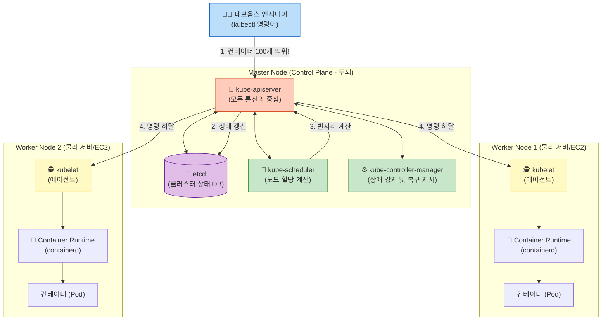

# Docker 완전 정복: Chapter 9-3. Kubernetes Introduction ☸️

앞선 챕터에서 가장 단순한 형태의 오케스트레이터인 도커 스웜(Docker Swarm)을 살펴보았습니다. 이번 챕터에서는 전 세계 모든 엔터프라이즈와 클라우드 생태계를 장악한 **사실상의 표준(De facto standard) 오케스트레이터, 쿠버네티스(Kubernetes, K8s)**의 압도적인 기능과 그 내부 아키텍처를 해부해 보겠습니다.

---

## 👑 1. 왜 쿠버네티스는 '실무의 제왕'이 되었는가? (4대 핵심 무기)

단순히 컨테이너를 여러 대 띄우는 것은 스웜으로도 가능합니다. 하지만 쿠버네티스는 대규모 실무 프로덕션 환경에서 요구하는 **'무중단'과 '자동화'**의 끝판왕 기능을 제공합니다.

### ① 완벽한 오토 스케일링 (Auto-Scaling)
트래픽이 폭주하면 `kubectl` 명령어 한 줄로 1,000개의 컨테이너를 순식간에 2,000개로 늘릴 수 있습니다. 

> **💡 [Q] 서버(물리 컴퓨터)를 늘려야지, 1대의 서버 안에서 컨테이너만 여러 개 늘린다고 성능이 좋아지나요?**
> 좋은 질문입니다! 이것이 무거운 가상머신(VM)과 가벼운 컨테이너의 가장 큰 차이점입니다.
> 1대의 서버(예: 8코어 CPU, 16GB RAM)를 하나의 컨테이너가 전부 독점하지 않습니다. 가벼운 컨테이너 하나는 0.5코어, 512MB RAM만 차지할 수도 있습니다. 
> 즉, **아직 서버에 남는 자원(여유 CPU/RAM)이 있다면 굳이 비싼 새 서버를 빌릴 필요 없이, 기존 서버의 남는 공간에 컨테이너를 꽉꽉 채워 넣는 것(Bin-packing)이 훨씬 이득**입니다.
> 
> * **1단계 - Pod Autoscaling (HPA):** 트래픽이 늘면 기존 서버들의 '남는 빈 공간'에 컨테이너 개수를 빽빽하게 늘려 트래픽을 방어합니다.
> * **2단계 - Node Autoscaler (CA):** 만약 10대의 서버가 모두 컨테이너로 100% 꽉 차서 더 이상 새 컨테이너를 올릴 공간이 없다면? 그때 비로소 쿠버네티스가 AWS에 명령을 내려 **"진짜 물리 서버(노드) 1대 더 추가해!"**라고 스케일 아웃을 진행합니다.

이 이중 오토스케일링 구조 덕분에 실무에서는 **버텨내는 성능은 극대화하면서도 서버 호스팅 비용은 최소화**하는 마법이 가능해집니다.
### ② 무중단 배포 (Rolling Update)와 즉각 롤백 (Rollback)
새로운 버전의 애플리케이션 코드를 배포할 때, 서비스가 1초도 멈추면 안 됩니다. 쿠버네티스는 2,000개의 기존 컨테이너를 한 번에 지우는 것이 아니라, 새로운 버전을 10개씩 띄우고 기존 버전을 10개씩 지우는 **롤링 업데이터(Rolling Update)**를 완벽하게 지원합니다. 배포 중 치명적인 버그가 발견되면 명령어 한 줄로 즉각 이전 버전으로 복구(Rollback)합니다.

### ③ 카나리 배포 / A-B 테스트 (Canary Deployment)
신규 기능을 전체 유저에게 바로 공개하는 것은 위험합니다. 쿠버네티스는 전체 트래픽 중 딱 5%의 유저만 새로운 버전의 컨테이너로 접속하게 하여 안전성을 테스트하는 카나리(Canary) 배포를 완벽히 지원합니다.

### ④ 압도적인 생태계와 클라우드 네이티브 호환성
지구상의 모든 네트워크, 스토리지 솔루션은 쿠버네티스용 플러그인을 제공합니다. 또한 AWS(EKS), Google Cloud(GKE), Azure(AKS) 등 모든 글로벌 클라우드 기업들이 쿠버네티스 최적화 서비스를 핵심 상품으로 판매하고 있습니다.

---

## 🏛️ 2. 쿠버네티스 아키텍처 완벽 해부 (Control Plane & Data Plane)

쿠버네티스는 크게 뇌 역할을 하는 **마스터(Master, Control Plane)**와 손발 역할을 하는 **워커 노드(Worker Node, Data Plane)**로 나뉩니다.

### 🧠 마스터 노드 (Master / Control Plane)
클러스터 전체의 상태를 감시하고 스케줄링을 담당하는 중앙 통제소입니다. 내부는 4가지 핵심 컴포넌트로 이루어져 있습니다.

1. **kube-apiserver (API 서버):** 
   * 쿠버네티스의 '얼굴'이자 유일한 출입구입니다. 개발자, 관리자, 심지어 내부 컴포넌트들조차 오직 API 서버를 통해서만 통신할 수 있습니다.
2. **etcd (엣시디 - Key-Value 저장소):** 
   * 클러스터의 '기억력(DB)'입니다. 현재 어떤 노드에 어떤 컨테이너가 떠 있는지, 클러스터의 모든 상태 정보가 저장되는 분산 저장소입니다. 실무에서 **etcd 데이터가 날아가면 클러스터 전체가 붕괴**되므로 백업이 가장 중요합니다.
3. **kube-scheduler (스케줄러):** 
   * 새로운 컨테이너를 띄워야 할 때, 어떤 워커 노드의 CPU와 메모리가 가장 널널한지 계산하여 컨테이너를 배치(할당)해 주는 역할을 합니다.
4. **kube-controller-manager (컨트롤러 매니저):** 
   * 클러스터의 '자가 치유(Self-Healing)'를 담당하는 뇌입니다. 워커 노드가 죽었거나 컨테이너가 삭제된 것을 감지하면, 즉시 API 서버에 "컨테이너를 다시 살려내라"고 지시합니다.

### 🦾 워커 노드 (Worker Node / Data Plane)
실제 애플리케이션 컨테이너가 구동되는 깡통 서버들입니다.

1. **kubelet (큐블렛):**
   * 각 워커 노드마다 설치된 **'마스터의 스파이(Agent)'**입니다. 마스터의 API 서버와 24시간 통신하며 "이 노드에 컨테이너를 띄워라"라는 명령을 수행하고, 현재 컨테이너들의 건강 상태를 마스터에 보고합니다.
2. **Container Runtime (컨테이너 런타임):**
   * 실제로 컨테이너를 구동시키는 소프트웨어입니다. 
   * **[2026 실무 트렌드 주의사항]:** 영상에서는 Docker를 언급하지만, 최신 쿠버네티스 버전에서는 무거운 Docker Engine(dockershim) 지원을 완전히 중단했습니다. 현재 실무에서는 도커 대신 훨씬 가볍고 빠른 **`containerd`**나 **`CRI-O`**라는 런타임을 표준으로 사용합니다. 

**[쿠버네티스 전체 아키텍처 다이어그램]**

---

## 💻 3. `kubectl` - 쿠버네티스와 소통하는 유일한 마법 지팡이

> **💡 [Q] 서버를 제어하려면 마스터 노드 서버에 SSH로 원격 접속해서 명령어를 쳐야 하는 거 아닌가요?**
> 아닙니다! 과거에는 엔지니어들이 리눅스 서버에 직접 SSH로 접속해 명령어를 쳤지만, 쿠버네티스 환경에서는 이 방식이 완전히 사라졌습니다. 실무에서는 아예 보안을 위해 마스터 노드의 SSH 접속 통로 자체를 막아버립니다. (AWS EKS 같은 관리형 서비스는 유저가 마스터 노드에 아예 접속할 수조차 없습니다.)

수십 대의 마스터와 수천 대의 워커 노드가 얽혀 있는 거대한 클러스터를 조종하기 위해, 엔지니어는 **자신의 로컬 노트북(Mac/Windows)에 `kubectl` (큐브-컨트롤 / 큐벡틀)이라는 클라이언트 프로그램만 설치**합니다.

* **동작 원리:** 엔지니어가 자신의 노트북에서 터미널을 열고 `kubectl get nodes`를 치면, 이 프로그램이 인터넷을 통해 저 멀리 AWS에 있는 **마스터 노드의 API 서버로 HTTPS REST 요청(웹 브라우저가 통신하는 것과 완벽히 동일한 방식)**을 쏩니다.
* 로컬 노트북에 미리 세팅해 둔 보안 인증서(`~/.kube/config`)만 통과하면, 마스터의 API 서버가 알아서 결과를 JSON으로 변환해 내 노트북으로 응답해 줍니다.

* **`kubectl get nodes`**: 현재 클러스터에 편입된 전체 워커 노드들의 목록과 건강 상태를 확인합니다.
* **`kubectl cluster-info`**: 쿠버네티스 클러스터의 마스터(API 서버) 주소 및 주요 정보를 출력합니다.
* **`kubectl run`**: 컨테이너(Pod)를 띄웁니다. (하지만 실무에서는 명령어를 직접 치는 대신, GitOps를 통해 YAML 파일을 `kubectl apply -f`로 밀어넣는 방식을 사용합니다.)

결과적으로 데브옵스 엔지니어는 **"수천 대의 서버를 `kubectl`이라는 단 하나의 명령어로 통제"**하는 막강한 힘을 얻게 됩니다. 이것이 바로 컨테이너 오케스트레이션이 현대 인프라의 표준이 된 결정적인 이유입니다.
